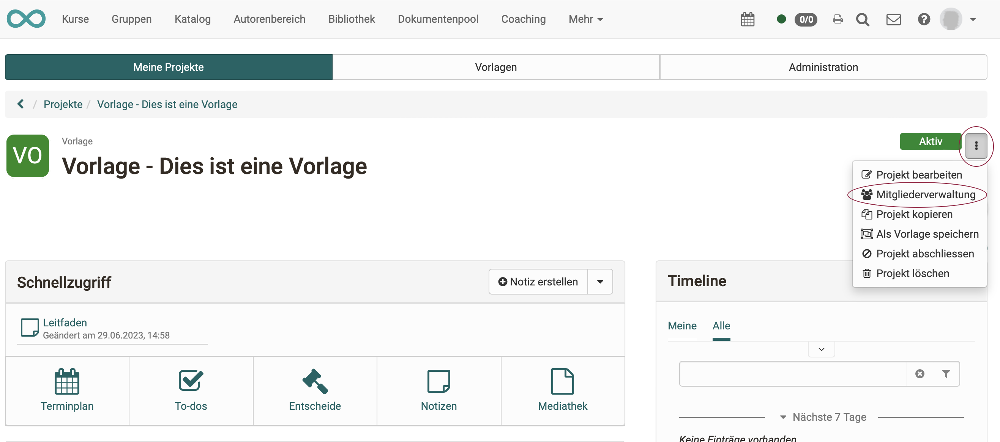
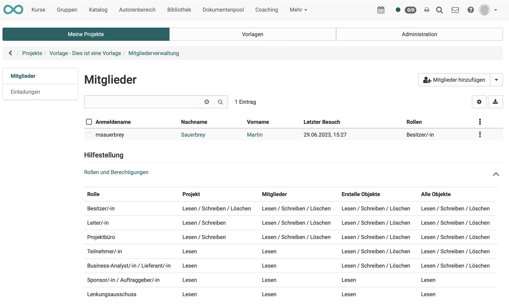
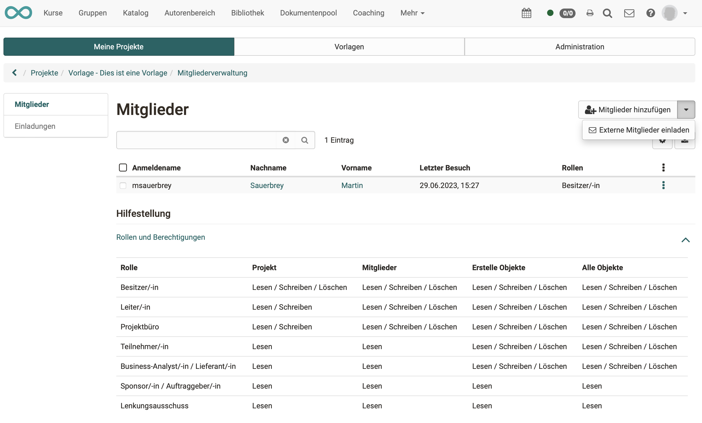

# Projects - Member Management

The project members are usually made project members by the project owner(s). (As a rule, project management lies with the person who creates the new project).

{ class="shadow lightbox" }

{ class="shadow lightbox" }

## External members

If people who are not registered as users in OpenOlat are also to work on the project, they can be invited as external members.

As soon as a project member is registered, he or she receives a link. After calling up the link, a wizard guides the new project member through login and registration.

{ class="shadow lightbox" }

!!! info "Note"

    "External member" is not a role. An external member can have all roles except owner (role that can be used to delete the whole project). 

## Rollen

|    | Project| Objects in project | Managing members | Managing external members |
| ------------------------------------------------------------- | :--------------: | :--------------: | :--------------: | :--------------: |
|                                                                                       |
|**Owner (Project owner)** | create, edit, close, delete | create, edit, delete | create, edit, delete, can assign leadership role | create, edit, delete |
|**Course owner** | tbd | tbd | tbd | :material-cancel: |
|**Leader (Project leader)**| edit | create, edit, close, delete | create, edit, delete | :material-cancel: |
|**Project Office** | edit | create, edit, delete | create, edit, delete | :material-cancel: |
|**Participants (Project participant)**              | Read only | create, edit, delete            | :material-cancel: |     :material-cancel:    |
|**Business analyst/Supplier**         | Read only           | create, edit, delete | :material-cancel:| :material-cancel: |
|**Sponsor/Client**          | Read only           | :material-cancel: | :material-cancel: | :material-cancel: |
|**Steering Committee**         | Read only          | :material-cancel: | :material-cancel:| :material-cancel: |
| Roles that can act across multiple projects:                                                                                                   |
|**Project manager**                                        | create, edit, close, delete, Tab "Administration" in the Projects area      | sees no content | create, edit, delete, may assign leadership role | create, edit, delete  |
|**Administrator**                                         | Tab "Administration" in the Projects area      | only has insight into a project if also a member*       | may assign leadership role | create, edit, delete  |

*Administrators can make themselves members, however this is will be recorded. This way, abusive access is to be curbed.

