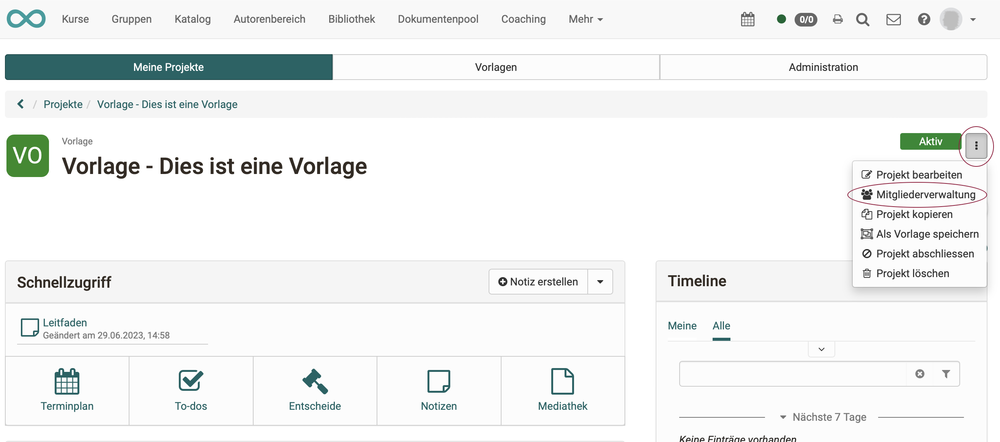
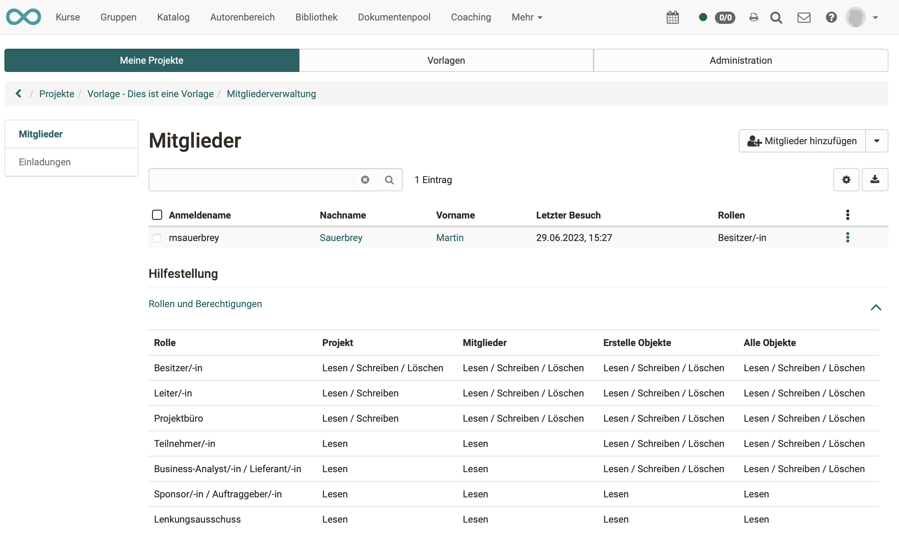
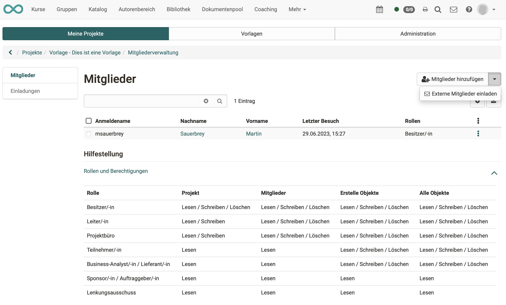

# Projects: Member Management {: #member_management}

The project members are usually made project members by the project owner. (As a rule, project management lies with the person who creates the new project.)

You open the members management in the project via the 3-dot menu at the top right: `Projects > Tab "My projects" > Select project > 3-dot menu > "Members management"`.

{ class="shadow lightbox" }

{ class="shadow lightbox" }

!!! info "Important"

    Only OpenOlat administrators can see the "Administration" tab. Project owners do not see it.

[To the top of the page ^](#member_management)

---

## External members {: #external}

If people who are not registered as users in OpenOlat are also to work on the project, they can be invited as external members. They can then use OpenOlat for a maximum of 180 days.

As soon as a project member is registered, he or she receives a link. After calling up the link, a wizard guides the new project member through login and registration.

{ class="shadow lightbox" }

!!! info "Important"

    "External member" is not an OpenOlat role. An external member can have all roles except owner (role that can be used to delete the whole project).

[To the top of the page ^](#member_management)

---

## Roles {: #roles}

|    | Project| Objects in project | Manage members | Manage external members |
| ------------------------------------------------------------- | :--------------: | :--------------: | :--------------: | :--------------: |
|                                                                                       |
|**Owner (project owner)** | create, edit, close, delete | create, edit, delete | create, edit, delete, can assign leadership role | create, edit, delete |
|**Leader (project leader)**| edit | create, edit, close, delete | create, edit, delete | :material-cancel: |
|**Project office** | edit | create, edit, delete | create, edit, delete | :material-cancel: |
|**Participant (project collaborator)**              | read only | create, edit, delete            | :material-cancel: |     :material-cancel:    |
|**Business analyst / Supplier**         | read only           | create, edit, delete | :material-cancel:| :material-cancel: |
|**Sponsor / Client**          | read only           | :material-cancel: | :material-cancel: | :material-cancel: |
|**Steering committee**         | read only          | :material-cancel: | :material-cancel:| :material-cancel: |
| Roles that can act across multiple projects:                                                                                                   |
|**Project manager**                                        | create, edit, close, delete, tab "Administration" in the Projects area      | sees no content | create, edit, delete, can assign leadership role | create, edit, delete  |
|**Administrator**                                         | tab "Administration" in the Projects area      | only has insight into a project if also a member*       | can assign leadership role | create, edit, delete  |

*Administrators can make themselves members, but this is recorded. This way, abusive access is to be curbed.

[To the top of the page ^](#member_management)

