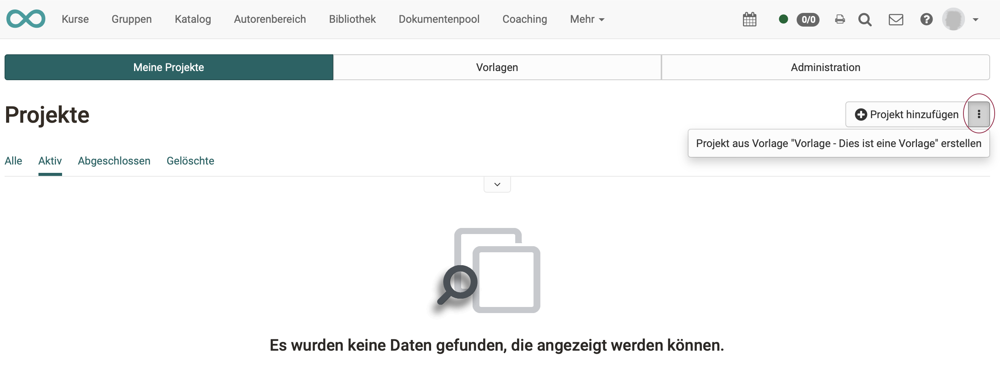

# Projects - How to create a new project?

## Without template

You can create a completely new project (without a template) under 
**Projects > Tab "My projects" > Button "Add project"**

{ class="shadow lightbox" }

## With template

The easiest way to create new projects is to use a **template**. The templates can be created and edited in a separate tab.

{ class="shadow lightbox" }

## Create template

tbd