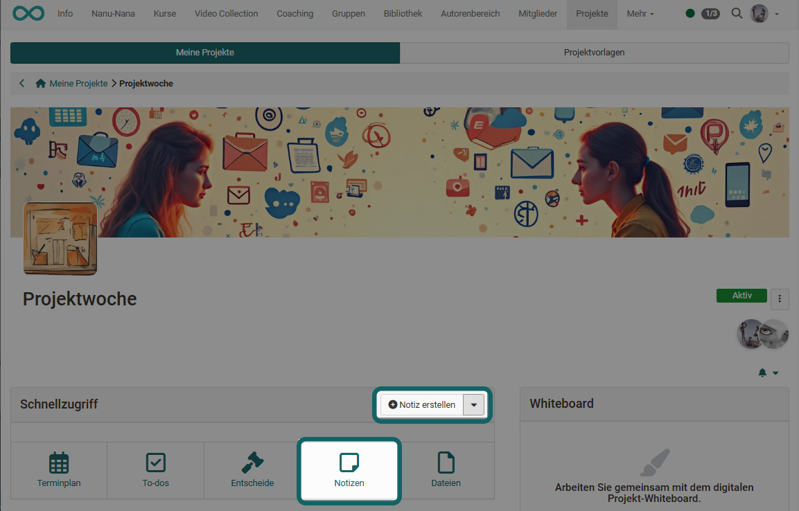
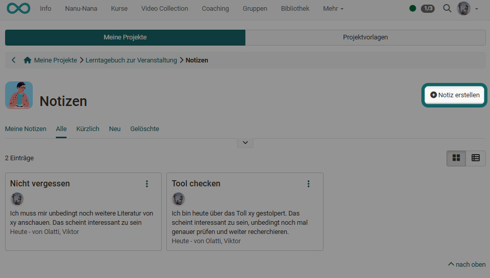
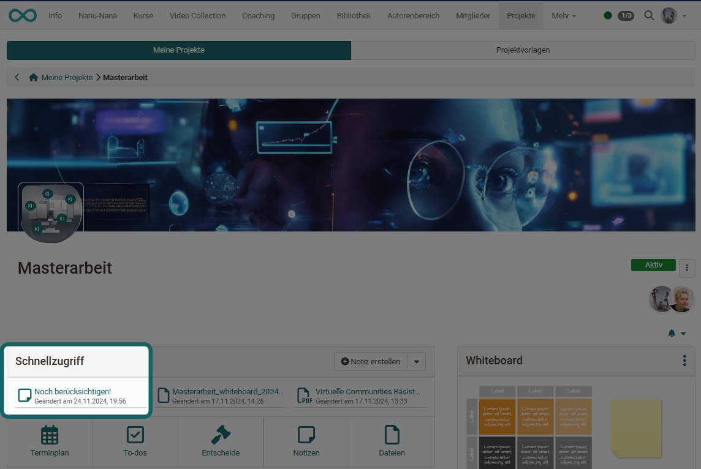
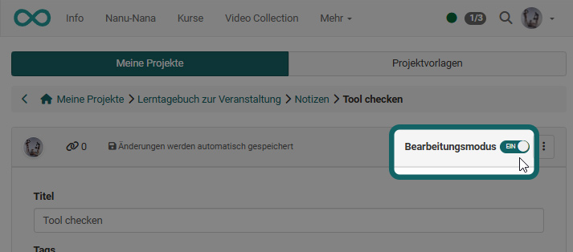
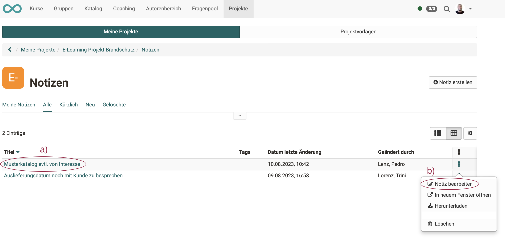
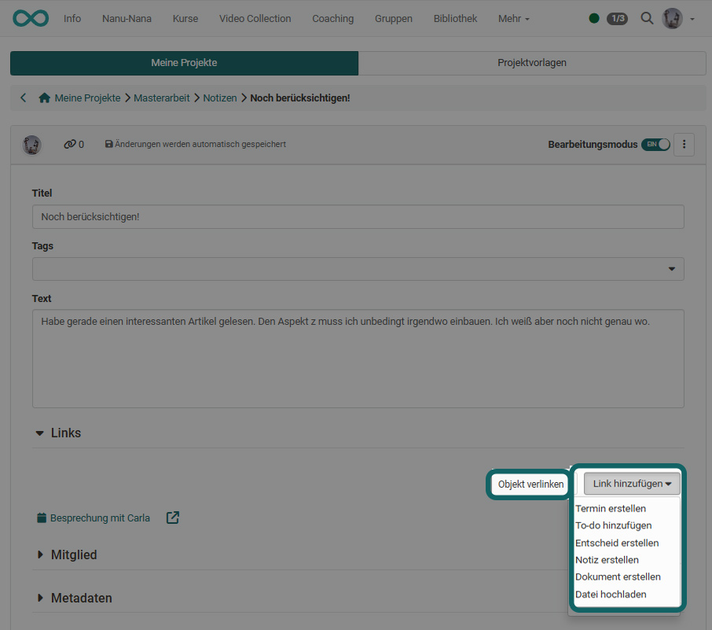
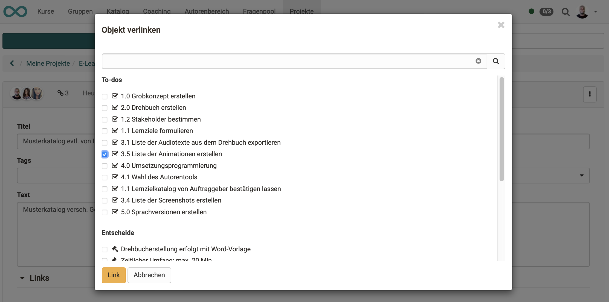
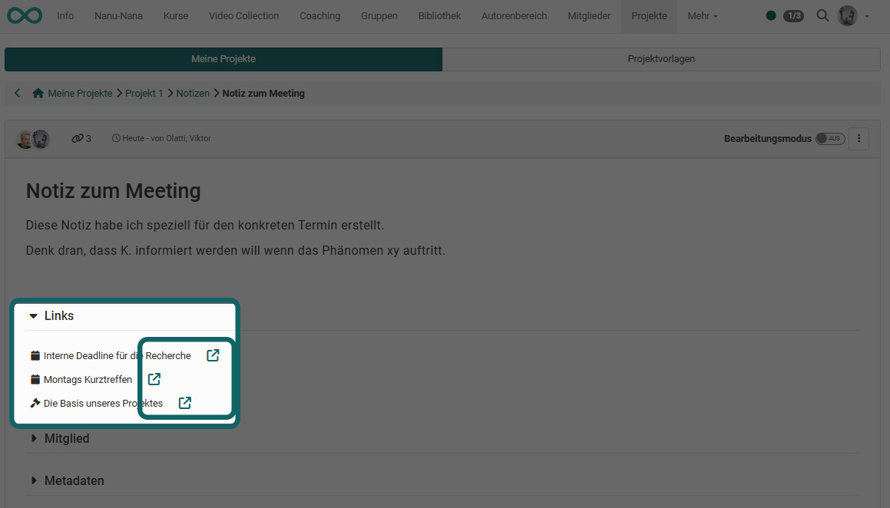
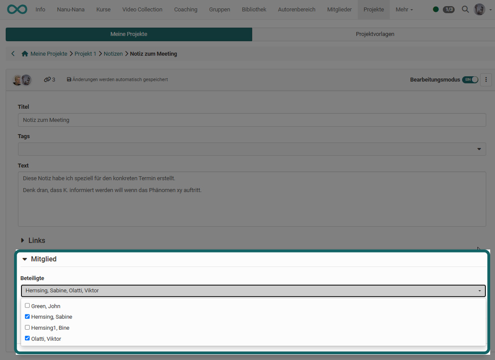

# Projekte - Notizen

In jedem Projekt können im Abschnitt "Schnellzugriff" Notizen hinterlegt werden. Sie sind nur innerhalb des Projektes verfügbar. Im Unterschied zu To-dos können Notizen auch heruntergeladen werden.

{ class="shadow lightbox" }

## Notizen erstellen

Neben dem Erstellen im Abschnitt "Schnellzugriff" können Notizen auch im Bereich "Notizen" mit Klick auf das Pluszeichen oder direkt im Notizbereich mit Hilfe des Buttons "Notiz erstellen" angelegt werden. 

{ class="shadow lightbox" }

## Liste der Notizen anzeigen

Die Liste aller im Projekt vorhandenen Notizen öffnen Sie analog zu den To-dos oder Entscheiden: 

**a) Projekte > Tab "Meine Projekte" > Projekt wählen > Schnellzugriff Button "Notizen"** 
oder 
**b) Projekte > Tab "Meine Projekte" > Projekt wählen > Titel im Abschnitt "Notizen" anklicken** 
oder 
**c) Projekte > Tab "Meine Projekte" > Projekt wählen > im Abschnitt "alle Notizen anzeigen" klicken**

Beachten Sie, dass Sie zwischen der Ansicht der Karten und der Listenansicht wechseln können.  

{ class="shadow lightbox" }

Unter den 3 Punkten am Ende jedes Listeneintrags finden Sie weitere Optionen.

{ class="shadow lightbox" }

## Schnellzugriff auf Notizen

Im Abschnitt Schnellzugriff werden die zuletzt verwendeten **Dateien** und **Notizen** angezeigt (max. 6, erstellt, geändert, angesehen, heruntergeladen). Sie können direkt durch Anklicken vom Ersteller oder Mitgliedern geöffnet und weiterbearbeitet werden.

{ class="shadow lightbox" }

## Notizen bearbeiten

Um eine Notiz zu bearbeiten, klicken Sie beim Schnellzugriff oder im Notizenbereich auf den Titel der Notiz und aktivieren Sie den Bearbeitungsmodus über den den Schieberegler. 

{ class="shadow lightbox" }

Anstatt auf den Titel einer Notiz zu klicken, können Sie auch über das 3-Punkte Menü gehen und hier "Notiz bearbeiten" wählen. 

{ class="shadow lightbox" }

Anschliessend muss ebenfalls der Bearbeitungsmodus aktiviert werden. 

In den Notizen wird commonmark unterstützt, eine inoffizielle Spezifikation von grundlegendem Markdown zur Formatierung von Text. Auf der folgenden Übersichtsseite ist die Syntax aufgeführt: [https://commonmark.org/help/](https://commonmark.org/help/){:target="_blank”}

!!! note "Hinweis"

    Notizen werden automatisch gespeichert. 

## Notizen verlinken

Wenn Sie eine Notiz bearbeiten, können Sie Links zu anderen Objekten dieses Projekts erstellen, indem Sie zu einem bereits bestehenden Objekt verlinken **(Button "Objekt verlinken")**.

**Unterschied "Objekt verlinken" und "Link hinzufügen"** 
Oft taucht während dem Erstellen einer Notiz das Bedürfnis auf, noch einen Entscheid, einen Termin oder ein To-Do zu erstellen.
Mit dem **Button "Link hinzufügen"** (im Bearbeitungsmodus), können Sie diese Objekte neu erstellen und sie sind dann automatisch schon mit der aktuellen Notiz verlinkt. Der lange Umweg (anderen Objekttyp wählen, Objekt neu erstellen, Rückkehr zum Entscheid und erst dann die Verlinkung vornehmen) entfällt dadurch.

{ class="shadow lightbox" }

Verlinkte Objekte können z.B. Entscheide, Termine, To-dos usw.. sein: 

{ class="shadow lightbox" }

Einer Notiz hinzugefügte Links können direkt über die entsprechenden Icons aufgerufen werden.

{ class="shadow lightbox" }

!!! info "Was passiert, wenn ein verlinktes Objekt gelöscht wird?"

    Wird ein verlinktes Objekt gelöscht, werden auch die Links gelöscht, die aus anderen Objekten auf dieses Objekt zeigen.

## Notizen für andere Projektmitglieder

Notizen für andere erstellen Sie in OpenOlat, indem Sie den Notizen im Bearbeitungsmodus Mitglieder zuweisen.

{ class="shadow lightbox" }

Durch das Zuordnen von Mitgliedern  erscheint eine Notiz bei den betreffenden Mitgliedern z.B. unter "Meine Notizen".

## Notizen herunterladen

Die Notizen werden in einem Markdown-Editor erstellt und angezeigt. Sie können dadurch auch als Dateien (.md) heruntergeladen werden und ausserhalb von OpenOlat mit einem Markdown-Editor-/Viewer genutzt werden.

{ class="shadow lightbox" }

## Notizen löschen

Gelöscht werden können Notizen jeweils unter dem Icon mit den 3 Punkten.

{ class="shadow lightbox" }

{ class="shadow lightbox" }

!!! note "Endgültiges Löschen"

    Um eine spätere Nachvollziehbarkeit zu gewährleisten, werden die Notizen nicht endgültig gelöscht, sondern sind unter "Gelöschte" weiterhin einsehbar. Es steht dort auch keine Option zum endgültigen Löschen zur Verfügung.
    
    { class="shadow lightbox" }

