# Projects - Notes {: #notes}

In each project, notes can be stored in the "Quick start" section. They are only available within the project. Unlike to-dos, notes can also be downloaded.

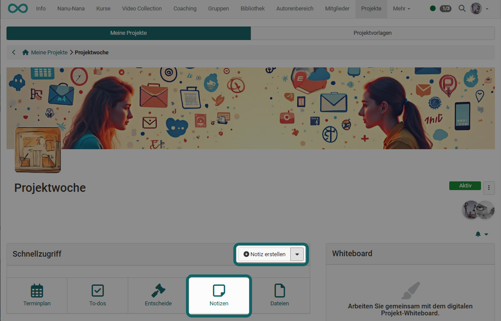{ class="shadow lightbox" }

## Create notes

In addition to creating notes in the "Quick start" section, notes can also be created in the "Notes" area by clicking on the plus sign or directly in the notes area using the "Create note" button.

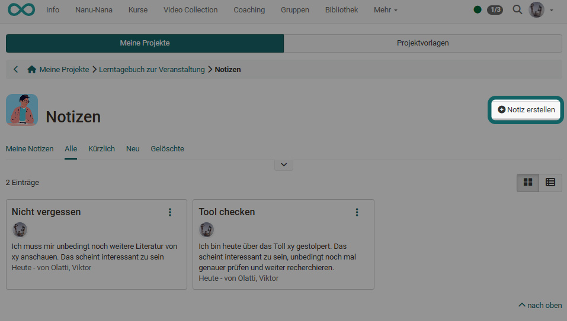{ class="shadow lightbox" }

## Show list of notes

Open the list of all notes in the project in the same way as for to-dos or decisions:

a) `Projects > Tab "My projects" > Select project > Quick start button "Notes"` 
or 
b) `Projects > Tab "My projects" > Select project > Title of the section "Notes"` 
or 
c) `Projects > Tab "My projects" > Select project > Section "Notes" > "Show all notes"`

Note that you can switch between the card view and the list view.

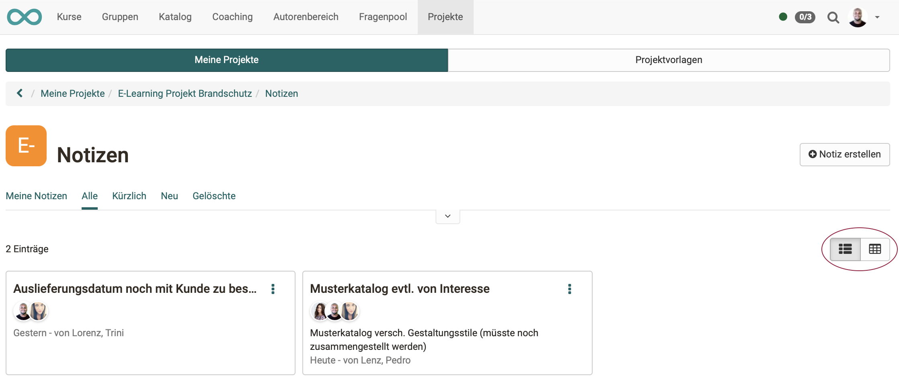{ class="shadow lightbox" }

You will find more options under the 3 dots at the end of each list entry.

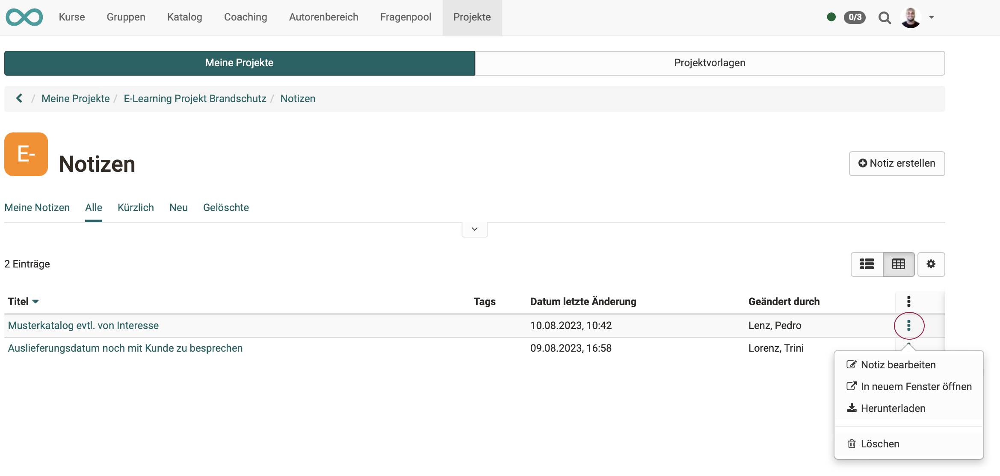{ class="shadow lightbox" }

## Quick start to notes

The Quick start section displays the most recently used **files** and **notes** (max. 6, created, modified, viewed, downloaded). They can be opened and edited directly by the creator or members by clicking on them.

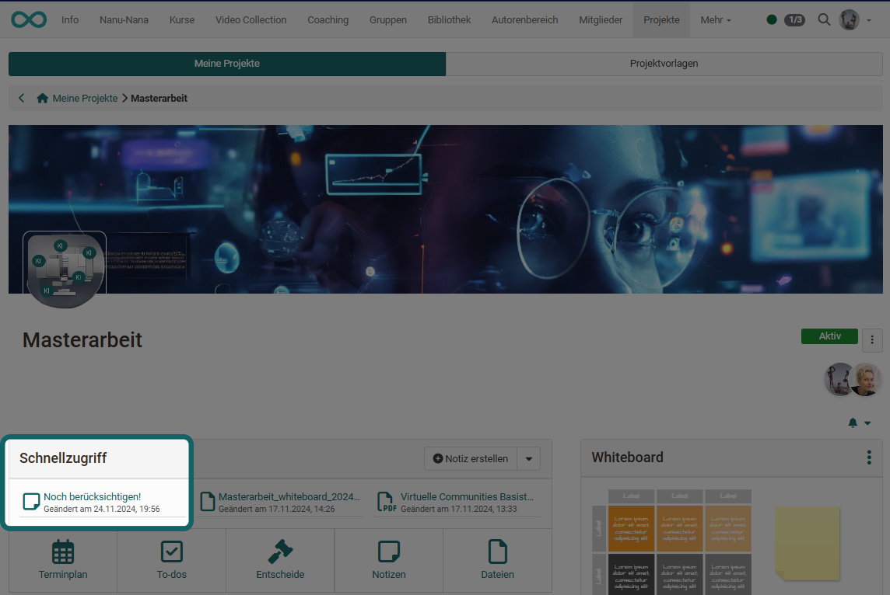{ class="shadow lightbox" }

## Edit notes

To edit a note, click on the title of the note in the Quick start or in the notes area and activate the edit mode using the slider.

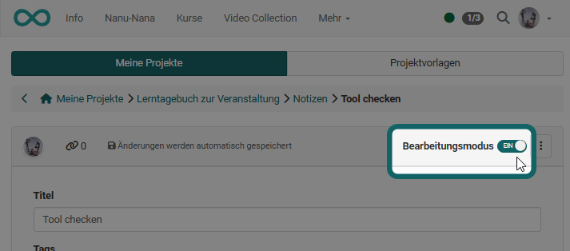{ class="shadow lightbox" }

Instead of clicking on the title of a note, you can also go to the 3-dot menu and select "Edit note" there.

{ class="shadow lightbox" }

The edit mode must then also be activated.

The notes support CommonMark, an unofficial specification of basic Markdown for formatting text. The syntax is listed on the following overview page: [https://commonmark.org/help/](https://commonmark.org/help/){:target="_blank"}

!!! info "Important"

    Notes are saved automatically.

## Link notes

When you edit a note, you can create links to other objects of this project by linking to an already existing object **(button "Link object")**.

**Difference between "Link object" and "Add link"** 
Often, while creating a note, the need arises to create a decision, an appointment or a to-do.
With the **button "Add link"** (in edit mode) you can create these objects and they are then automatically linked to the current note. The long detour (select a different object type, create a new object, return to the note and only then create the link) is thus eliminated.

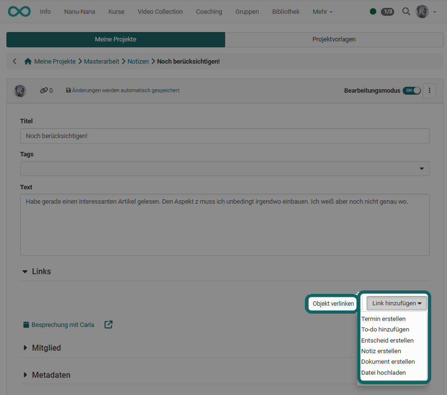{ class="shadow lightbox" }

Linked objects can be decisions, appointments, to-dos etc., for example:

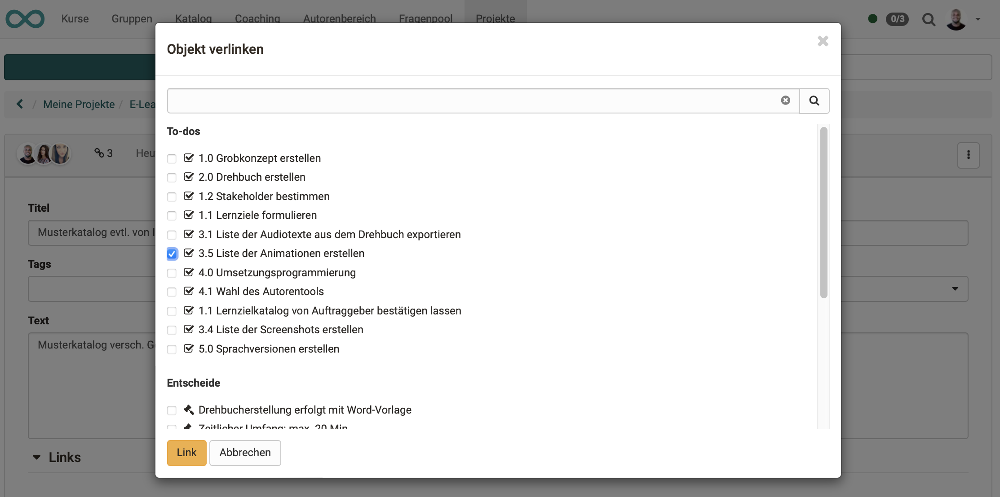{ class="shadow lightbox" }

Links added to a note can be opened directly via the corresponding icons.

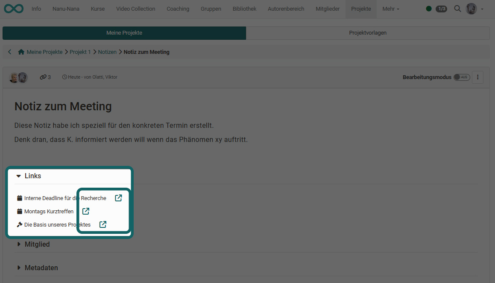{ class="shadow lightbox" }

!!! info "What happens if a linked object is deleted?"

    If a linked object is deleted, the links pointing to this object from other objects are also deleted.

## Notes for other project members

You create notes for others in OpenOlat by assigning members to the notes in edit mode.

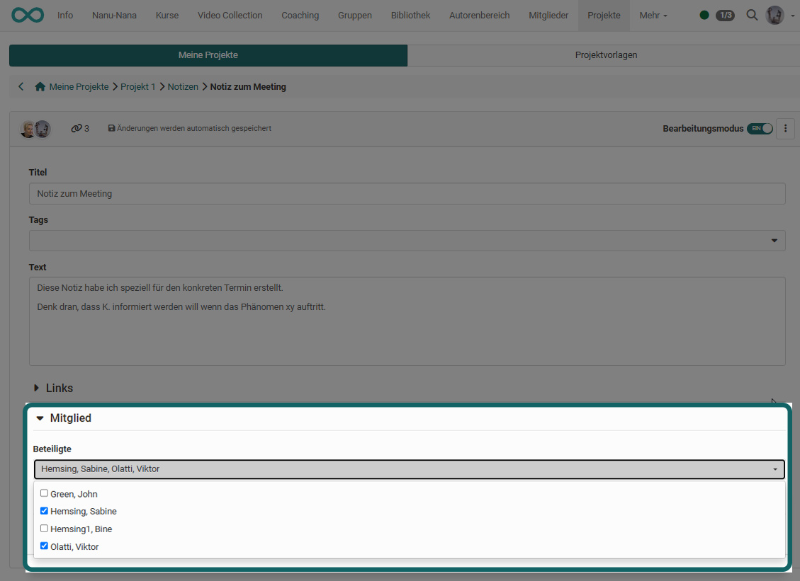{ class="shadow lightbox" }

By assigning members, a note appears for the members concerned, e.g. under "My notes".

## Download notes

The notes are created and displayed in a Markdown editor. This also allows them to be downloaded as files (.md) and used outside OpenOlat with a Markdown editor or viewer.

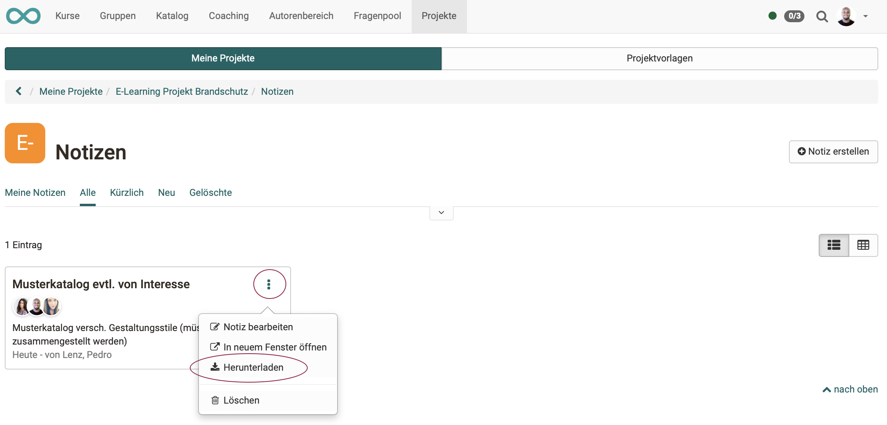{ class="shadow lightbox" }

## Delete notes

Notes can be deleted under the icon with the 3 dots.

{ class="shadow lightbox" }

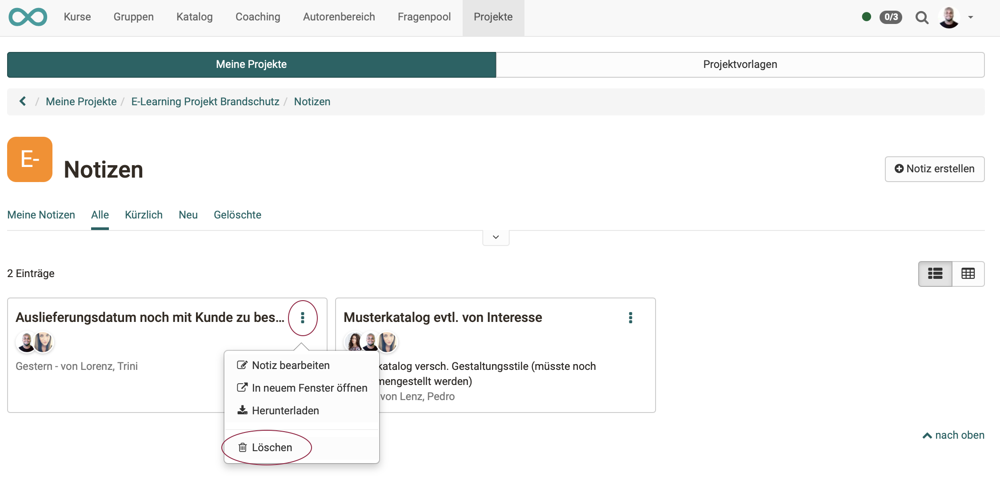{ class="shadow lightbox" }

!!! info "Final deletion"

    In order to ensure later traceability, the notes are not permanently deleted, but can still be viewed under "Deleted". There is also no option available there for final deletion.

    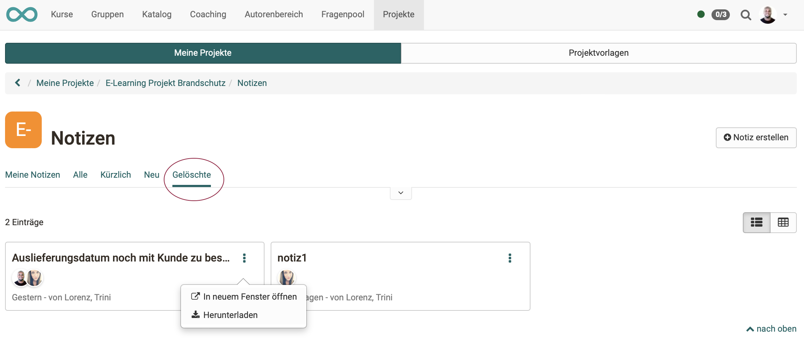{ class="shadow lightbox" }

## Further information {: #further_information}

[CommonMark syntax overview >](https://commonmark.org/help/){:target="_blank"}

[To the top of the page ^](#notes)
