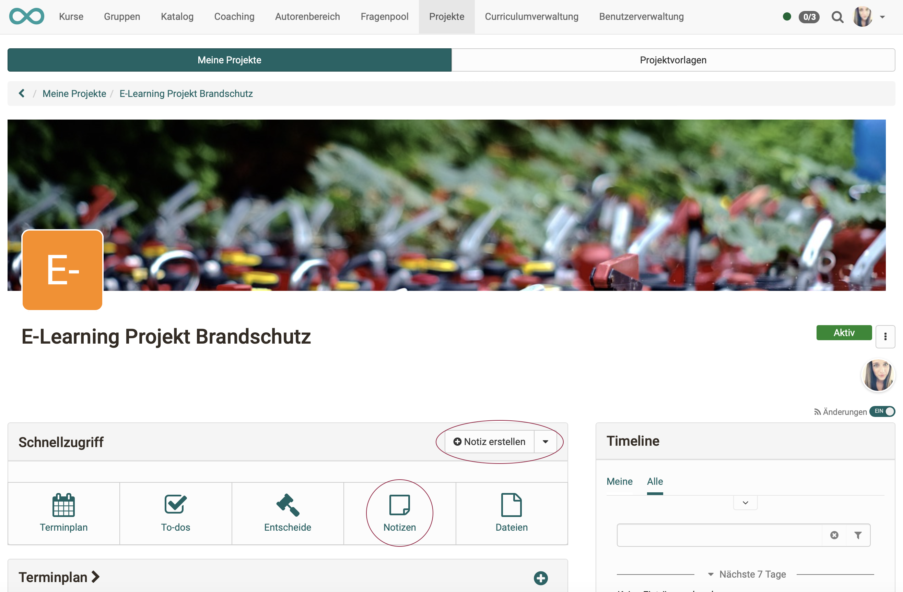
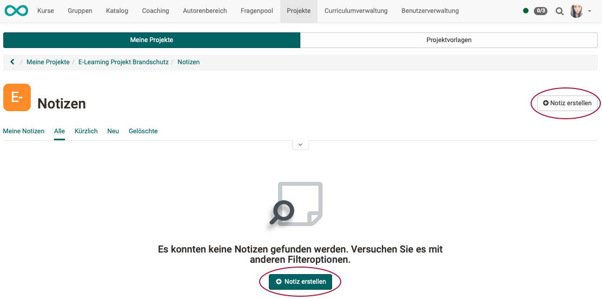
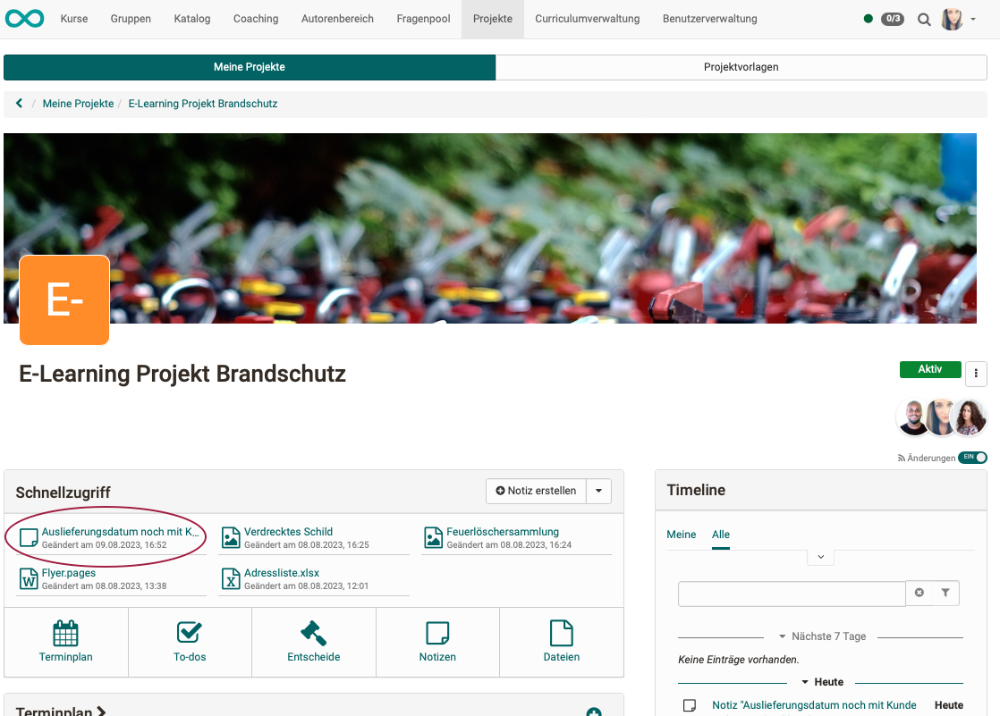
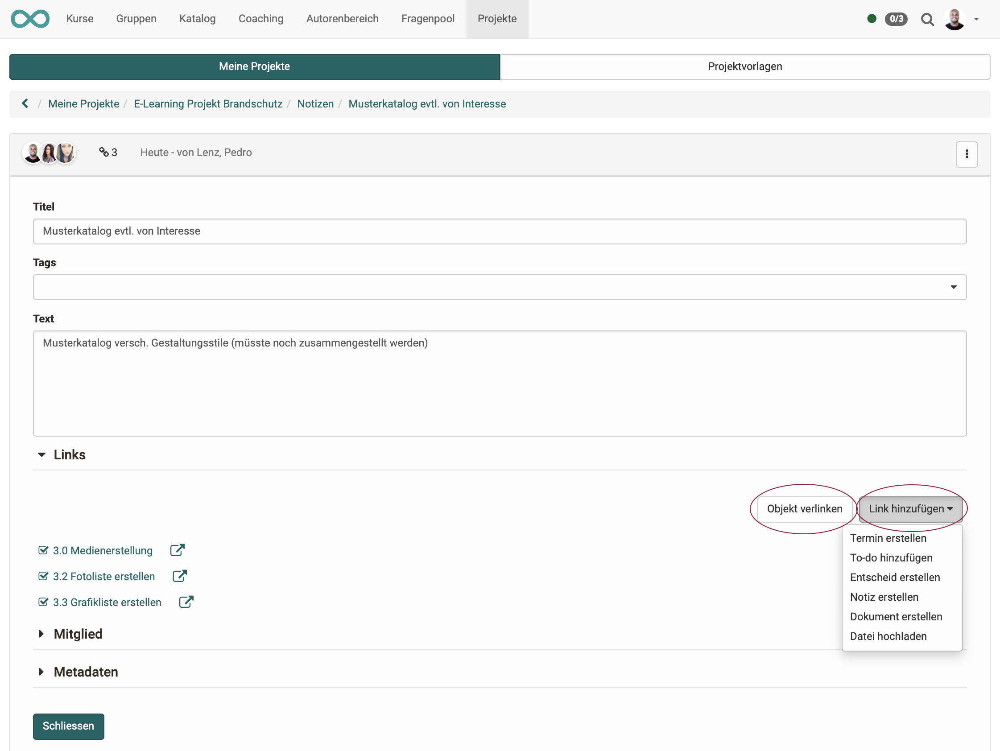
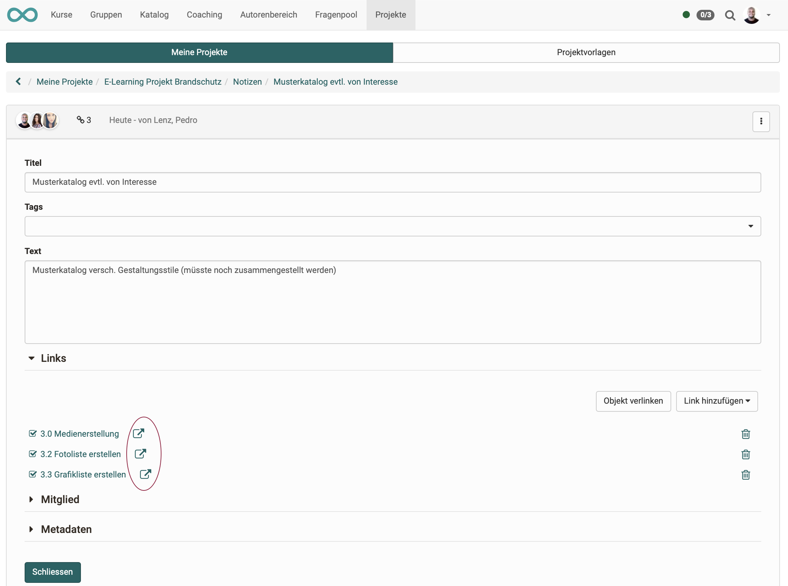

# Projects - Notes

In each project, notes can be stored in the "Quick access" section. They are only available within the project. Unlike to-dos, notes can also be downloaded.

{ class="shadow lightbox" }

## Create notes

In addition to direct creation in the "Quick Access" section, notes can also be created in the list view of all notes.

{ class="shadow lightbox" }

## Show list of notes

Open the list of all notes in the project in the same way as for to-dos or decisions: 

**a) Projects > Tab "My projects" > Select project > Quick Access Button "Notes"** 
or 
**b) Projects > Tab "My projects" > Select project > Click on the title in the "Notes" section** 
or 
**c) Projects > Tab "My projects" > Select project > Click in the "show all notes" section**

Note that you can switch between the map view and the list view. 

{ class="shadow lightbox" }

You will find more options under the 3 dots at the end of each list entry.

{ class="shadow lightbox" }

## Quick access to notes

The Quick Access section displays the most recently used **files** and **notes** (max. 6, created, modified, viewed, downloaded). They can be opened and edited directly by the creator or members by clicking on them.

{ class="shadow lightbox" }

## Edit notes

To edit a note, click on the list and then

**a) on the title of the note** (as also in the quick access) and then the **"Edit" button"** 
or alternatively 
**b) on the 3 dots at the end of a line.**

{ class="shadow lightbox" }

!!! note "Note"

    Notes are automatically saved. 

## Link notes

When you edit a note, you can create links to other objects of this project by linking to an already existing object **(button "Link object")**.

**Difference between "Link object" and "Add link"** 
Often, while creating a note, the need arises to create another decision, an appointment or a to-do.
With the **"Add link "** button, you can create these objects and they are then automatically linked to the current note. The long diversions (select a different object type, create a new object, return to the decision and only then make the link) is thus eliminated.

{ class="shadow lightbox" }

Linked objects can be decisions, for example: 

{ class="shadow lightbox" }

Links added to a note can be accessed directly:

{ class="shadow lightbox" }

!!! info "What happens if a linked object is deleted?"

    If a linked object is deleted, the links pointing to this object from other objects are also deleted.

## Notes for other project members

You create notes for others in OpenOlat by assigning members to the notes.

By assigning members (in the edit pop-up), a note appears with the members concerned, e.g. under "My notes".

{ class="shadow lightbox" }

## Download notes

The notes are created and displayed in a Markdown editor. This also allows them to be downloaded as files (.md) and used outside OpenOlat with a Markdown editor/viewer.

{ class="shadow lightbox" }

## Delete notes

Notes can be deleted under the icon with the 3 dots.

{ class="shadow lightbox" }

{ class="shadow lightbox" }

!!! note "Final deletion"

    In order to ensure later traceability, the notes are not permanently deleted, but can still be viewed under "Deleted". There is also no option available there for final deletion.
    
    { class="shadow lightbox" }

