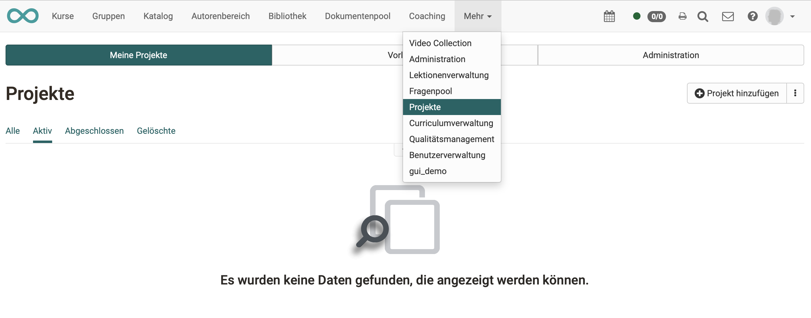
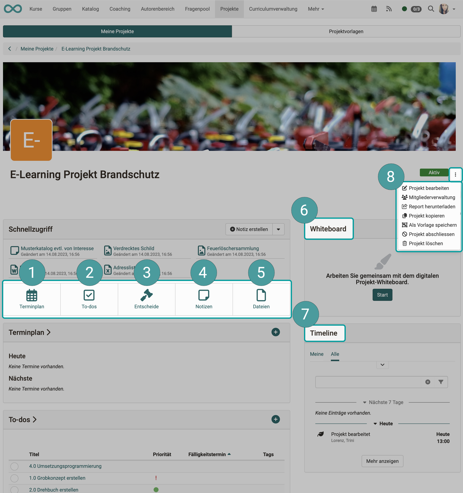

# Projekte: Überblick {: #overviews}

## Wozu dient das Projekt-Tool? [:octicons-tag-16:{ title="ab Release 18.0 (OO-6612)" }](https://track.frentix.com/issue/OO-6612)

Das in OpenOlat integrierte Projekt-Tool ist in erster Linie ein Werkzeug zur **Projektdokumentation** (nicht zur **Projektplanung**).

## Wo finde ich Projekte in OpenOlat?

Benutzer:innen finden die Projekte **im Menü der Kopfzeile**.

!!! info "Wichtig"

    Der Menü-Eintrag kann auch an einer anderen Stelle stehen. Wenn viele Einträge in der Kopfzeile angezeigt werden, kann es auch sein, dass "Projekte" unter "Mehr" ganz rechts enthalten ist.

{ class="shadow lightbox" }

!!! info "Wichtig"

    Ist ein Projekt gelöscht, kann es nicht mehr bearbeitet werden. Es liegt aber weiterhin unter `Projekte > Tab "Meine Projekte" > Tab "Gelöschte"`. Von hier aus besteht noch lesender Zugriff. Auch der Report kann heruntergeladen oder das Projekt reaktiviert werden.

[Zum Seitenanfang ^](#overviews)

---

## Welche Projekte können in OpenOlat abgebildet werden?

Beispiele:

* Projekte einer Lerngruppe
* längere Einzelarbeiten (z.B. Diplomarbeit)
* Projektwochen an Schulen
* Lerntagebuch als Projekt
* …

[Zum Seitenanfang ^](#overviews)

---

## Welche Hauptfunktionen/Bestandteile hat ein Projekt?

Nach dem Aufruf eines Projektes werden Ihnen im Cockpit die Hauptfunktionen angezeigt:

1. Termine und Meilensteine
2. To-dos
3. Entscheide
4. Notizen
5. Dateien
6. Whiteboard (draw.io)
7. Timeline
8. Verwaltungsfunktionen

{ class="shadow lightbox" }

[Zum Seitenanfang ^](#overviews)

---

## Aktivierung des Moduls "Projekte"

Damit die Projekte im Menü verfügbar sind, muss das Modul von einem/einer Administrator:in aktiviert worden sein. Weitere Informationen dazu finden Sie [hier](../../manual_admin/administration/Modules_Projects.de.md).

[Zum Seitenanfang ^](#overviews)

