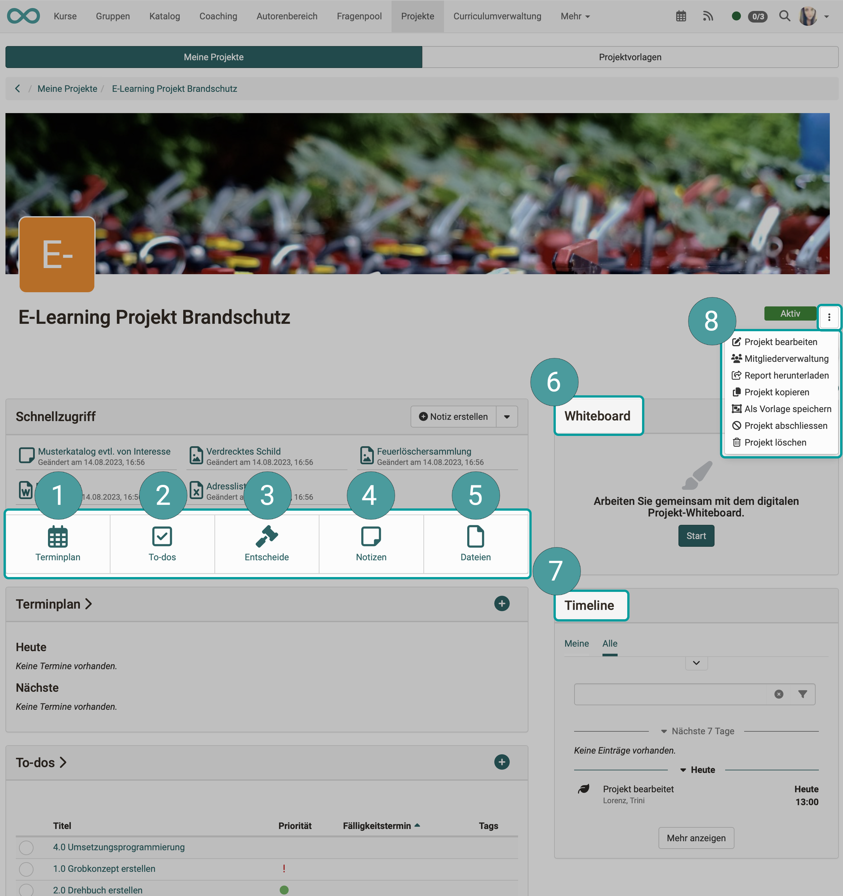

# Projects - Overview

:octicons-tag-24: Release 18.0

## What is the project tool for?

The project tool integrated in OpenOlat is primarily a tool for **project documentation** (not for **project planning**).

## Where can I find projects in OpenOlat?

OpenOlat users can find the projects **in the header menu**. 

!!! info "Note"

    The menu entry can also be in a different location. If many entries are displayed in the header, "Projects" may also be included under "More" on the far right.

{ class="shadow lightbox" }

## Which projects can be mapped in OpenOlat?

Examples:

* Projects of a learning group
* lengthy individual works (e.g. Diploma thesis)
* Project weeks at schools
* Learning diary as a project
* …

## What are the main functions/components of a project?

After calling up a project, the main functions are displayed in the cockpit:

1. Dates and milestones
2. To-dos
3. Decisions
4. Notes
6. Files
5. Whiteboard (draw.io)
7. Timeline
8. Administration functions

{ class="shadow lightbox" }

## Activation of the module "Projects"

For the projects to be available in the menu, the module must have been activated by an administrator.