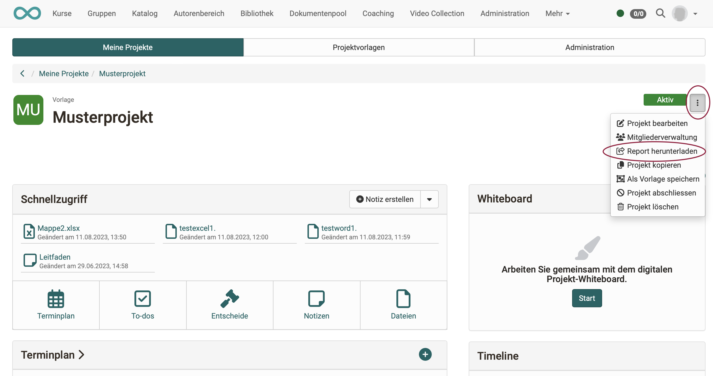

# Projekte - Projektreport

Der Projektreport fasst die wichtigsten Projektdaten zusammen. Damit können sie bei Bedarf heruntergeladen, für die Geschäftsleitung oder Meetings aufbereitet und auch archiviert werden. Sie laden den Report im Projekt über das 3-Punkte-Menü rechts oben herunter: `Projekte > Tab "Meine Projekte" > Projekt wählen > 3-Punkte-Menü > "Report herunterladen"`.

Der Report besteht aus einem **Word-Dokument**, in dem Angaben zum Projekt (Titel und Teaser), die Projektmitglieder sowie sämtliche Inhalte wie Timeline, Termine, Meilensteine, To-dos, Notizen des Projektes und der aktuelle Stand des Whiteboards enthalten sind. Zusätzlich sind in einem Ordner alle Dateien und Notizen separat abgelegt. (Auch die mit der Recording-Funktion in OpenOlat selbst aufgenommenen Video- und Audiodateien sind dort zu finden.)

Der Report kann vom Zeitraum eingeschränkt werden, um beispielsweise wöchentliche oder monatliche Zusammenfassungen zu erstellen. Die Sortierung der Inhalte ist entweder chronologisch oder nach Objekttyp möglich.

{ class="shadow lightbox" }
