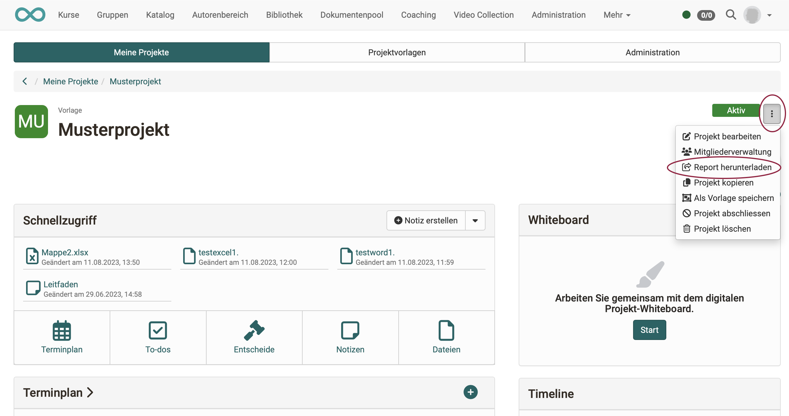

# Projects - Project report

With Release 18.1, the project report is available. With it, the most important project data can be downloaded if required, prepared for the management or meetings, and also archived.

The report consists of a **Word document** containing details of the project (title and teaser), the project members and all content such as timeline, dates, milestones, to-dos, notes of the project and the current status of the whiteboard. In addition, all files and notes are stored separately in a folder.

The report can be restricted by time period, for example to create weekly or monthly summaries. Sorting of the contents is possible either chronologically or by object type.

{ class="shadow lightbox" }