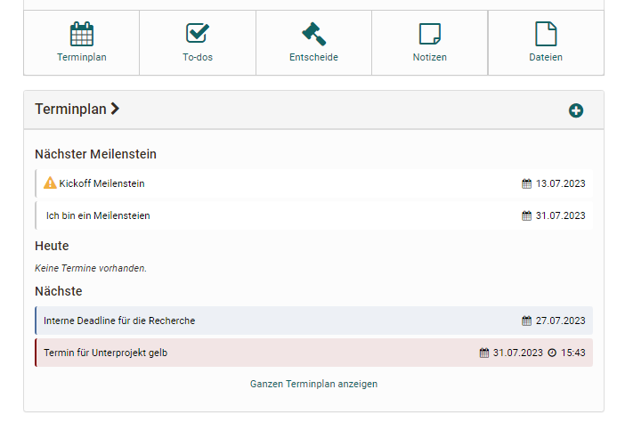
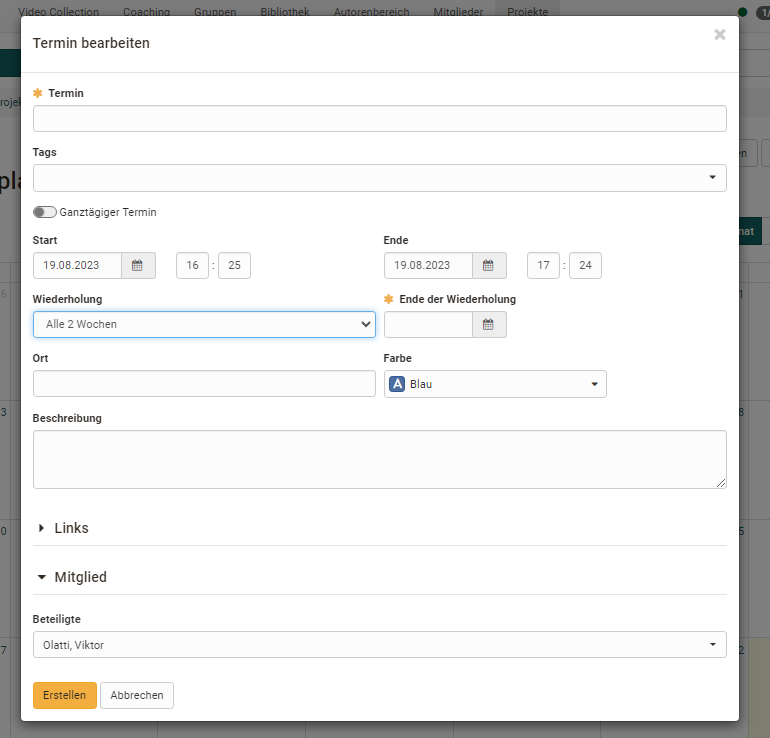
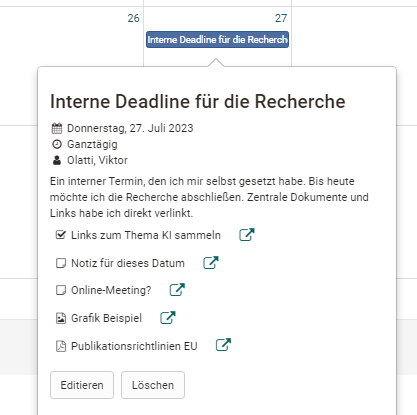

# Projekte - Terminplan

Der Terminplan nutzt den OpenOlat Kalender um dort spezifische Termine für das Projekt zu sammeln und für alle sichtbar zu machen. Jeder Termin kann konkreter beschrieben, mit Tags versehen werden und dem Termin Links und Mitglieder zugeordnet werden.  

Es können sowohl Einzeltermine als auch Serientermine z.B. für regelmäßige Projekttreffen angelegt werden. Auch spezielle Meilensteine, die als erreicht markiert werden können, sobald sie erledigt wurden, sind möglich. 

Ein Termin oder Meilenstein kann darüber hinaus mit weiteren Terminen, Entscheiden, Notizen oder Dateien des Projektes verknüpft werden. So werden bestimmte Zusammenhänge noch deutlicher. 

