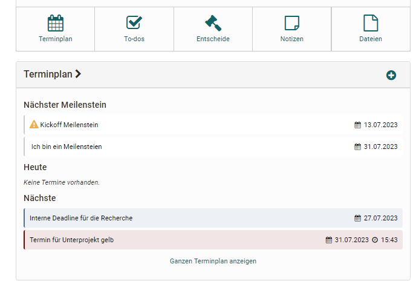
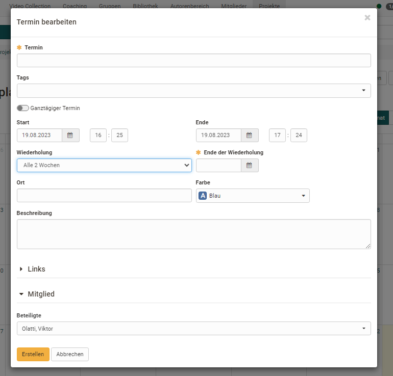
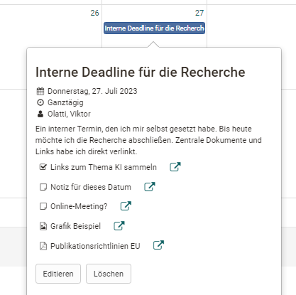

# Projects - Schedule

{ class="shadow lightbox" }

The schedule uses the OpenOlat calendar to collect specific appointments for the project and make them visible to everyone. Each appointment can be described in more detail, tagged, and links and members can be assigned to the appointment.

{ class="shadow lightbox" }

Both single appointments and recurring appointments, e.g. for regular project meetings, can be created. Special milestones that can be marked as accomplished as soon as they have been completed are also possible.

An appointment or milestone can also be linked to other appointments, decisions, notes or files of the project. This makes certain connections even clearer.

{ class="shadow lightbox" }

!!! info "Important"

    Milestones and appointments from projects are also transferred to the personal calendar.
