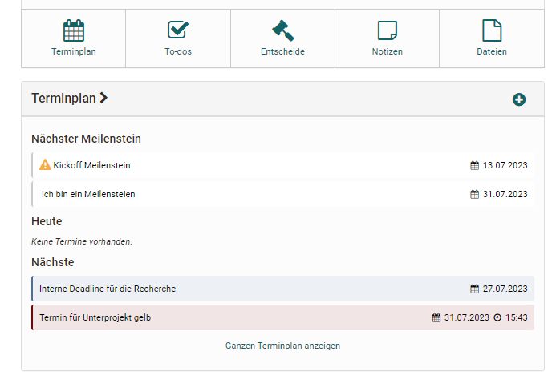
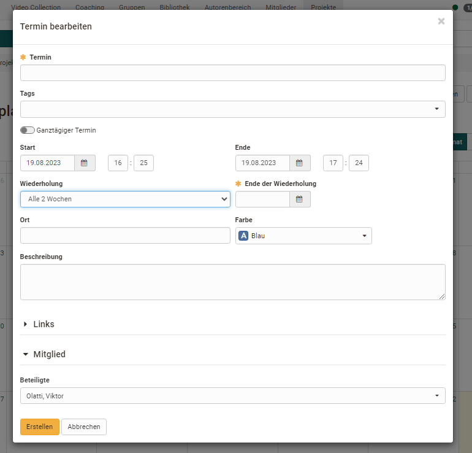
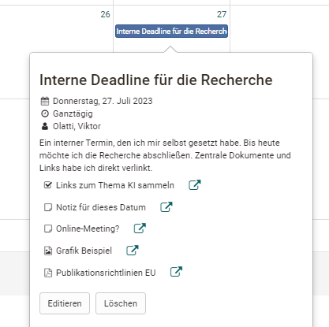

# Projects - Schedule

The schedule uses the OpenOlat calendar to collect specific appointments for the project and make them visible to everyone. Each appointment can be described more concretely, tagged and links and members can be assigned to the appointment.  

Both individual appointments and serial appointments, e.g. for regular project meetings, can be created. Special milestones that can be marked as achieved as soon as they have been completed are also possible.

A deadline or milestone can also be linked to other deadlines, decisions, notes or files in the project. This makes certain connections even clearer. 

!!! info "Note"

    Milestones and deadlines from projects are also transferred to the personal calendar.