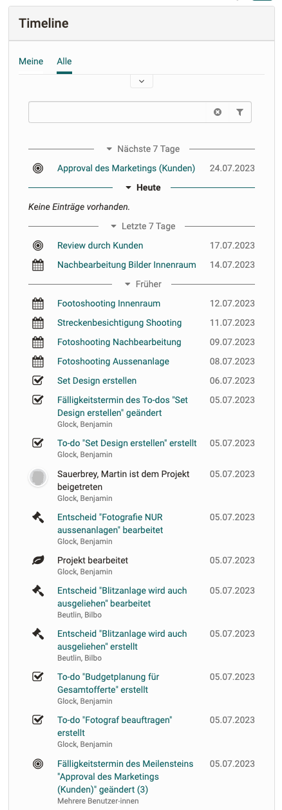

# Projekte - Timeline

Die Timeline (Zeitleiste) im Projekt zeigt Termine, Meilensteine, fällige To-dos und Änderungen.

Dass chronologisch alle Änderungen der Mitglieder an Projektobjekten angezeigt werden, ist hilfreich, um nachzuvollziehen, was in der Vergangenheit passiert ist.

Es können entweder alle Aktionen oder nur die, die man selbst vorgenommen hat bzw. bei denen man in irgendeiner Form betroffen ist/war, angezeigt werden.

## Funktionsweise

Die Zeitleiste ist in verschiedene Abschnitte unterteilt, wobei Zukünftiges und Heute immer aufgeklappt sind. Mit dem Button "Mehr anzeigen" können Einträge aus der Vergangenheit geholt werden. Filtern über das Eingabefeld oder über die Filter darüber ist möglich. So lassen sich beispielsweise nur die Meilensteine des Projektes oder nur die Einträge von bestimmten Projektmitgliedern anzeigen.

Aktionen von einem Mitglied an einem Objekt werden auf der Zeitleiste als ein Eintrag dargestellt. Bearbeiten mehrere Mitglieder ein Objekt (z.B. eine Notiz), wird dies mit dem Vermerk "Mehrere Benutzer:innen" gekennzeichnet.

Aktionen, die in der Zeitleiste auftauchen, sind:

* Erstellen bzw. Hochladen eines Objektes
* Bearbeiten eines Objektes
* Löschen eines Objektes
* Verlassen/Beitreten zu einem Projekt

{ class="shadow lightbox" }
