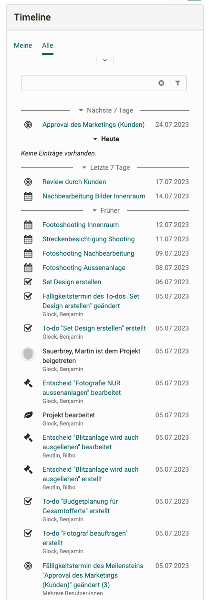

# Projekte - Zeitleiste

Die Zeitleiste im Projekt zeigt chronologisch alle Änderungen der Mitglieder an Projektobjekten und ist hilfreich um nachzuvollziehen, was in der Vergangenheit passiert ist.

## Funktionsweise

Die Zeitleiste ist in verschiedene Abschnitte unterteilt, wobei Zukünftiges und heute immer aufgeklappt ist. Mit dem "Mehr" Button können Einträge aus der Vergangenheit geholt werden. Filtern über das Eingabefeld oder über die Filter darüber ist möglich.

Aktionen von einem Mitglied an einem Objekt wird auf der Zeitleiste als ein Eintrag dargestellt. Bearbeiten mehrere Mitglieder ein Objekt (z.b. eine Notiz) wird dies mit dem Vermerk, "mehrere Mitglieder" gekennzeichnet.

Aktionen die in der Zeitleiste auftauchen sind: Erstellen/ bzw. hochladen, bearbeiten eines Objektes, löschen eines Objektes. Verlassen/Beitreten eines Projektes wird auch registriert.

