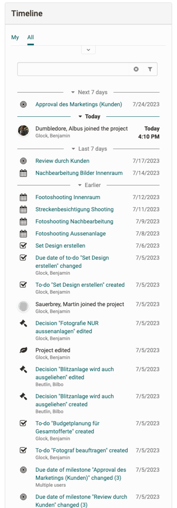

# Projects - Timeline

The timeline in the project shows chronologically all changes made by members to project objects and is useful to track what happened in the past.

## How it works

The timeline is divided into different sections, with future and today always expanded. With the "More" button entries from the past can be fetched. Filtering via the input field or via the filters above is possible.

Actions of a member on an object are shown on the timeline as one entry. If more than one member is working on the same object (e.g. a note), this will be marked as "multiple members".

Actions that appear in the timeline are: Create/ or upload, edit an object, delete an object. And Actions from members of the project.

