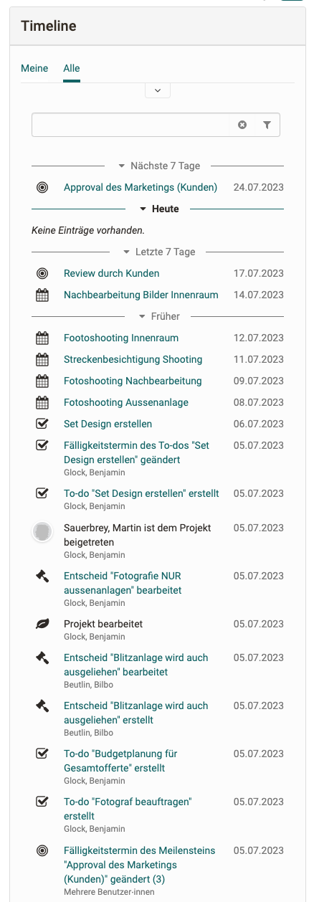

# Projects - Timeline

The Timeline in the project shows dates, milestones, due to-dos and changes.

The fact that all members' changes to project objects are displayed chronologically is helpful in keeping track of what has happened in the past.

Either all actions or only those that you have carried out yourself or in which you are/were affected in some way can be displayed.

## How it works

The timeline is divided into different sections, with the Future and Today always being expanded. Entries from the past can be retrieved with the "More" button. Filtering via the input field or via the filters above is possible.

Actions by a member on an object are shown on the timeline as one entry. If several members edit an object (e.g. a note), this is marked with the note "Multiple Members".

Actions that appear in the timeline are:

* Creating or uploading an object 
* Editing an object
* Deleting an object
* Leaving/joining a project

