# Projekte: To-dos {: #to-dos}

In allen Projekten sind einzelne Arbeitspakete (To-dos) wesentlicher Bestandteil der Planung.

!!! note "Hinweis"

    Über die Projekte hinaus können To-dos auch in anderen Bereichen erstellt und genutzt werden (bspw. QM-Massnahmen).

## To-do erstellen {: #create}

Um ein neues To-do innerhalb eines Projektes zu erstellen, haben Sie folgende Möglichkeiten:

a) `Projekte > Tab "Meine Projekte" > Projekt wählen > Schnellzugriff > Pulldown neben "Notiz erstellen" > "To-do erstellen"`

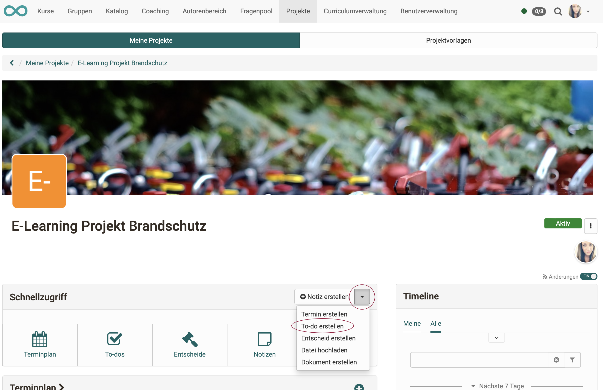{ class="shadow lightbox" }

b) `Projekte > Tab "Meine Projekte" > Projekt wählen > Abschnitt "To-dos" > Plus-Symbol`

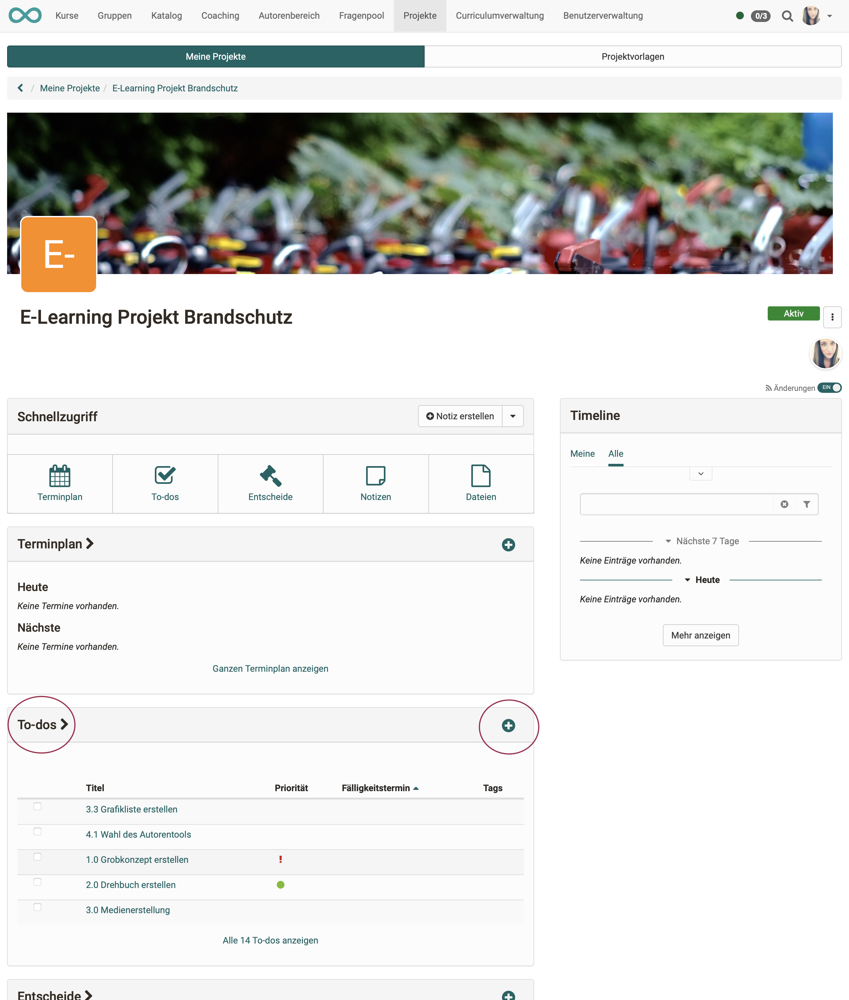{ class="shadow lightbox" }

 

c) `Projekte > Tab "Meine Projekte" > Projekt wählen > Schnellzugriff-Button "To-dos" > Button "To-do erstellen"`

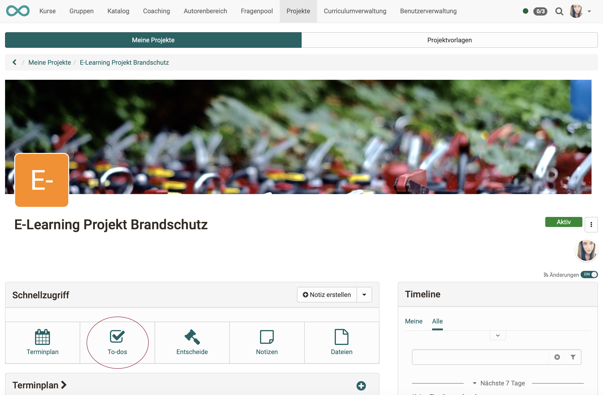{ class="shadow lightbox" }

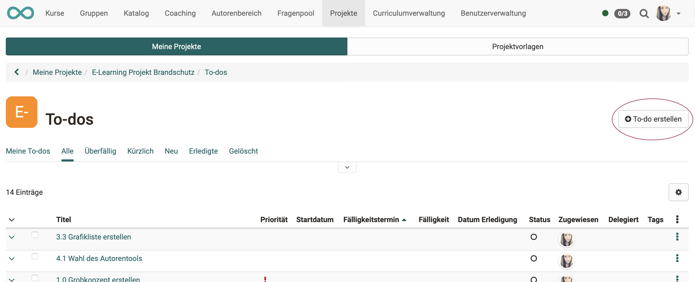{ class="shadow lightbox" }

[Zum Seitenanfang ^](#to-dos)

---

## Liste der To-dos anzeigen {: #list}

Haben Sie Ihr Projekt gewählt, können Sie von der Projektübersicht aus auf verschiedene Arten auf die To-dos der jeweiligen Projekte zugreifen.

a) `Projekte > Tab "Meine Projekte" > Projekt wählen > Schnellzugriff-Button "To-dos"` 
oder 
b) `Projekte > Tab "Meine Projekte" > Projekt wählen > Titel des Abschnitts "To-dos"` 
oder 
c) `Projekte > Tab "Meine Projekte" > Projekt wählen > Abschnitt "To-dos" > "Alle To-dos anzeigen"`

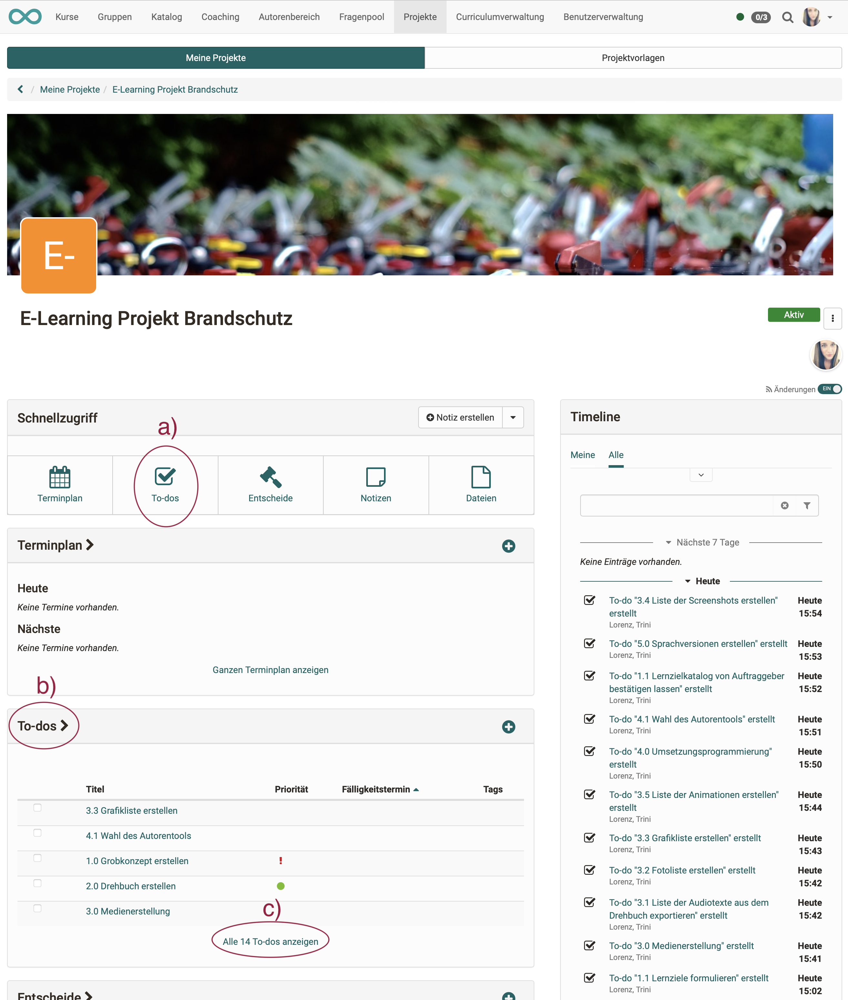{ class="shadow lightbox" }

[Zum Seitenanfang ^](#to-dos)

---

## To-do bearbeiten {: #edit}

Um ein To-do zu bearbeiten, klicken Sie in der To-do-Liste

**a) auf den Titel des To-dos** 
oder 
**b) auf die 3 Punkte am Ende einer Zeile.**

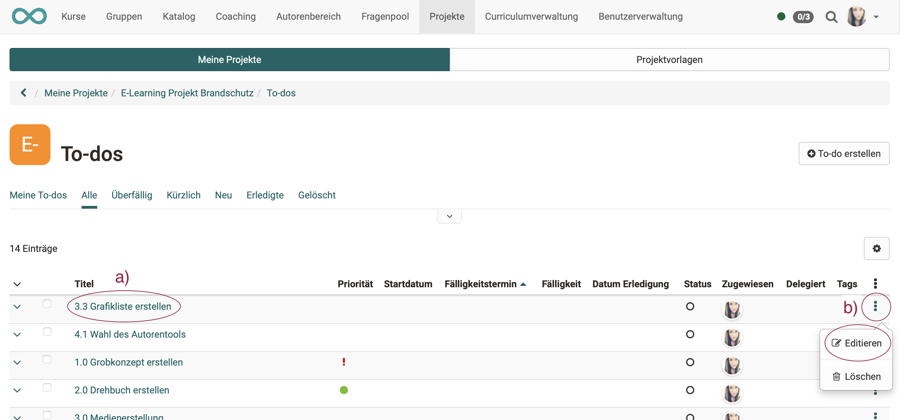{ class="shadow lightbox" }

[Zum Seitenanfang ^](#to-dos)

---

## To-do zuweisen und delegieren {: #assign}

Ein neu erstelltes To-do wird zunächst automatisch der Erstellerin / dem Ersteller **zugewiesen**. (Es kann dann aber einer anderen Person zugewiesen werden.)

In einem weiteren Feld kann bestimmt werden, ob und an wen das To-do **delegiert** wird.

Die Unterscheidung zwischen Zuweisung und Delegation ermöglicht es, klar nachzuvollziehen, wer ursprünglich für ein To-do zuständig war. Die Verantwortung kann bei der zugewiesenen Person bleiben, während z.B. die Ausführung bei der/den Personen liegt, an die ein To-do delegiert wurde.

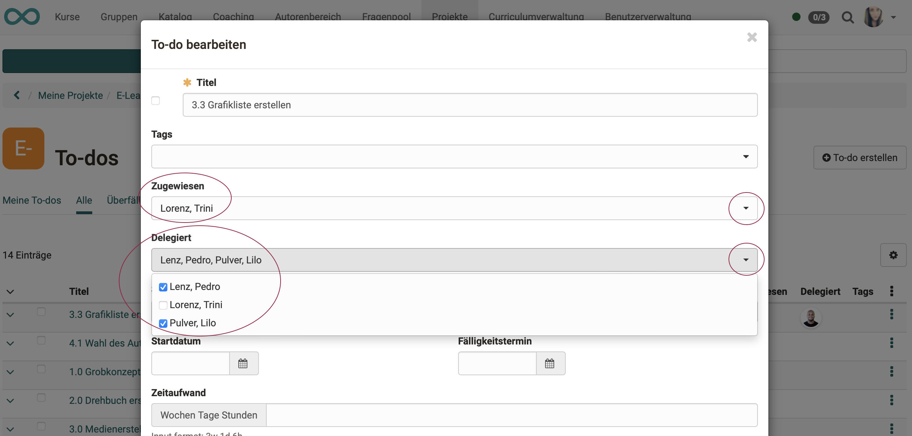{ class="shadow lightbox" }

!!! info "Wichtig"

    * Ein To-do kann mehreren Personen zugewiesen werden.

    * Ein To-do kann an mehrere Personen delegiert werden.

[Zum Seitenanfang ^](#to-dos)

---

## To-dos verlinken {: #link}

Wenn Sie ein To-do bearbeiten, können Sie Links zu anderen Objekten dieses Projekts erstellen, indem Sie zu einem bereits bestehenden Objekt verlinken **(Button "Objekt verlinken")**.

**Unterschied "Objekt verlinken" und "Link hinzufügen"** 
Oft taucht während dem Erstellen eines To-dos das Bedürfnis auf, noch einen Entscheid, einen zusätzlichen Termin oder ein weiteres To-do zu erstellen.
Mit dem **Button "Link hinzufügen"** können Sie diese Objekte neu erstellen und sie sind dann automatisch schon mit dem aktuellen To-do verlinkt. Der lange Umweg (anderen Objekttyp wählen, Objekt neu erstellen, Rückkehr zum To-do und erst dann die Verlinkung vornehmen) entfällt dadurch.

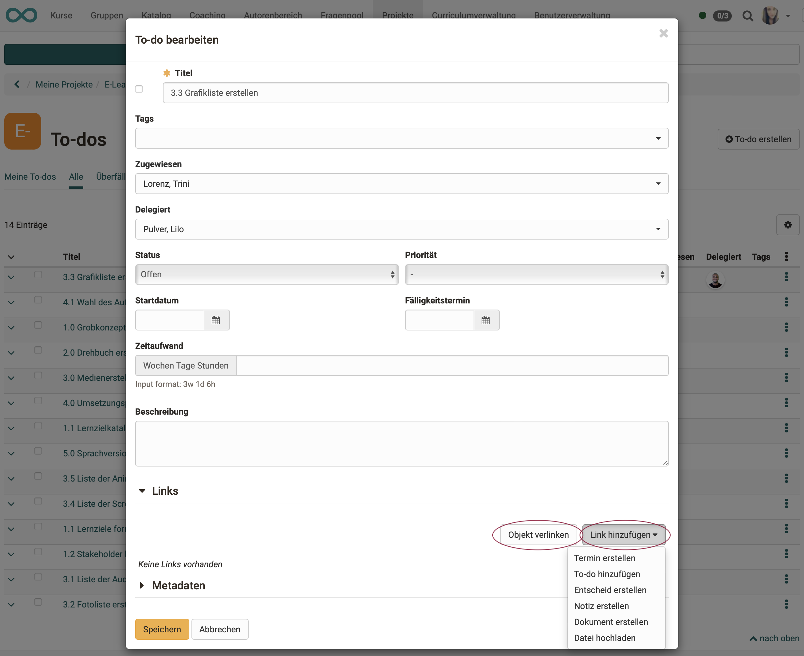{ class="shadow lightbox" }

Verlinkte Objekte können z.B. Entscheide sein:

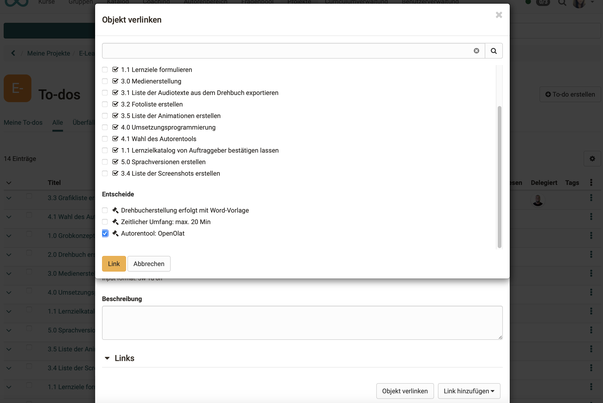{ class="shadow lightbox" }

Einem To-do hinzugefügte Links können direkt aufgerufen werden.

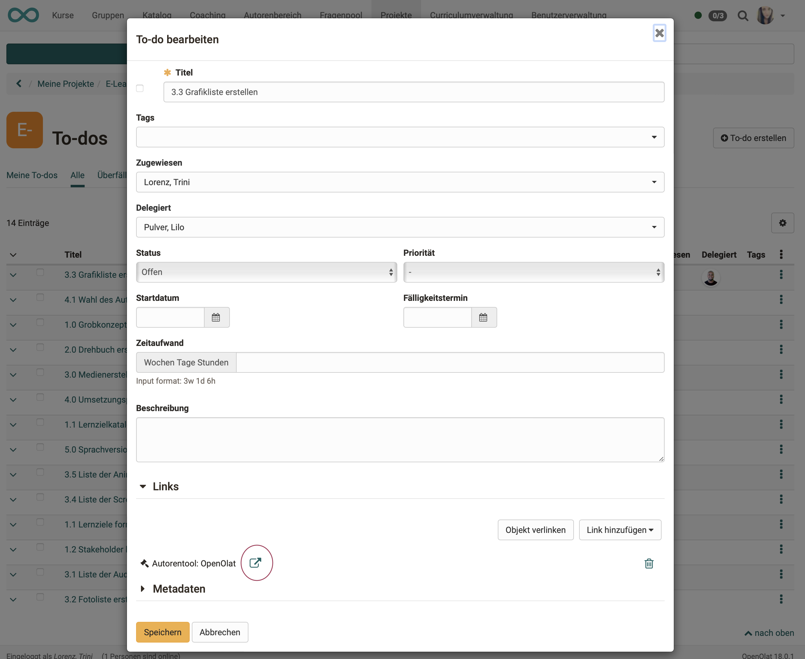{ class="shadow lightbox" }

!!! info "Was passiert, wenn ein verlinktes Objekt gelöscht wird?"

    Wird ein verlinktes Objekt gelöscht, werden auch die Links gelöscht, die aus anderen Objekten auf dieses Objekt zeigen.

[Zum Seitenanfang ^](#to-dos)

---

## Erledigte To-dos {: #done}

Damit ein To-do als erledigt gilt, muss sein Status geändert werden. Diese Änderung kann auf verschiedene Arten erfolgen.

**a) Status in der Bearbeitungsmaske ändern**

Im Popup zur Bearbeitung eines To-dos kann auch der Status eingestellt werden.

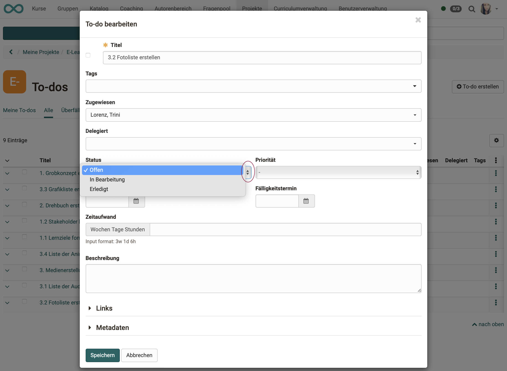{ class="shadow lightbox" }

**b) "Abhaken" eines To-dos**

Wird in der Checkbox vor dem Titel ein Häkchen gesetzt, ändert sich der Status auf "Erledigt".

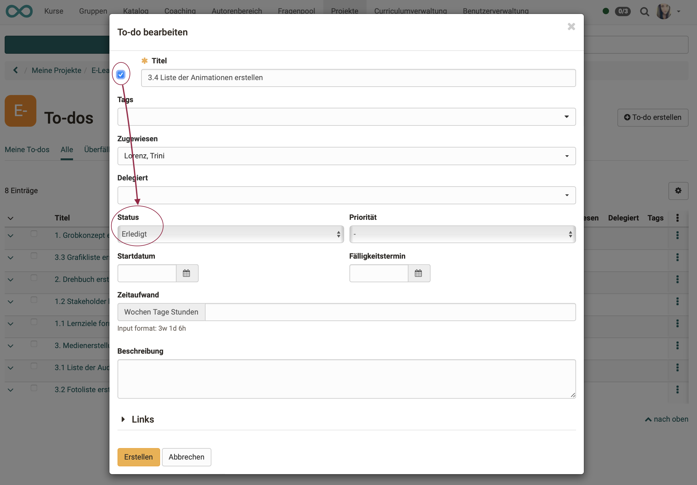{ class="shadow lightbox" }

**c) "Abhaken" eines To-dos in der Liste**

Wird in der To-do-Liste ein Eintrag durch Auswahl der Checkbox am Zeilenbeginn selektiert, wird er automatisch als erledigt markiert.
Das To-do erscheint dann nur noch unter Tab "Alle" und Tab "Erledigte".

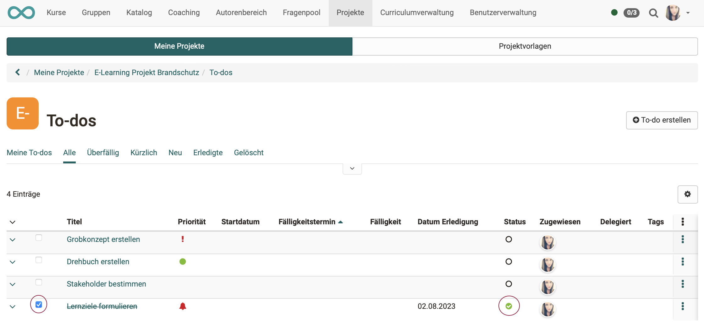{ class="shadow lightbox" }

[Zum Seitenanfang ^](#to-dos)

---

## To-dos löschen {: #delete}

Zum Löschen eines To-dos klicken Sie auf die 3 Punkte am Ende einer Zeile und dann auf "Löschen". Das To-do erscheint dann nur noch unter dem Tab "Gelöscht". Es kann nicht wiederhergestellt werden.

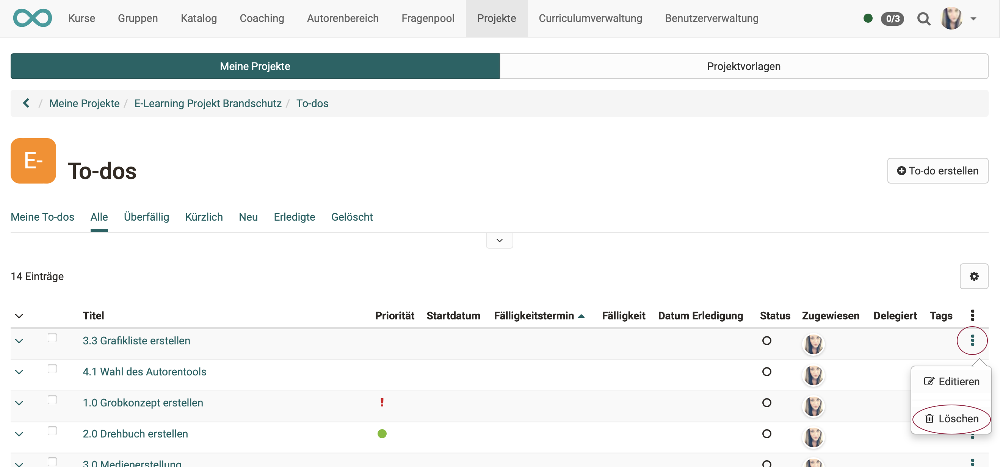{ class="shadow lightbox" }

Wollen Sie mehrere To-dos auf einmal löschen (Sammelaktion), dann wählen Sie die Listenansicht und markieren die gewünschten Checkboxen am Anfang der Zeilen. Dadurch wird ein Button "Löschen" oberhalb der Liste eingeblendet.

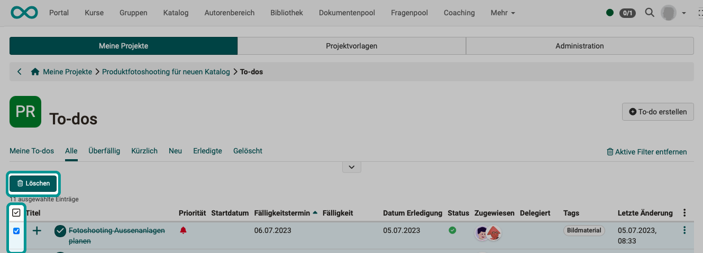{ class="shadow lightbox" }

[Zum Seitenanfang ^](#to-dos)

