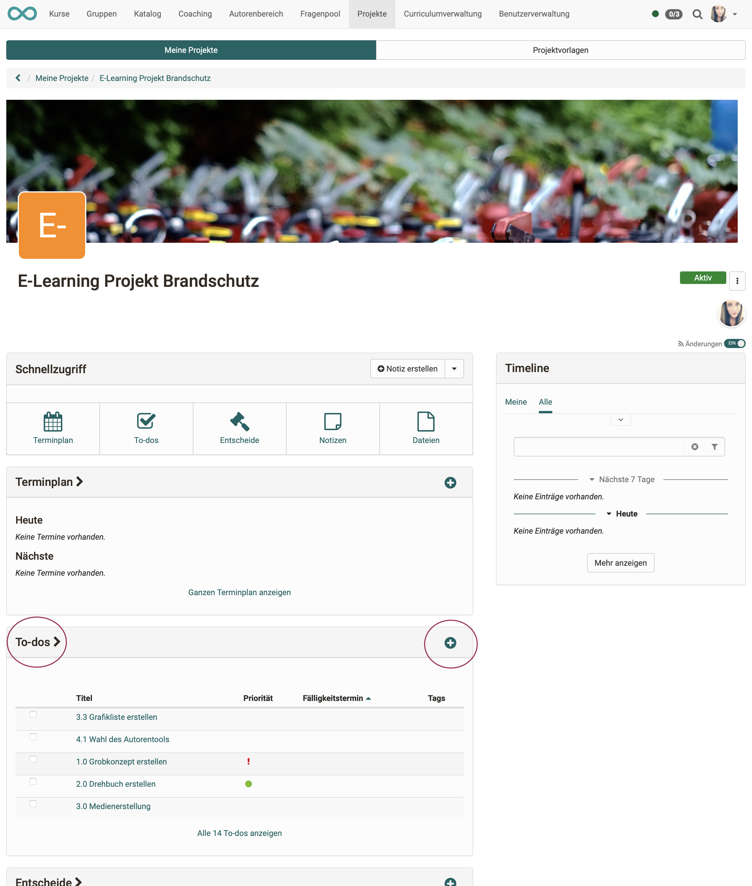
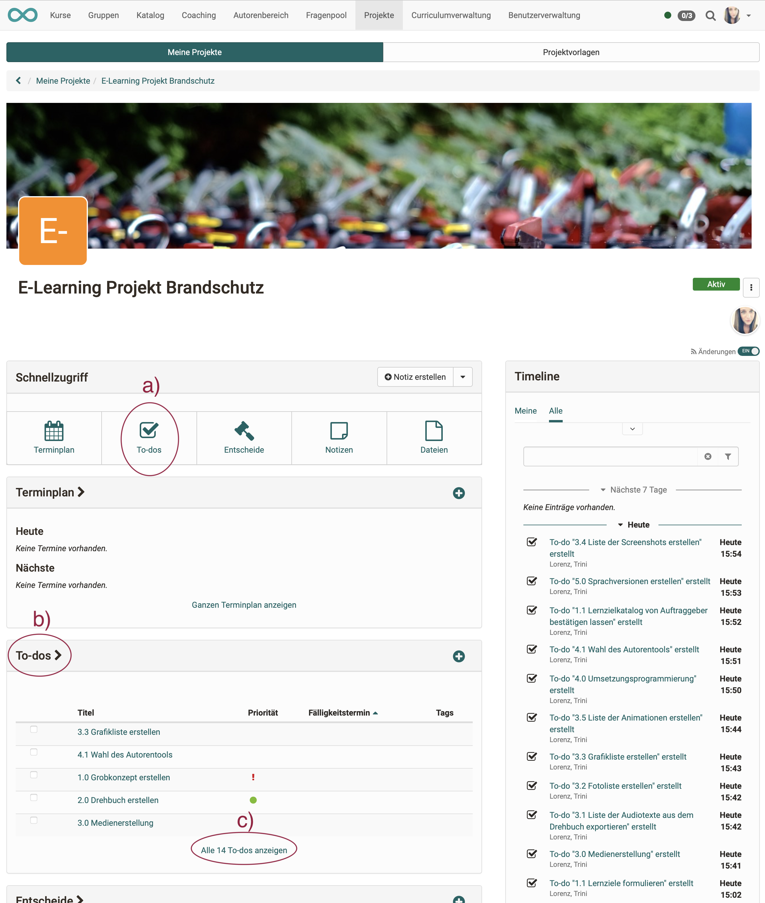
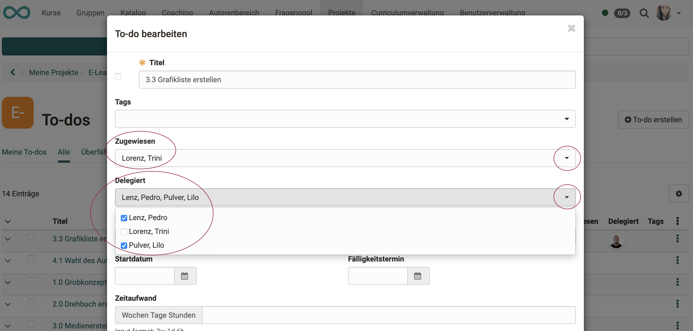
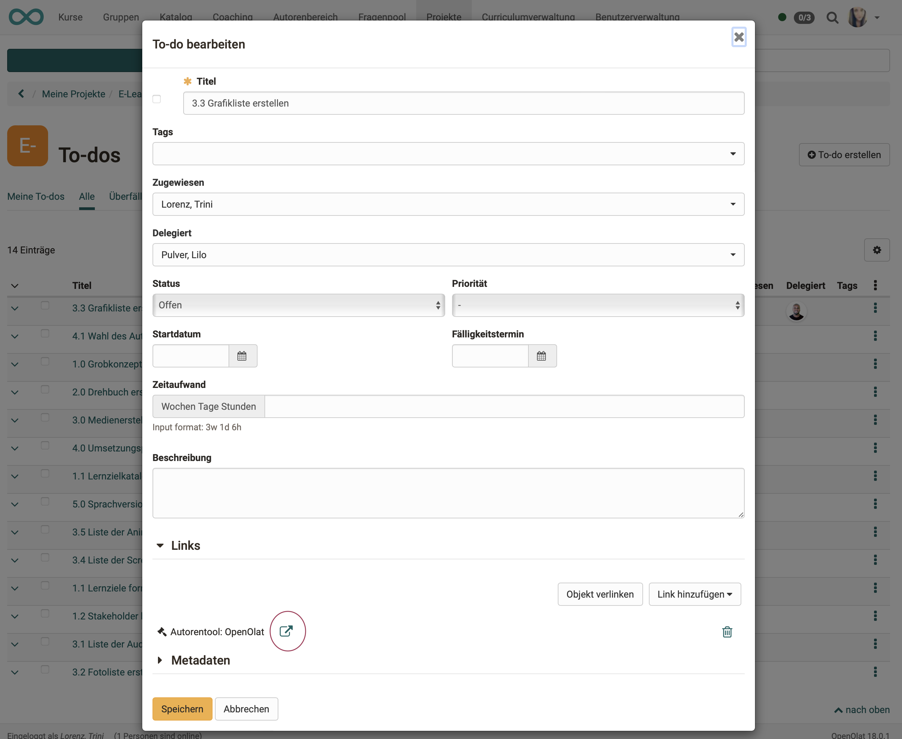
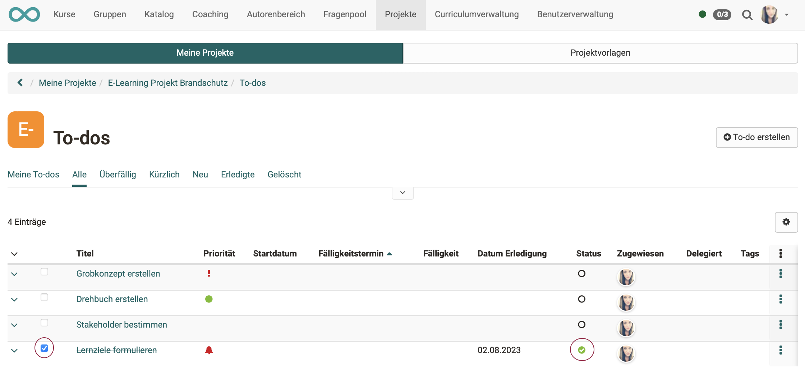

# Projekte - To-dos

In allen Projekten sind einzelne Arbeitspakete (To-dos) wesentlicher Bestandteil der Planung.

!!! note "Hinweis"

    Über die Projekte hinaus können To-dos auch in anderen Bereichen erstellt und genutzt werden (bspw. QM-Massnahmen).

## To-do erstellen

Um ein neues To-do innerhalb eines Projektes zu erstellen haben Sie folgende Möglichkeiten:

**a) Projekte > Tab „Meine Projekte“ > Projekt wählen > im Pulldown: „To-do erstellen“**

{ class="shadow lightbox" }

**b) Projekte > Tab „Meine Projekte“ > Projekt wählen > Klick auf das Plus-Symbol im Abschnitt „To-dos“**

{ class="shadow lightbox" }

 

**c) Projekte > Tab „Meine Projekte“ > Projekt wählen > Schnellzugriff Button „To-do“ > Klick auf den Button „To-do erstellen“**<

{ class="shadow lightbox" }

{ class="shadow lightbox" }

## Liste der To-dos anzeigen

Haben Sie Ihr Projekt gewählt, können Sie von der Projektübersicht aus auf verschiedene Arten auf die to-dos der jeweiligen Projekte zugreifen.

**a) Projekte > Tab „Meine Projekte“ > Projekt wählen > Schnellzugriff Button „To-do“** 
oder 
**b) Projekte > Tab „Meine Projekte“ > Projekt wählen > Titel im Abschnitt „To-dos“ anklicken** 
oder 
**c) Projekte > Tab „Meine Projekte“ > Projekt wählen > im Abschnitt „alle To-dos anzeigen“ klicken**

{ class="shadow lightbox" }

## To-do bearbeiten

Um ein to-do zu bearbeiten klicken Sie in der To-do-Liste

**a) auf den Titel des to-do’s** 
oder 
**b) auf die 3 Punkte am Ende einer Zeile.**

{ class="shadow lightbox" }

## To-do zuweisen und delegieren

Ein neu erstelltes To-do wird zunächst automatisch der Erstellerin / dem Ersteller **zugewiesen**. (Es kann dann aber einer anderen Person zugewiesen werden.)

In einem weiteren Feld kann bestimmt werden, ob und an wen das To-do **delegiert** wird.

Die Unterscheidung zwischen Zuweisung und Delegation ermöglicht es, 
- klar nachzuvollziehen, wer ursprünglich für ein To-do zuständig war. 
- Die Verantwortung kann bei der zugewiesenen Person bleiben, während z.B. die Ausführung bei der/den Personen liegt, an die ein To-do delegiert wurde.

{ class="shadow lightbox" }

!!! note "Hinweise"

    * Ein To-do kann mehreren Personen zugewiesen werden.

    * Ein To-do kann an mehrere Personen delegiert werden.

## To-dos verlinken

Wenn Sie ein To-do bearbeiten, können Sie Links zu anderen Objekten dieses Projekts erstellen, indem Sie zu einem bereits bestehenden Objekt verlinken **(Button „Objekt verlinken")**.

**Unterschied „Objekt verlinken" und „Link hinzufügen"** 
Oft taucht während dem Erstellen eines To-dos das Bedürfnis auf, noch einen Entscheid, einen zusätzlichen Termin oder ein weiteres To-Do zu erstellen.
Mit dem **Button „Link hinzufügen"**, können Sie diese Objekte neu erstellen und sie sind dann automatisch schon mit dem aktuellen Entscheid verlinkt. Der lange Umweg (anderen Objekttyp wählen, Objekt neu erstellen, Rückkehr zum Entscheid und erst dann die Verlinkung vornehmen) entfällt dadurch.

{ class="shadow lightbox" }

Verlinkte Objekte können z.B. Entscheide sein: 

{ class="shadow lightbox" }

Einem To-do hinzugefügte Links können direkt aufgerufen werden.

{ class="shadow lightbox" }

!!! info "Was passiert, wenn ein verlinktes Objekt gelöscht wird?"

    Wird ein verlinktes Objekt gelöscht, werden auch die Links gelöscht, die aus anderen Objekten auf dieses Objekt zeigen.

## Erledigte To-dos

Damit ein To-do als erledigt gilt, muss sein Status geändert werden. Diese Änderung kann auf verschiedene Arten erfolgen.

**a) Status in der Bearbeitungsmaske ändern**

Im Popup zur Bearbeitung eines To-do’s kann auch der Status eingestellt werden.

{ class="shadow lightbox" }

**b) „Abhaken“ eines To-do’s** 

Wird in der Checkbox vor dem Titel ein Häkchen gesetzt, ändert sich der Status auf „Erledigt“.

{ class="shadow lightbox" }

**c) „Abhaken“ eines To-do’s in der Liste**

Wird in der To-Do Liste ein Eintrag durch Auswahl der Checkbox am Zeilenbeginn selektiert, wird er automatisch als erledigt markiert.
Das To-do erscheint dann nur noch unter Tab „Alle“ und Tab „Erledigte“.

{ class="shadow lightbox" }

## To-dos löschen

Zum Löschen eines To-do’s klicken Sie auf die 3 Punkte am Ende einer Zeile und dann auf „Löschen". Das To-do erscheint dann nur noch unter dem Tab „Gelöscht“. Es kann nicht wiederhergestellt werden.

{ class="shadow lightbox" }
