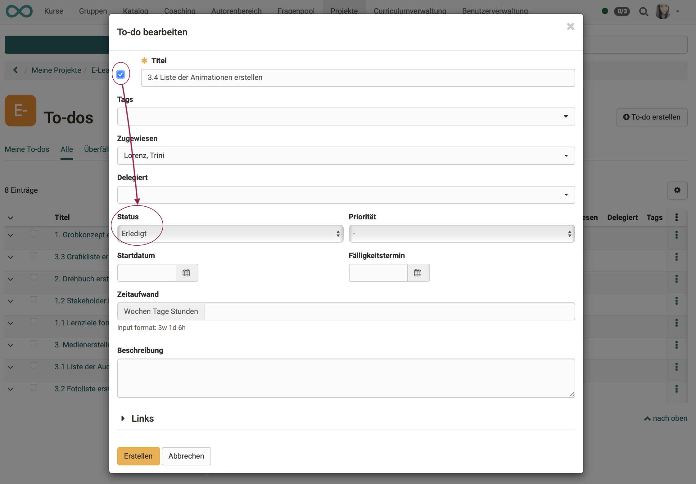

# Projects: To-dos {: #to-dos}

In all projects, individual work packages (to-dos) are an essential part of the planning.

!!! note "Note"

    Beyond the projects, to-dos can also be created and used in other areas (e.g. QM measures).

## Create to-dos {: #create}

To create a new to-do within a project, you have the following options:

**a) Projects > Tab "My projects" > Select project > in the pulldown: "Create to-do"**

{ class="shadow lightbox" }

**b) Projects > Tab "My projects" > Select project > Click on the plus-symbol in the section "To-dos"**

{ class="shadow lightbox" }

 

**c) Projects > Tab "My projects" > Select project >  Quick start button "To-do" > Click on the button "Create to-do"**<

{ class="shadow lightbox" }

{ class="shadow lightbox" }

[To the top of the page ^](#to-dos)

---

## Show list of to-dos {: #list}

Once you have selected your project, you can access the to-dos of the respective projects in various ways from the project overview.

**a) Projects > Tab "My projects" > Select project >  Quick start button "To-do"** 
or 
**b) Projects > Tab "My projects" > Select project >  Click the title in the section "To-dos"** 
or 
**c) Projects > Tab "My projects" > Select project >  Click on the section "Show all to-dos"**

{ class="shadow lightbox" }

[To the top of the page ^](#to-dos)

---

## Edit to-do {: #edit}

To edit a to-do, click the following in the to-do list:

**a) on the title of the to-do** 
or 
**b) on the three dots at the end of a line.**

{ class="shadow lightbox" }

[To the top of the page ^](#to-dos)

---

## Assign and delegate to-do {: #assign}

A newly created to-do is first automatically **assigned** to the creator. (However, it can then be assigned to another person).

In another field, you can determine whether and to whom the to-do is **delegated**.

The distinction between assignment and delegation makes it possible, 
- to clearly understand who was originally responsible for a to-do. 
- The responsibility can remain with the assigned person, while e.g. the execution lies with the person(s) to whom a to-do has been delegated.

{ class="shadow lightbox" }

!!! note "Note"

    * A to-do can be assigned to several people.

    * A to-do can be delegated to several people.

[To the top of the page ^](#to-dos)

---

## Link to-dos {: #link}

When you edit a to-do, you can create links to other objects of this project by linking to an already existing object **(button "Link object")**.

**Difference between "Link object" and "Add link"** 
Often, while creating a to-do, the need arises to create another decision, an additional appointment or another to-do.
With the **"Add link"** button, you can create these objects again and they are then automatically linked to the current decision.  The long diversions (select another object type, create a new object, return to the decision and only then create the link) are thus eliminated.

{ class="shadow lightbox" }

Linked objects can for example be to-dos: 

{ class="shadow lightbox" }

Links added to a to-do can be accessed directly.

{ class="shadow lightbox" }

!!! info "What happens if a linked object is deleted?"

    If a linked object is deleted, the links pointing to this object from other objects are also deleted.

[To the top of the page ^](#to-dos)

---

## Completed to-dos {: #done}

In order for a to-do to be considered completed, its status must be changed. This change can be made in several different ways.

**a) Change status in the edit screen**

In the pop-up for editing a to-do, the status can also be set.

{ class="shadow lightbox" }

**b) "Checking off" a to-do** 

If a tick is set in the checkbox in front of the title, the status changes to "Done".

{ class="shadow lightbox" }

**c) "Checking off" a to-do in the list**

If an entry is selected in the To-Do list by selecting the checkbox at the beginning of the line, it is automatically marked as completed.
The to-do then only appears under the "All" tab and the "Done" tab.

{ class="shadow lightbox" }

[To the top of the page ^](#to-dos)

---

## Delete to-dos {: #delete}

To delete a to-do, click on the 3 dots at the end of a line and then on "Delete". The to-do then only appears under the tab "Deleted". It cannot be restored.

{ class="shadow lightbox" }

If you want to delete several to-dos at once (bulk action), select the list view and tick the desired checkboxes at the beginning of the lines. This will display a ‘Delete’ button above the list.

{ class="shadow lightbox" }

[To the top of the page ^](#to-dos)