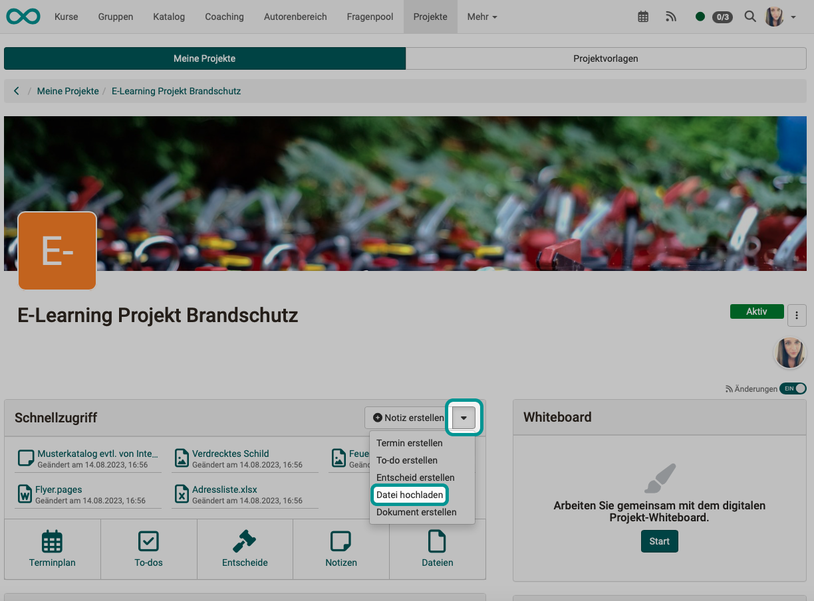
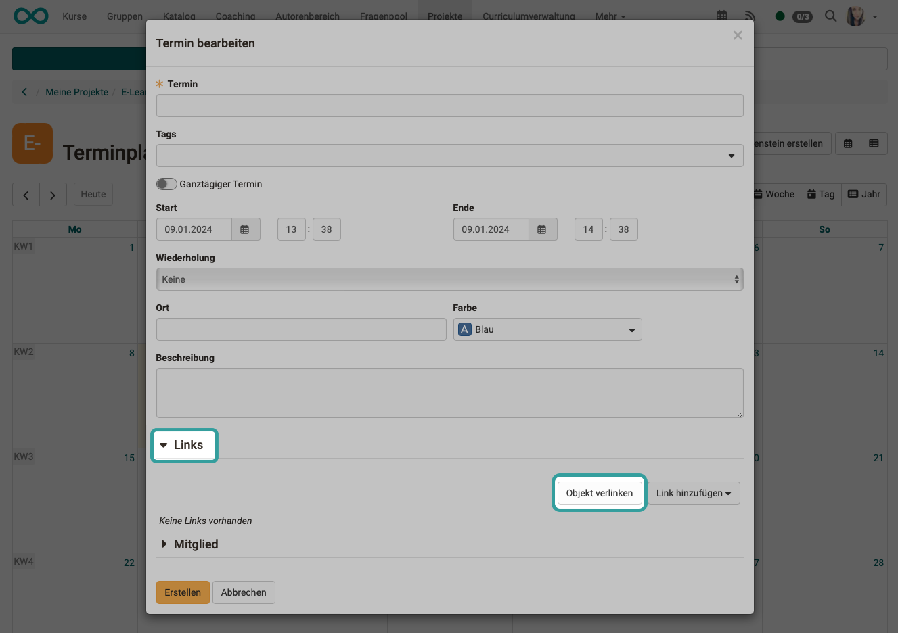

# Projekte - Video und Audio

## Wo und wie können in Projekten Video und Audio integriert werden?

Videos und Audios können in OpenOlat sowohl **hochgeladen** als auch an verschiedenen Stellen direkt **aufgenommen** werden. Die neu aufgenommenen oder hochgeladenen Video- und Audiodateien können dann in allen weiteren Bereichen eines Projektes **verlinkt** werden. 
Die direkte Aufnahmemöglichkeit von Audio und Video wird schrittweise ausgebaut.

## Upload

Innerhalb von Projekten können Video- und Audiodateien vor allem unter **"Dateien"** hochgeladen und dann in allen weiteren Bereichen verlinkt werden. Der Upload ist auch im Schnellzugriff verfügbar.

{ class="shadow lightbox" }

## Recording

Im Bereich **Dateien** eines OpenOlat-Projektes gibt es neben dem Button zum Hochladen verschiedener Dateien auch die Möglichkeit, Videos und Audiodateien direkt in OpenOlat aufzunehmen.

Neu aufgenommene Videos werden als mp4-Dateien gespeichert, Audios als m4a-Dateien.

{ class="shadow lightbox" }

## Verlinkung

In allen Objekten innerhalb eines Projektes (Termine, To-dos, Entscheide, Notizen, Dateien) können Sie Links hinzufügen. Wenn kein Video oder Audio direkt aufgenommen werden kann, ist dies der Weg um Videos und Audios einzubinden:

* Nehmen Sie das Video oder Audio anderweitig auf.
* Laden Sie die Datei im Projekt unter **Dateien** hoch.
* Verlinken Sie die Video- oder Audiodatei mit einem beliebigen Objekt.

{ class="shadow lightbox" }

## Download

Insbesondere die selbst direkt in OpenOlat aufgenommenen Video- und Audiodateien möchten Sie wahrscheinlich manchmal auch herunterladen. Sie können in Projekten unter **Dateien** auch die Video- und Audiodateien herunterladen.

{ class="shadow lightbox" }

Sollen alle Dateien auf einmal heruntergeladen werden, benutzen Sie den Button mit den 3 Punkten rechts oben. In der so erzeugten zip-Datei sind dann auch die Video- und Audiodateien enthalten.

{ class="shadow lightbox" }

## Video/Audio in Reports

Beim Erstellen von Reports (z.B. auch für die Archivierung eines Projekts) können alle Dateien mit heruntergeladen werden. Die Video- und Audiodateien sind darin ebenfalls enthalten.
