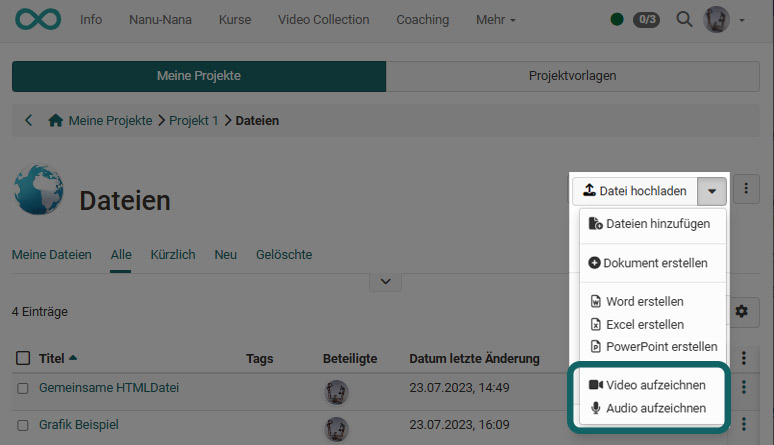

# Projekte - Video und Audio

## Wo und wie können in Projekten Video und Audio integriert werden?

Videos und Audios können in OpenOlat sowohl **hochgeladen** als auch an verschiedenen Stellen direkt **aufgenommen** werden. Die neu aufgenommenen oder hochgeladenen Video- und Audiodateien können dann in allen weiteren Bereichen eines Projektes **verlinkt** werden. 

## Upload

Innerhalb von Projekten können Video- und Audiodateien vor allem unter "[Dateien](../area_modules/Project_Files.de.md)" hochgeladen und dann in allen weiteren Bereichen verlinkt werden. Der Upload ist auch im Schnellzugriff verfügbar.

{ class="shadow lightbox" }

## Recording

Im Bereich **Dateien** eines OpenOlat-Projektes gibt es neben dem Button zum Hochladen verschiedener Dateien auch die Möglichkeit, Videos und Audiodateien direkt in OpenOlat aufzunehmen.

Neu aufgenommene Videos werden als mp4-Dateien gespeichert, Audios als m4a-Dateien.

{ class="shadow lightbox" }

## Verlinkung

In allen Objekten innerhalb eines Projektes (Termine, To-dos, Entscheide, Notizen, Dateien) können Sie projektinterne Links hinzufügen. Auf diesem Weg können Sie auch Verbindungen zu Videos herstellen.

### Objekt verlinken
Wählen Sie diese Option, wenn sich Ihr Video bereits im Bereich Dateien des Projektes befindet. Sie können aus der Liste direkt die gewünschte Datei markieren. 

{ class="shadow lightbox" }

### Link hinzufügen
Hier können Sie über "Datei hochladen" Ihre Video Datei hochladen. Sie wird dann im Bereich "Dateien" des Projektes abgelegt und mit dem Objekt passend verlinkt. 

!!! warning "Achtung"

    Mit Verlinkung ist hier nicht ein Link zu einer extern im Internet vorliegenden Video-Datei z.B. in YouTube gemeint. Derartige Links können z.B. über eine HTML-Seite mit entsprechenden Links hergestellt werden. 

## Download

Insbesondere die selbst direkt in OpenOlat aufgenommenen Video- und Audiodateien möchten Sie wahrscheinlich manchmal auch herunterladen. Da alle projektbezogenen Videos, die Sie in OpenOlat hochgeladen oder erstellt haben im Bereich "Dateien" abgelegt werden, können Sie diese dort auch herunterladen oder löschen. 

{ class="shadow lightbox" }

Um mehrere Dateien auf einmal herunterzuladen verwenden Sie am besten sie Tabellenansicht. Hier können Sie auf einen Schlag mehrere Dateien herunterladen oder löschen. 

Sollen *alle* Dateien auf einmal heruntergeladen werden, benutzen Sie den Button mit den 3 Punkten rechts oben. In der so erzeugten zip-Datei sind dann auch die Video- und Audiodateien enthalten.

{ class="shadow lightbox" }

## Video/Audio in Reports

Beim Erstellen von Reports (z.B. auch für die Archivierung eines Projekts) können alle Dateien mit heruntergeladen werden. Die Video- und Audiodateien sind darin ebenfalls enthalten.

{ class="shadow lightbox" }
