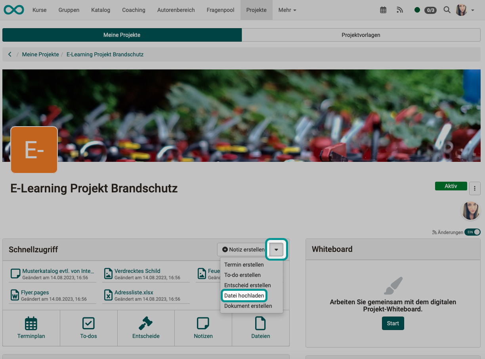
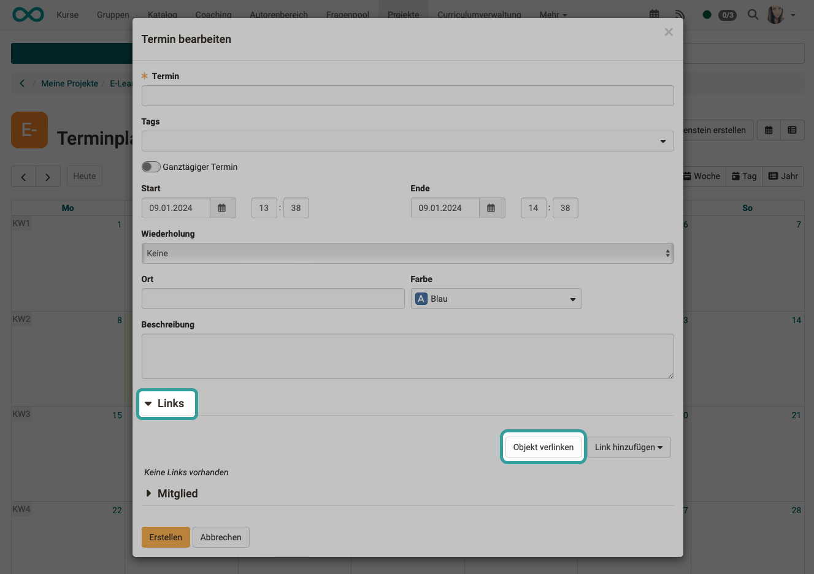
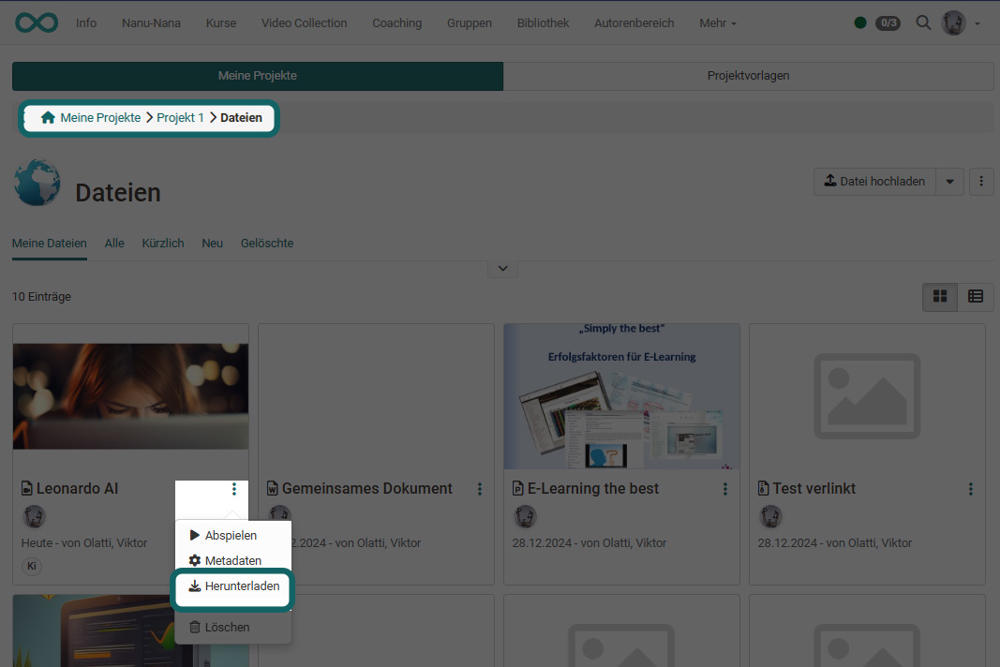
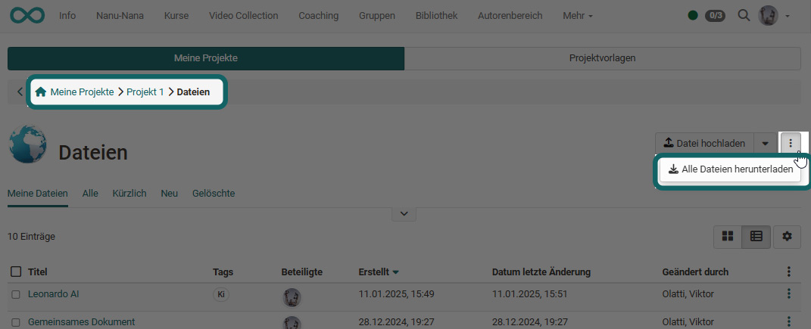
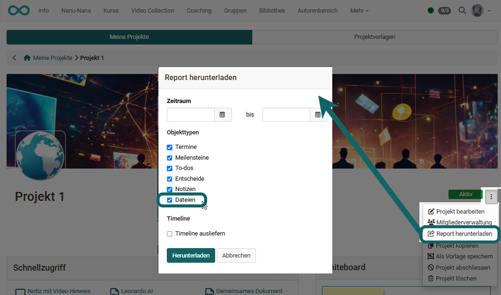

# Projects - Video and Audio

## Where and how video and audio can be integrated into projects?

Videos and audio can be **uploaded** in OpenOlat as well as **recorded** directly in various places. The newly recorded or uploaded video and audio files can then be **linked** in all other areas of a project. 
The direct recording option for audio and video is gradually being expanded.

## Upload

Within projects, video and audio files can be uploaded under "[Files](../area_modules/Project_Files.md)" and then linked in all other areas. The upload is also available in quick access.

{ class="shadow lightbox" }

## Recording

In the **Files** section of an OpenOlat project, in addition to the button for uploading various files, there is also the option of recording videos and audio files directly in OpenOlat.

Newly recorded videos are saved as mp4 files, audio as m4a files.

{ class="shadow lightbox" }

## Linking

You can add project-internal links to all objects within a project (Schedule, To-dos, Decisions,Notes, Files). You can also create links to videos in this way.

### Link object
Select this option if your video is already in the Files area of the project. You can select the desired file directly from the list. 

{ class="shadow lightbox" }

### Add link 

Here you can upload your video file via "Upload file". It will then be stored in the "Files" section of the project and linked to the object. 

!!! warning "Attention"

    Linking here does not mean a link to an external video file available on the Internet, e.g. on YouTube. Such links can be created, for example, via an HTML page with corresponding links. 

## Download

In particular, you will probably sometimes want to download video and audio files that you have recorded directly in OpenOlat. As all project-related videos that you have uploaded or created in Olat are stored in the "Files" area, you can also download or delete them there. 

{ class="shadow lightbox" }

To download several files at once, it is best to use the table view. Here you can download or delete several files at once. 

If you want to download all files at once, use the button with the 3 dots at the top right. The zip file created in this way also contains the video and audio files.

{ class="shadow lightbox" }

## Video/Audio in Reports

When creating reports (e.g. also for archiving a project), all files can also be downloaded. The video and audio files are also included.

{ class="shadow lightbox" }
