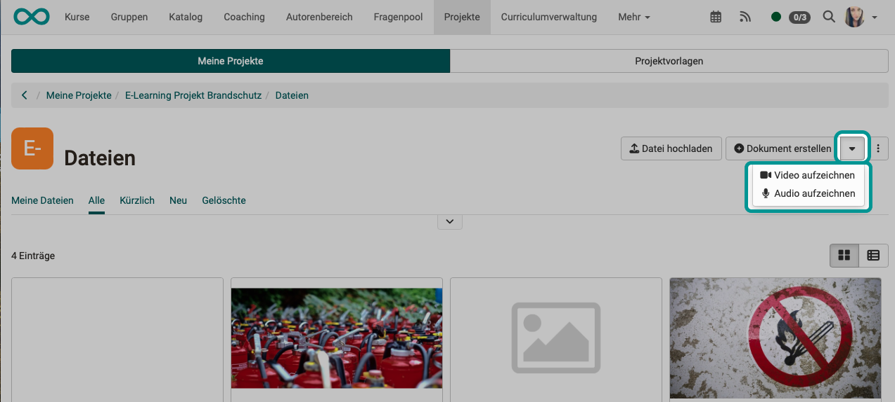
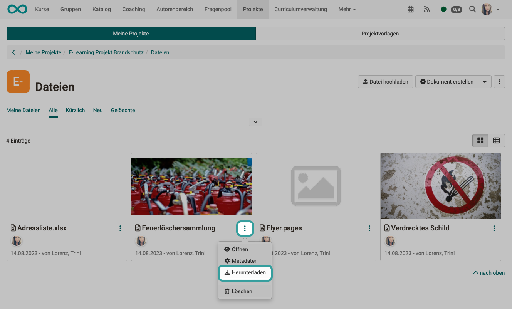

# Projects - Video and Audio

## Where and how video and audio can be integrated into projects?

Videos and audio can be **uploaded** in OpenOlat as well as **recorded** directly in various places. The newly recorded or uploaded video and audio files can then be **linked** in all other areas of a project. 
The direct recording option for audio and video is gradually being expanded.

## Upload

Within projects, video and audio files can be uploaded under **"Files"** and then linked in all other areas. The upload is also available in quick access.

{ class="shadow lightbox" }

## Recording

In the **Files** section of an OpenOlat project, in addition to the button for uploading various files, there is also the option of recording videos and audio files directly in OpenOlat.

Newly recorded videos are saved as mp4 files, audio as m4a files.

{ class="shadow lightbox" }

## Linking

You can add links to all objects within a project (Schedule, To-dos, Decisions,Notes, Files). If no video or audio can be recorded directly, this is the way to integrate videos and audios:

* Record the video or audio elsewhere.
* Upload the file in the project under **Files**.
* Link the video or audio file to any object.

{ class="shadow lightbox" }

## Download

In particular, you will probably sometimes want to download video and audio files that you have recorded directly in OpenOlat. You can also download the video and audio files in projects under **Files**.

{ class="shadow lightbox" }

If you want to download all files at once, use the button with the 3 dots at the top right. The zip file created in this way also contains the video and audio files.

{ class="shadow lightbox" }

## Video/Audio in Reports

When creating reports (e.g. also for archiving a project), all files can also be downloaded. The video and audio files are also included.
