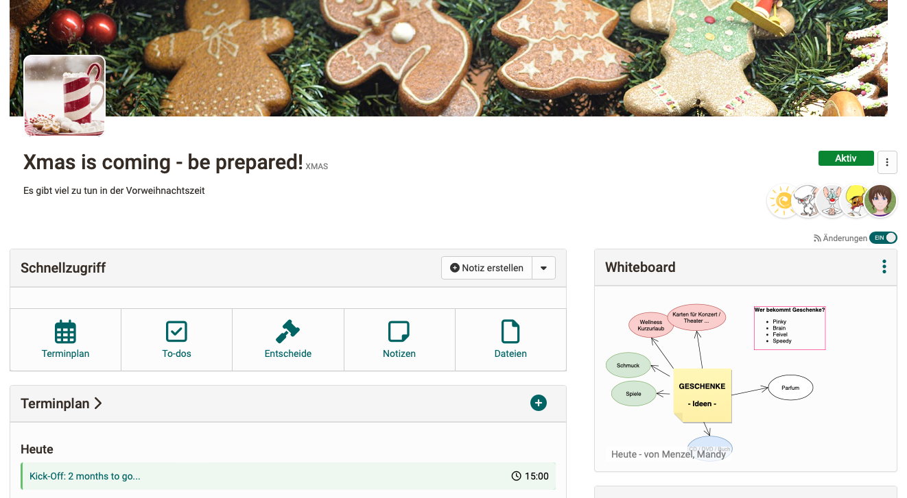
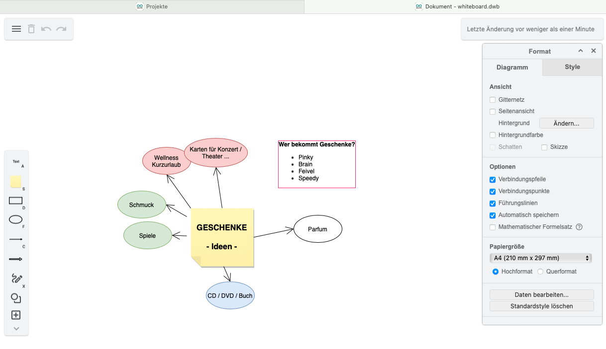

# Projekte - Whiteboard

Im Bereich "Projekte" kommt das freie Zeichen- und Diagrammwerkzeug "draw.io" als Whiteboard zum Einsatz. Es kann auch kollaborativ von mehreren Projektmitgliedern genutzt werden kann.

{ class="shadow lightbox" }

{ class="shadow lightbox" }

Die erstellten Zeichnungen werden zusammen mit den übrigen Dateien des Projektes abgelegt.

{ class="shadow lightbox" }