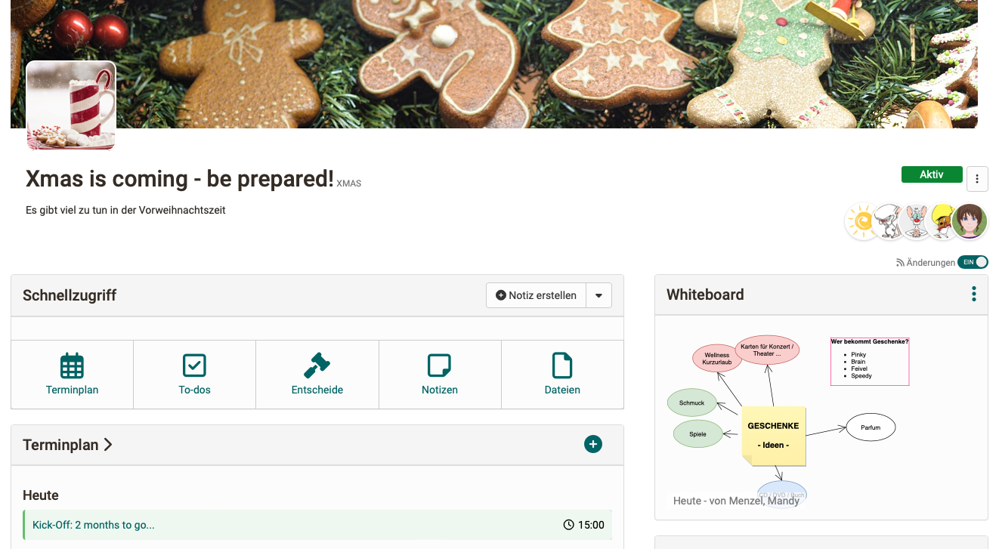
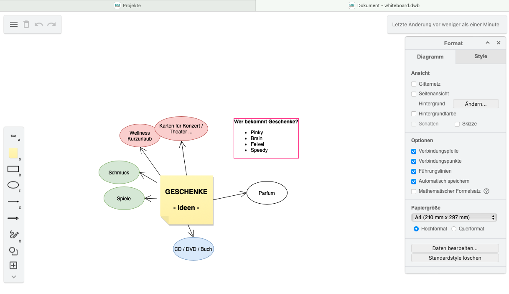
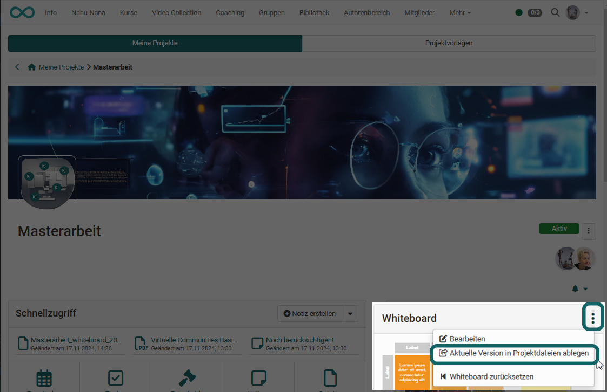

# Projects - Whiteboard

In the "Projects" area, the free drawing and diagramming tool "draw.io" is used as a whiteboard. It can also be used collaboratively by several project members.

{ class="shadow lightbox" }

{ class="shadow lightbox" }

The created drawings can also be saved together with the other files of the project: `Whiteboard > 3-dot menu > "Save current version to project files"`.

{ class="shadow lightbox" }

With "Reset whiteboard" in the same menu, OpenOlat saves the current version of the whiteboard as a file in the "Files" area and deletes the entire content of the whiteboard.
