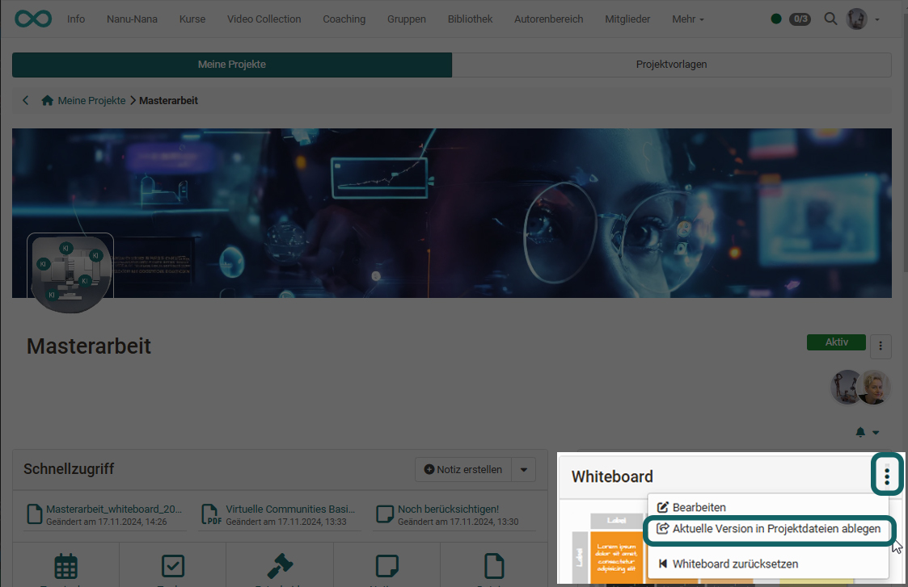

# Project - Whiteboard

In the "Projects" area, the free drawing and diagramming tool "draw.io" is used as a whiteboard. It can also be used collaboratively by several project members.

{ class="shadow lightbox" }

{ class="shadow lightbox" }

The created drawings can also be saved together with the other files in the project.

{ class="shadow lightbox" }