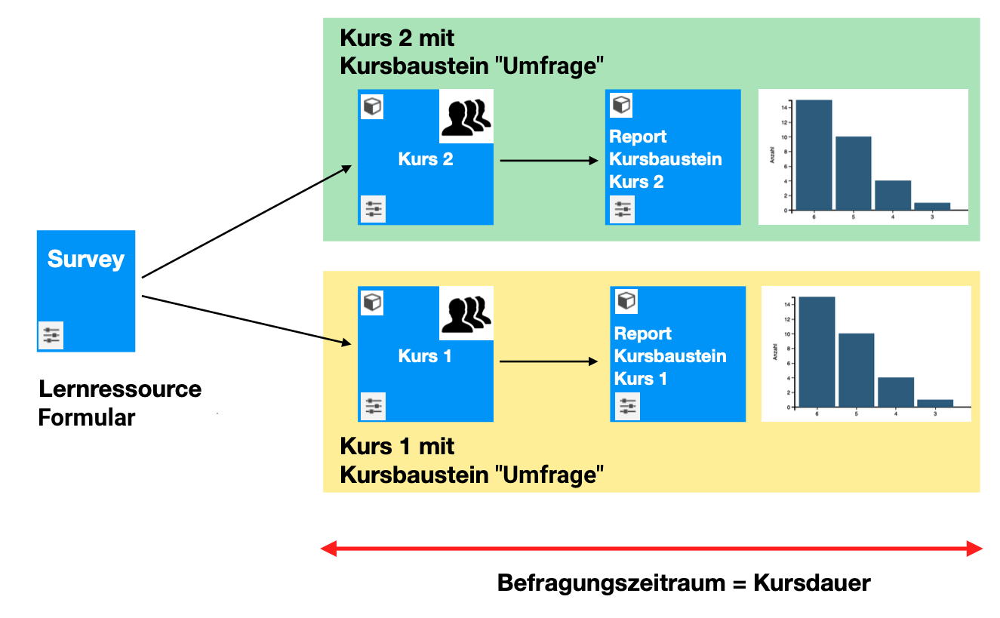
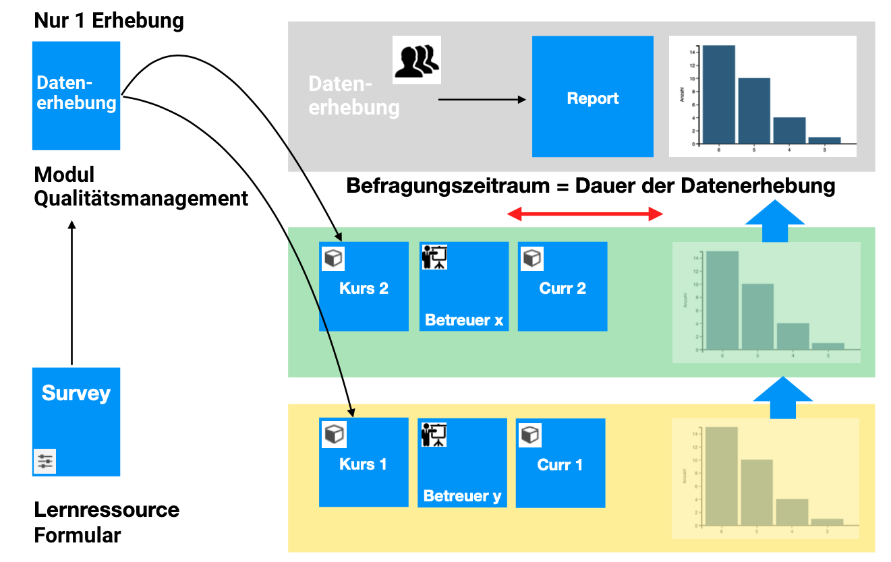
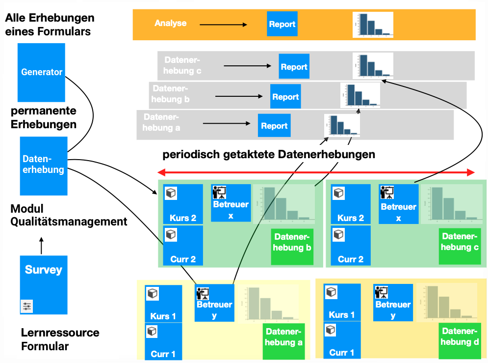

# Qualitätsmanagement: Übersicht {: #Quality_Management}

Um Rückmeldung zur Qualität von Kursen oder zur Unterricht zu erhalten, werden in OpenOlat **Formulare** innerhalb von Kursen eingesetzt.

Die Organisation von **Befragungen (Datenerhebungen)** mit diesen Formularen (insbesondere die Bestimmung des Zeitpunktes oder des Zeitfensters für die Befragung) kann durch ein **Zusatzmodul "Qualitätsmanagement"** kursübergreifend bewerkstelligt werden.

Die **Auswertung** der ausgefüllten Formulare kann durch **Qualitätsmanager:innen** ebenfalls in diesem Modul gemacht werden. Die Daten werden dort in Tabellen und Diagrammen aufbereitet.

## Fall 1: Mehrere Kurse nutzen das gleiche Formular

Für diesen einfachsten Fall wird das Modul "Qualitätsmanagement" nicht benötigt.

Eine Lernressource "Formular" wird in verschiedenen Kursen jeweils in einen Kursbaustein "Umfrage" eingebunden. Wenn in den verschiedenen Kursen das gleiche Formular verwendet wird, ist eine Vergleichbarkeit der Befragungsergebnisse gewährleistet. 

Die Teilnehmer:innen der Kurse füllen das Formular in jedem Kurs einmal aus.
Je nach Konfiguration, sind für die Teilnehmer:innen die Resultate des Reports sichtbar oder nicht. 

Der Report ist Bestandteil des Kursbausteines und fasst deshalb nur die Antworten der Mitglieder des jeweiligen Kurses zusammen. Die Reports stehen also nur kursweise zur Verfügung. 

{ class="lightbox" }

## Fall 2: Ad-hoc-Datenerhebung in mehreren Kursen
Für kursübergreifende Datenerhebungen wird das Modul "Qualitätsmanagement" benötigt. 

Dort wird eine Formular-Lernressource wird mit einer neuen Datenerhebung (= adhoc-Befragung) verknüpft.
Auf der Ebene dieser Datenerhebung werden dann Teilnehmer, Befragungsgegenstand und Datenerhebungszeitraum definiert. Der Befragungsgegenstand kann dabei variieren zwischen Betreuer, Kurs oder Curriculum/Curriculumelement, aber auch Organisation (bzw. einer Einheit davon).

Im Modul "Qualitätsmanagement" steht dann ein kursübergreifender Report zur Verfügung. 

{ class="lightbox" }

## Fall 3: Regelmässige Datenerhebung in mehreren Kursen

Im Modul Qualitätsmanagment können Datenerhebungen auch wiederholt und automatisiert ausgeführt werden.
Die Beschreibung und Einrichtung dieser mehrfachen Datenerhebungen geschieht in sogenannten **Datengeneratoren**.

Der kursübergreifende Report baut dann auf mehreren Datenerhebungen auf. 

{ class="lightbox" }

## Das Modul "Qualitätsmanagement"

Zu Ad-hoc-Datenerhebung (Fall 2) und regelmässiger Datenerhebung (Fall 3) wird das **Modul „Qualitätsmanagement“** verwendet. Es ermöglicht die Ergebnisse aus verschiedenen Kursen und Umfragen zusammen auszuwerten. Es greift von übergeordneter Stelle aus auf verschiedene Kurse zu und zieht sich die Ergebnisse der darin enthaltenen Umfragen (Formulare) zusammen.

## Die Rolle "Qualitätsmanager:in"

Da die Ergebnisse verschiedene Kurse betreffen, werden die Umfrageergebnisse nicht durch die Kursbesitzer:innen oder Betreuer:innen ausgewertet. Deren Rechte gelten ja jeweils nur für einen bestimmten Kurs. Die kursübergreifende Auswertung wird einer eigenen Rolle "Qualitätsmanager:in" übertragen. 

## Bestandteile des Qualitätsmanagements

Das Modul „Qualitätsmanagement“ in OpenOlat baut im Wesentlichen auf vier Infrastrukturen auf:

1. Lernressourcen "Formular"
2. Datenerhebungen
3. Datenerhebungsgenerator(en)
4. Analyse

## Aktivierung des Moduls

Die Aktivierung des kostenpflichtigen Moduls "Qualitätsmanagement" muss durch einen/eine Administrator:in vorgenommen werden.