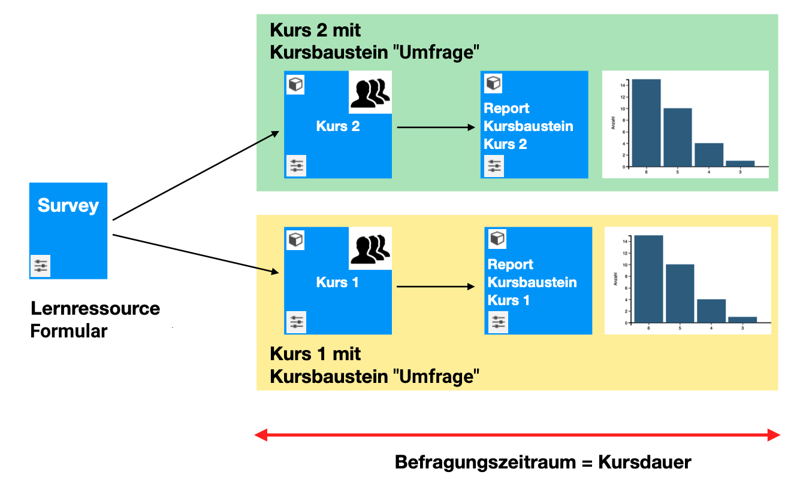
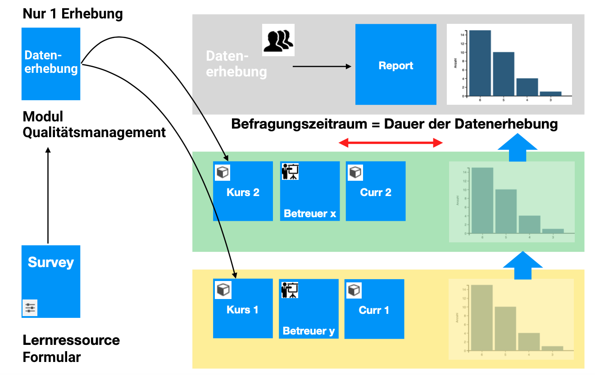
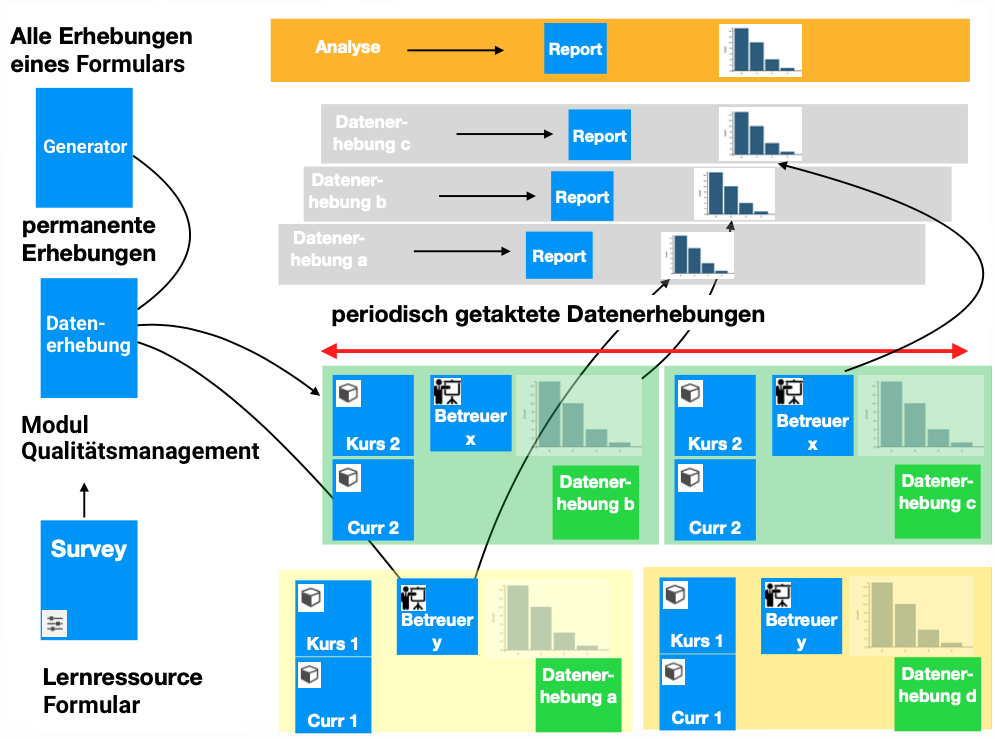
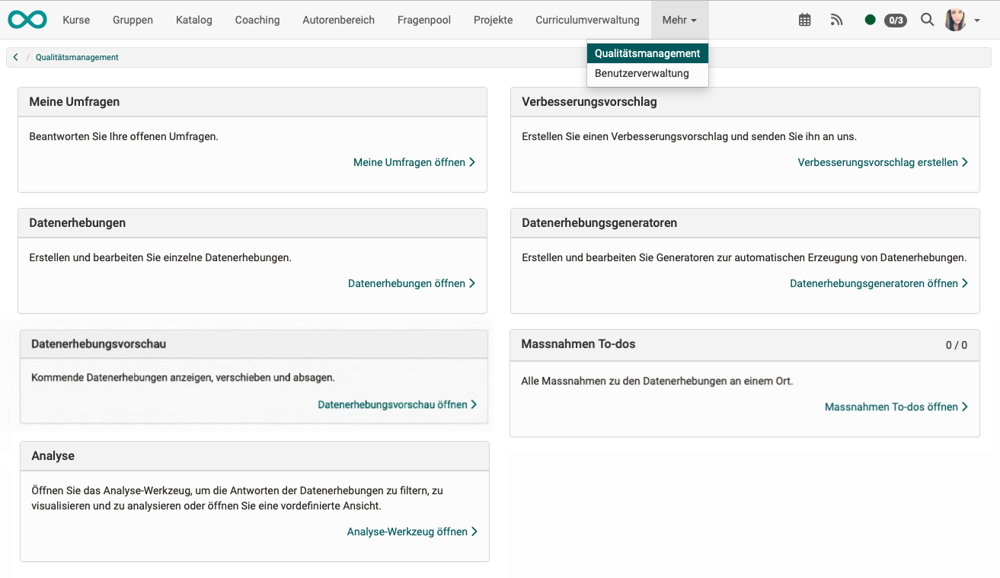

# Quality Management: Overview {: #Quality_Management}

OpenOlat uses **forms** within courses to obtain feedback on the quality of courses or teaching.

The organization of **surveys (data collection)** with these forms (in particular the determination of the time or the time window for the survey) can be managed by an **additional module "Quality Management"** across all courses.

The **evaluation** of the completed forms can also be carried out by **quality managers** in this module. The data is prepared there in tables and diagrams.

## Case 1: Individual survey (several courses use the same form)

The "Quality management" module is not required for this simplest case.

A "Form" learning resource is integrated into a "Survey" course element in various courses. If the same form is used in the different courses, comparability of the survey results is guaranteed. 

Course participants fill out the form once in each course.
Depending on the configuration, the results of the report may or may not be visible to the participants. 

The report is part of the course element and therefore only summarizes the answers of the members of the respective course. The reports are therefore only available on a course-by-course basis.

{ class="lightbox" }

## Case 2: Ad hoc data collection (multiple surveys in several courses or course-independent)

The "Quality management" module is required for cross-course data collection and analysis.

With the "Quality Management" module, form learning resources can also be used independently of courses for surveys (data collection). The benefit of the module is that the results can be compared in the case of multiple surveys using the same form.
The context of the survey is saved in each case.

A form learning resource is linked to a new data collection (= ad hoc survey). 
The participants, survey subject and data collection period are then defined at the level of this data collection. The subject of the survey can vary between coach, course or curriculum/curriculum element, but also organization (or a unit thereof).

A cross-course report is then available in the "Quality management" module. 

{ class="lightbox" }

## Case 3: Automated data collection (in several courses/curricula or independent of courses)

In the Quality Management module, data surveys can also be created automatically according to specific rules.
These rules are described and set up in so-called **data collection generators**.

The cross-course report is then based on several data collections. 

{ class="lightbox" }

## The Module "Quality Management"

The **"Quality management"** module is used for ad hoc data collection (case 2) and regular data collection (case 3). It enables the results from various courses and surveys to be evaluated together. It accesses various courses from a higher-level location and collects the results of the surveys (forms) contained therein.

The module can automatically send prompts with the link to a survey.

The results can be activated for definable recipients.

Quality managers can find the "Quality management" option in their main navigation in the header. 

{ class="shadow lightbox" }

## The role "Quality manager"

As the results concern different courses or are course-independent, the survey results are not evaluated by the course owners or coaches. Their rights only apply to a specific course. The planning of the surveys and the cross-course evaluation is assigned to a separate "quality manager" role.

## Components of quality management

The "Quality management" module in OpenOlat is essentially based on six infrastructures:

1. Learning resource "form"
2. Data collection
3. Data collection generator
4. Analysis
5. Suggestions for improvement
6. Measures (to-dos)

## Activation of the module

The "Quality management" module must be activated by an administrator.

