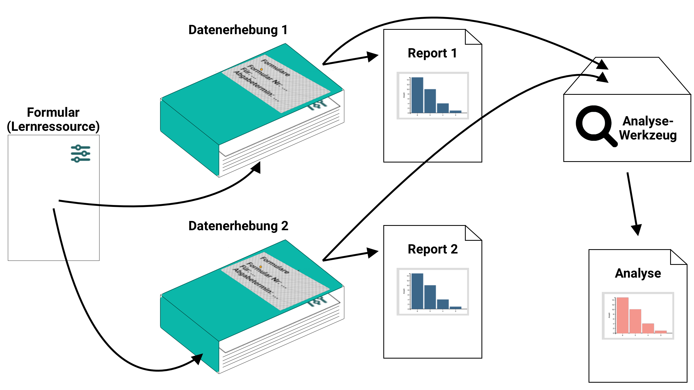
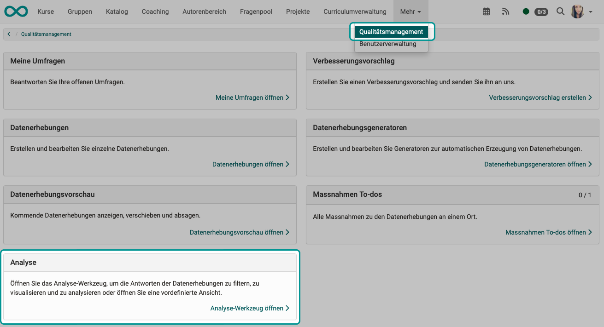
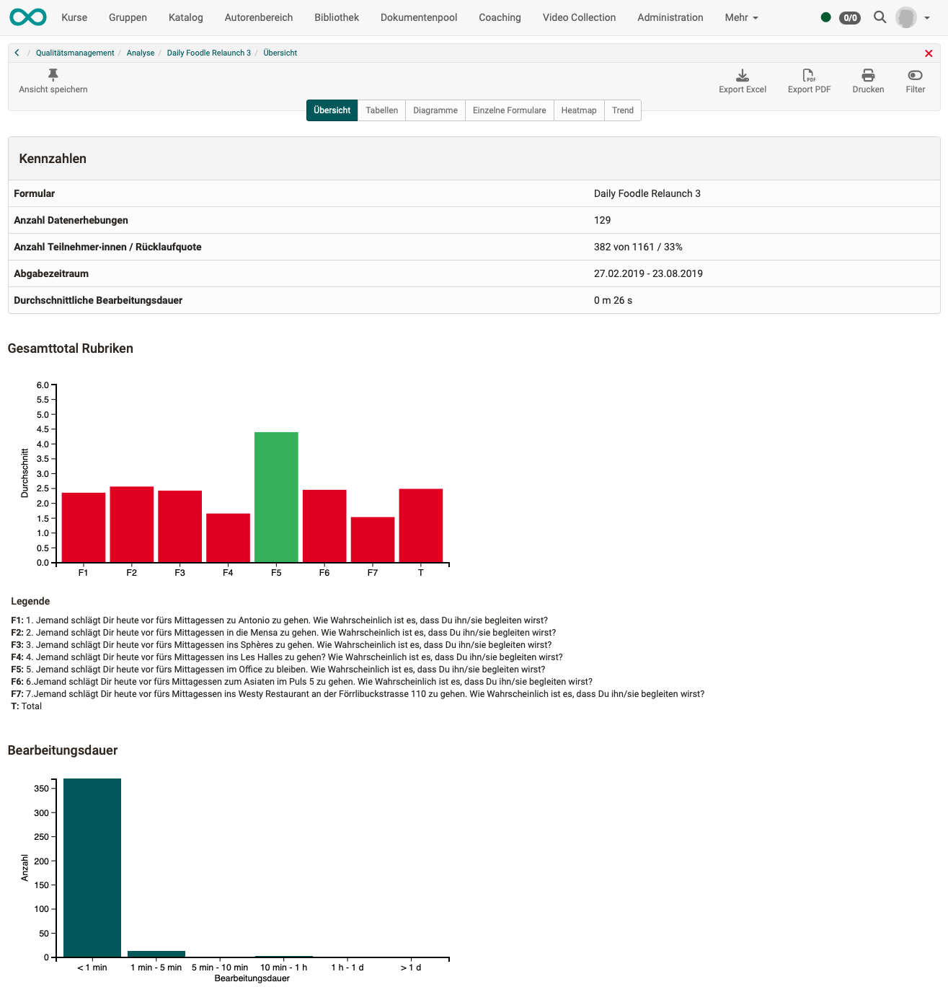
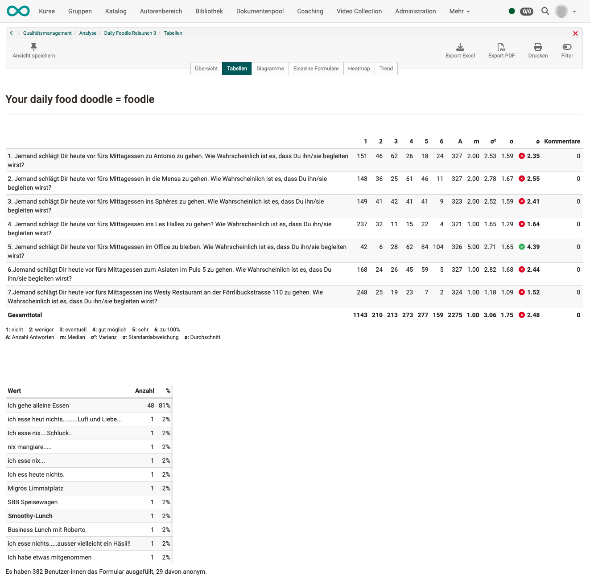
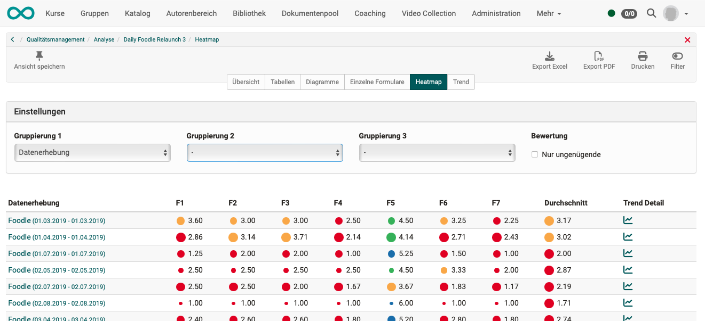
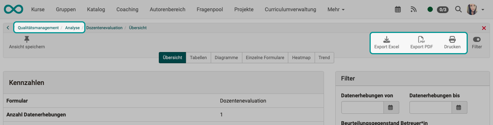

# Qualitätsmanagement: Analyse {: #Quality_Management_Analysis}

## Reports und Analysen

Eine [Datenerhebung](Quality_Management_Data_Collections.de.md) kann z.B. über mehrere Kurse hinweg durchgeführt werden. 
Zu jeder Datenerhebung gibt es einen Report.  

{ class="lightbox" }

Das Analyse-Werkzeug kann **über mehrere Datenerhebungen/Reports hinweg** eine Auswertung vornehmen.

{ class="lightbox" }

!!! info "Info"

    Reports werden immer bei Aufruf aus den aktuell vorhandenen Daten der Datenbank zusammengestellt und angezeigt. Es wird also kein Dokument erzeugt, sondern der aktuelle Status angezeigt. (Wird ein Dokument benötigt, müsste das über einen Export erstellt werden.)

    Eine Analyse ist sozusagen ein Sammelreport, der aus dem Zusammenführen mehrerer Report-Abfragen entsteht.

## Analyse öffnen

Um Analysen des Qualitätsmanagements einzusehen, klicken Sie auf den Link **"Analysewerkzeug öffnen"** im Abschnitt Analyse.

{ class="shadow lightbox" }

Anschliessend wählen Sie Ihre Analyse aus und klicken dort auf **"Öffnen"**.

{ class="shadow lightbox" }

Eine Analyse kann nur aus Datenerhebungen/Reports erstellt werden, die das gleiche Formular als Grundlage haben (um Vergleichbarkeit zu gewährleisten). Werden verschiedene Formulare verwendet, benötigt es pro Formular auch eine eigene Analyse. 

## Analysieren von Datenerhebungen

Sobald das Analyse-Werkzeug aufgerufen wird, wird "on the fly" eine Analyse erstellt.

Das Analyse-Werkzeug wertet die Daten aus verschiedenen [Datenerhebung](Quality_Management_Data_Collections.de.md) aus. Es sind die gleichen Daten, wie sie für Einzelreports verwendet werden.

Qualitätsmanager:innen haben jederzeit Zugriff auf die Reports, auch während eine Datenerhebung noch läuft und weitere Befragungsergebnisse eingehen können.
In Analysen, die ja einem "Sammelreport" aus mehreren Datenerhebungen entsprechen, werden dagegen nur abgeschlossene Datenerhebungen angezeigt.

## Datenquellen

Für die Datengrundlage einer Analyse gelten die folgenden Regeln:

* Für Analysen werden nur aus bereits beendeten [Datenerhebung](Quality_Management_Data_Collections.de.md) Daten berücksichtigt. (Eine Datenerhebung schliesst sich am Ende des definierten Zeitfensters selbst ab.)

* Sowohl bei Datenerhebungen als auch bei Analysen werden nur Daten berücksichtigt, die der Organisationseinheit der Qualitätsmanager:in entstammen.

* Mit Filtern kann eine Auswahl getroffen werden. Für Analysen werden dann die im Filter definierten Erhebungen als Datenquelle berücksichtigt. Wenn keine Eingrenzung durch einen Filter besteht, werden alle Erhebungen berücksichtigt, die mit diesem Formular gemacht wurden.

{ class="shadow lightbox" }

## Wer hat Zugriff auf Analysen?

Auf Analysen haben nur Qualitätsmanager:innen und Principals Zugriff.

Sie können die Analysen über die Hauptnavigation in der Kopfzeile aufrufen unter: 
**Qualitätsmanagment > Analysen**

Werden Organisationseinheiten genutzt, dann gilt:  
Sowohl bei Datenerhebungen als auch bei Analysen können Qualitätsmanager:innen jeweils nur die eigene Organisationseinheit analysieren.

## Analyse: Übersicht

Die ersten 4 Tabs (Übersicht, Tabellen, Diagramme, Einzelne Formulare) entsprechen denen bei der [Datenerhebung](Quality_Management_Data_Collections.de.md), haben jedoch hier eine andere Datengrundlage: In der Analyse sind es mehrere Datenerhebungen.

Im Tab Übersicht werden die Kennzahlen und pro Rubrik 1 Diagramm angezeigt.

In jedem Diagramm zeigt ein Balken je Frage den Durchschnittswert (über alle Datenerhebungen).

Ausserdem zeigt der Balken T ein Gesamttotal (Durchschnitt aller Fragen).

{ class="shadow lightbox" }

## Analyse: Tabellen

In der tabellarischen Darstellung werden alle Antworten aller Element des Formulars detailliert aufgeführt.

{ class="shadow lightbox" }

## Analyse: Diagramme

Die Diagramme gründen auf den gleichen Daten wie die tabellarische Darstellung.

{ class="shadow lightbox" }

## Analyse: Einzelne Formulare

Für Einsichtnahme in die Datengrundlage, können auch die Formulare der einzelnen Teilnehmer:innen angesehen werden.

{ class="shadow lightbox" }

## Analyse: Heatmap

In der Heatmap werden die problematischen Stellen visualisiert und schneller ersichtlich.
Die Daten können dort nach verschiedenen Kriterien gruppiert und gefiltert werden. 

Die Verwendung der Farben und ihre Zuordnung zu einem bestimmten Qualitätsbereich (gut, genügend, ungenügend) wird im Rubrik des Formulars definiert.

Die Grösse der Punkte symbolisiert die Anzahl der Antworten.

Mit diesen Hilfsmitteln wird ein Vergleichen ermöglicht.

{ class="shadow lightbox" }

## Analyse: Trend

In der **Heatmap** sieht man ob eine **Gesamtbewertung** über die gesamte Zeitdauer gut oder schlecht ist.

Im **Trend** sieht man dagegen, ob ein Beurteilungsgegenstand **im Verlauf der Zeit** unterschiedlich beurteilt worden ist.

Wurden Massnahmen eingeleitet, wird im Trend ersichtlich, ob und ab wann die Massnahmen etwas genützt haben.

{ class="shadow lightbox" }

## Analysen drucken und exportieren

Für Export (pdf, Excel) und Ausdruck der erstellten Analysen stehen rechts oben mehrere Buttons zur Verfügung. 

{ class="shadow lightbox" }

## Analyse für Organisationseinheiten

Damit eine Analyse für eine bestimmte Organisationseinheit gemacht werden kann, ist als Voraussetzung ein bereits **aktiviertes Modul "Organisationseinheiten"** erforderlich.

Die Rolle Qualitätsmanager:in kann dann für einzelne Organisationseinheiten vergeben werden. Dadurch sind die Zugriffsmöglichkeiten der Qualitätsmanager:innen auch auf ihre jeweilige Organisationseinheit einschränkbar.

Haben Qualitätsmanager:innen Berechtigungen und Zugriff auf mehrere oder alle Organisationseinheiten, dann können sie beim Erstellen von Datenerhebungen die Befragung auf die gewünschten Organisationseinheiten einschränken. Sie machen dazu eine entsprechende Angabe im Tab "Konfiguration" der Datenerhebung. 

{ class="shadow lightbox" }