# Quality Management: Analysis {: #Quality_Management_Analysis}

## Reports and analysis

A [data collection](Quality_Management_Data_Collections.md) can be carried out over several courses, for example. 
There is a report for each data collection.  

{ class="lightbox" }

The analysis tool can perform an evaluation **across several data collections/reports**.

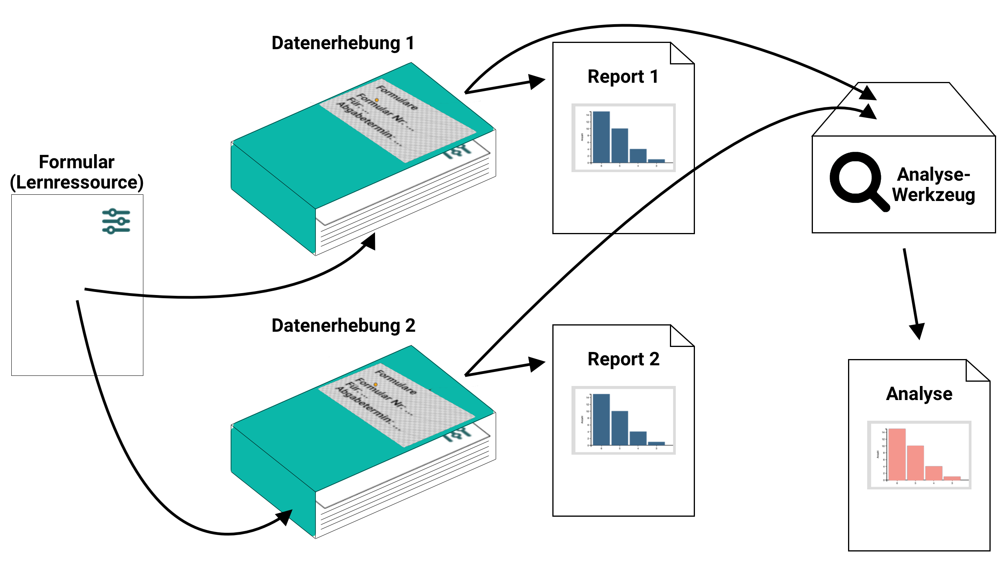{ class="lightbox" }

!!! info "Info"

    Reports are always compiled and displayed from the data currently available in the database when they are called up. This means that no document is created, but the current status is displayed. (If a document is required, this would have to be created via an export).

    An analysis is, so to speak, a collective report that is created by combining several report queries.

## Open analysis

To view quality management analysis, click on the **"Open analysis tool"** link in the Analysis section.

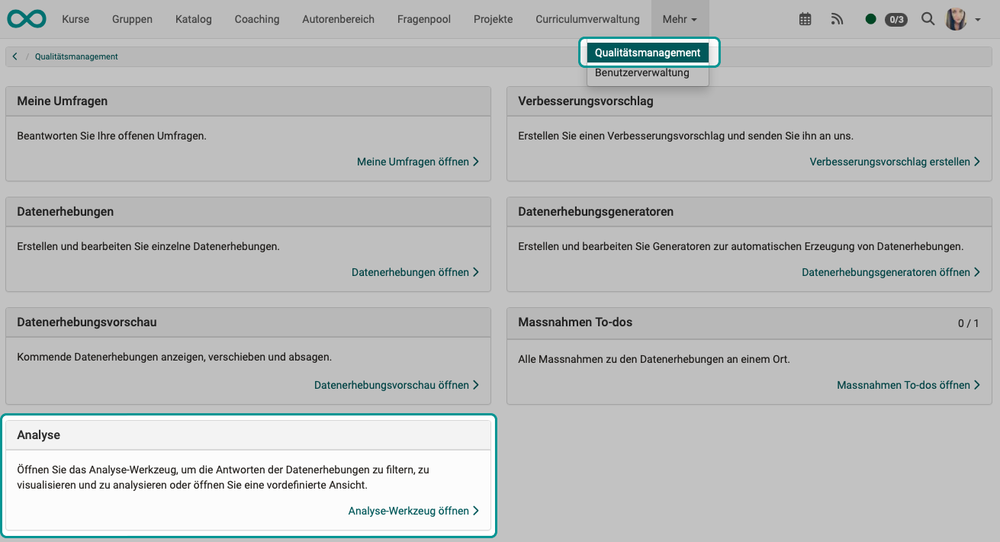{ class="shadow lightbox" }

Then select your analysis and click on **"Open"**.

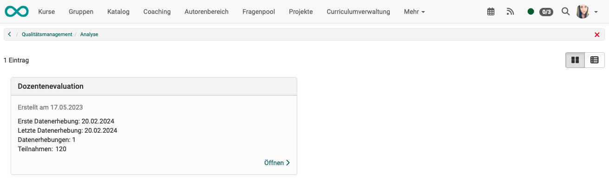{ class="shadow lightbox" }

An analysis can only be created from data surveys/reports that are based on the same form (to ensure comparability). If different forms are used, a separate analysis is also required for each form. 

## Analyze data collection

As soon as the analysis tool is called up, an analysis is created "on the fly".

The analysis tool evaluates the data from various [Data Collection](Quality_Management_Data_Collections.md). This is the same data that is used for individual reports.

Quality managers have access to the reports at all times, even while data collection is still ongoing and further survey results may be received.
In analyses, on the other hand, which correspond to a "collective report" from several data collections, only completed data collections are displayed.

## Data sources

The following rules apply to the data basis of an analysis:

* For analysis, only data from already completed [data collection](Quality_Management_Data_Collections.md) are taken into account. (A data collection completes itself at the end of the defined time window).

* For both data collection and analysis, only data originating from the quality manager's organizational unit is taken into account.

* Filters can be used to make a selection. The surveys defined in the filter are then taken into account as the data source for analyses. If there is no restriction by a filter, all surveys made with this form are taken into account.

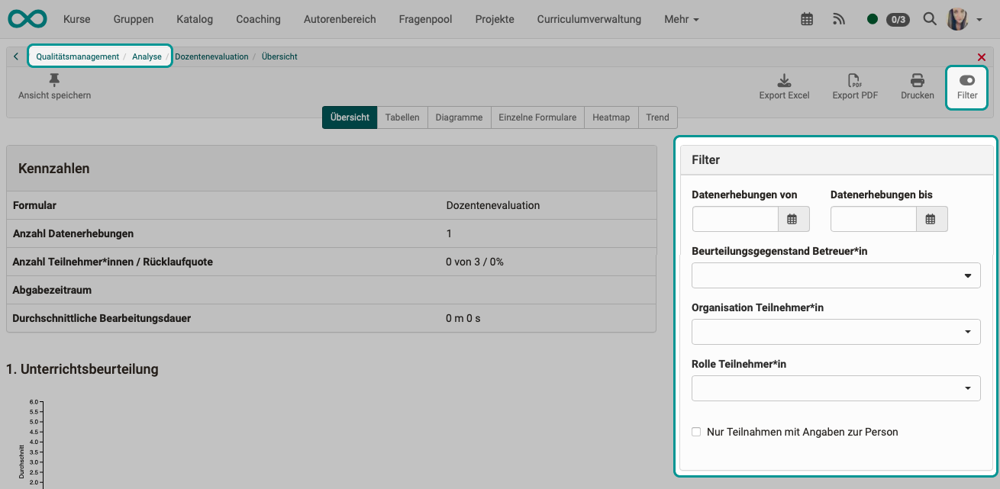{ class="shadow lightbox" }

## Who has access to analysis?

Only quality managers and principals have access to analysis. 

You can access the analysis via the main navigation in the header under: 
**Quality management > Analysis**

If organizational units are used, the following applies:  
In both data collection and analysis, quality managers can only analyze their own organizational unit.

## Analysis: Overview

The first 4 tabs (Overview, Tables, Diagrams, Individual forms) correspond to those in [Data collection](Quality_Management_Data_Collections.md), but have a different data basis here: there are several data collections in the analysis.

The key figures and 1 diagram per category are displayed in the Overview tab.

In each diagram, one bar per question shows the average value (across all data surveys).

In addition, bar T shows an overall total (average of all questions).

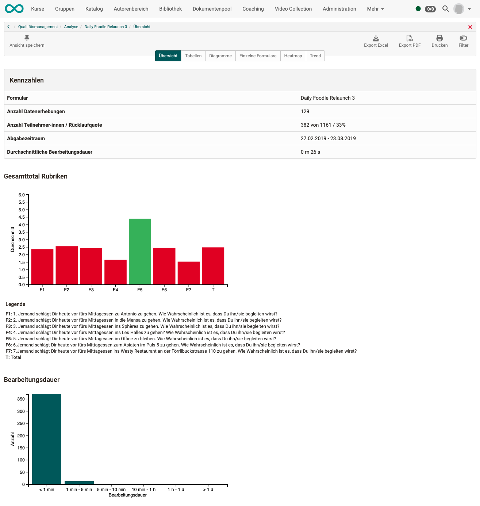{ class="shadow lightbox" }

## Analysis: Tables

In the tabular display, all answers of all elements of the form are listed in detail.

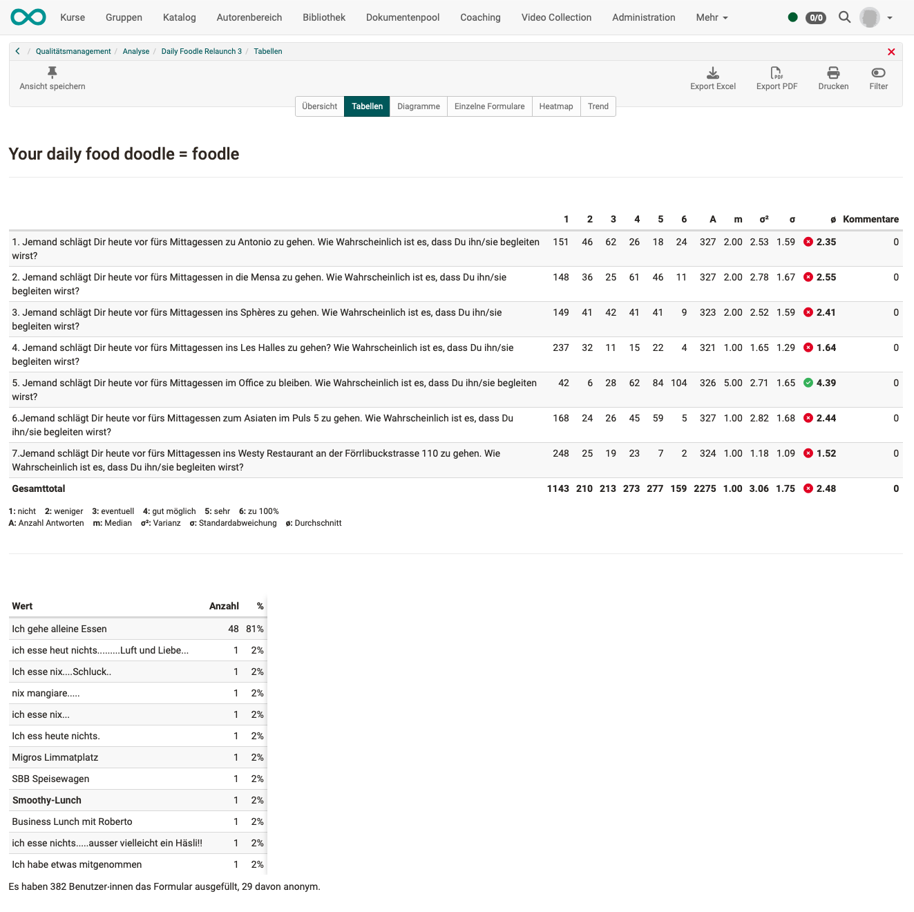{ class="shadow lightbox" }

## Analysis: Diagrams

The diagrams are based on the same data as the tabular presentation.

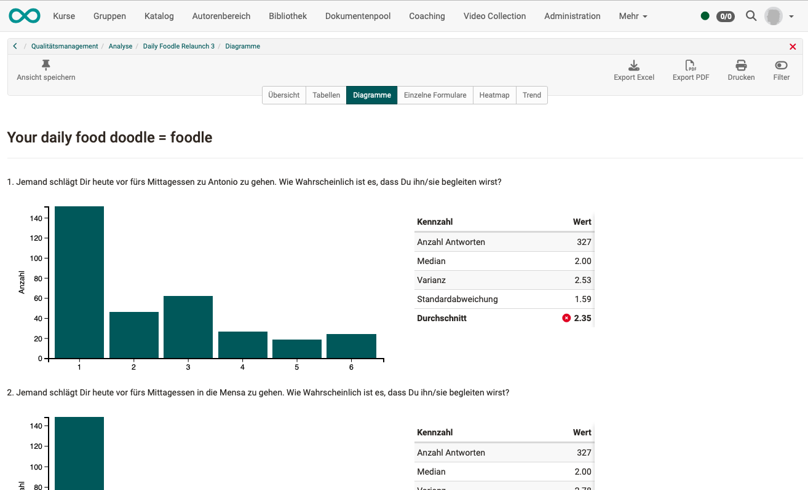{ class="shadow lightbox" }

## Analysis: Single forms

The forms of the individual participants can also be viewed for insight into the data basis.

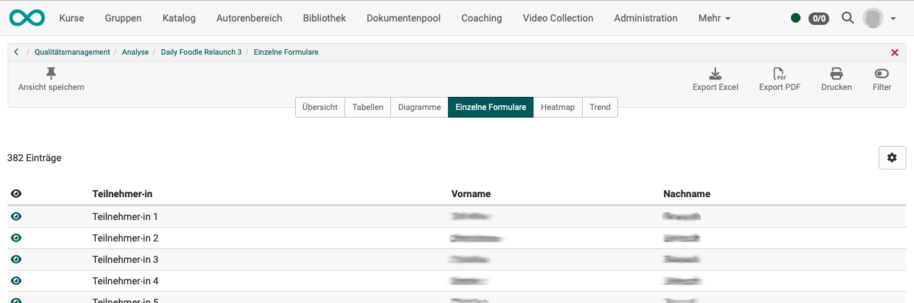{ class="shadow lightbox" }

## Analysis: Heat map

The problematic areas are visualized in the heat map and can be seen more quickly.
The data can be grouped and filtered according to various criteria.

The use of colors and their assignment to a specific quality area (good, sufficient, insufficient) is defined in the form's rubric.

The size of the dots symbolizes the number of answers.

These tools enable comparisons to be made.

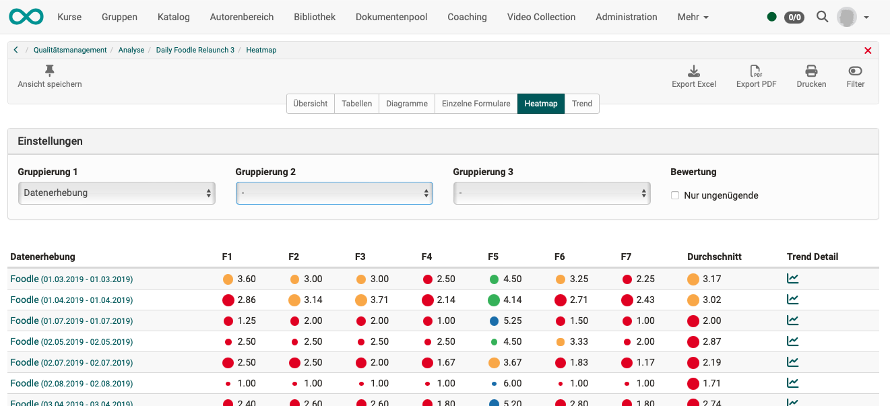{ class="shadow lightbox" }

## Analysis: Trend

In the **Heat map** you can see whether an **overall rating** is good or bad over the entire period.

The **trend**, on the other hand, shows whether an object of assessment has been assessed differently **over time**.

If measures have been introduced, the trend shows whether and when the measures have had any effect.

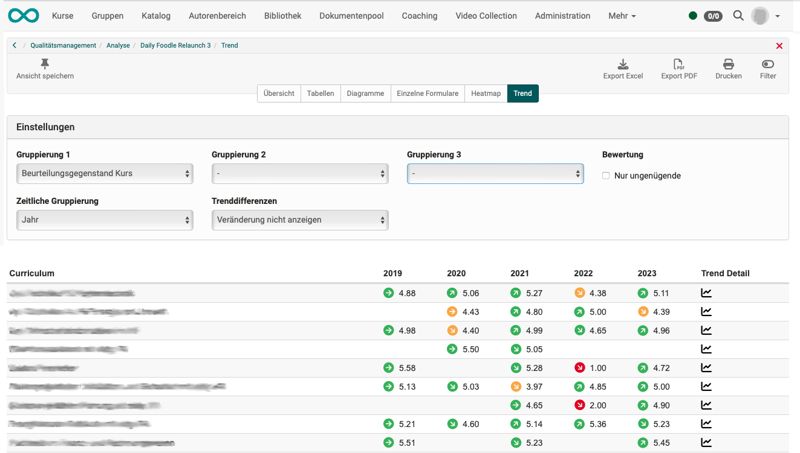{ class="shadow lightbox" }

## Print and export analysis

Several buttons are available at the top right for exporting (pdf, Excel) and printing the analyses created.

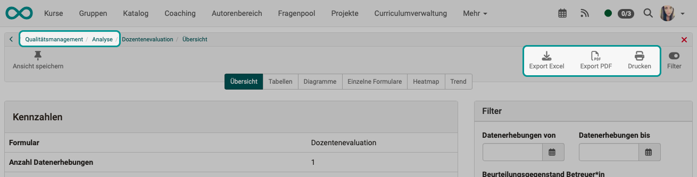{ class="shadow lightbox" }

## Analysis for organizational units

In order for an analysis to be made for a specific organizational unit, an already **activated module "Organizational units"** is required.

The role of quality manager can then be assigned to individual organizational units. This means that the quality managers' access options can also be restricted to their respective organizational unit.

If quality managers have permissions and access to several or all organizational units, they can restrict the survey to the desired organizational units when creating data surveys. You make a corresponding entry in the "Configuration" tab of the data collection.

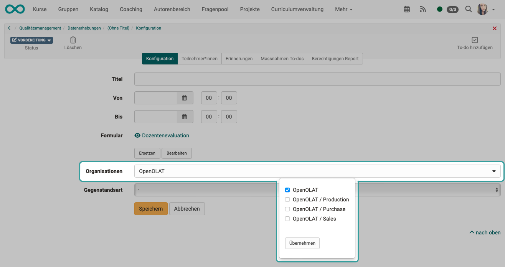{ class="shadow lightbox" }
