# Quality Management: Analysis {: #Quality_Management_Analysis}

## Reports and analyses {: #reports_analysis}

A [data collection](Quality_Management_Data_Collections.md) can, for example, be carried out across several courses.
There is a report for each data collection.

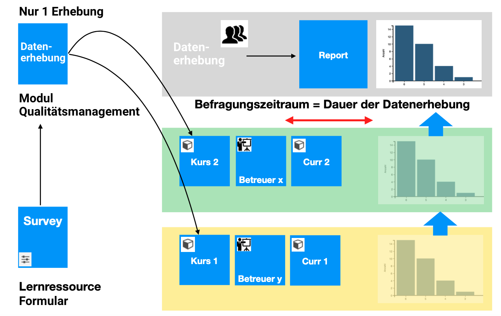{ class="lightbox" }

The analysis tool can perform an evaluation **across several data collections/reports**.

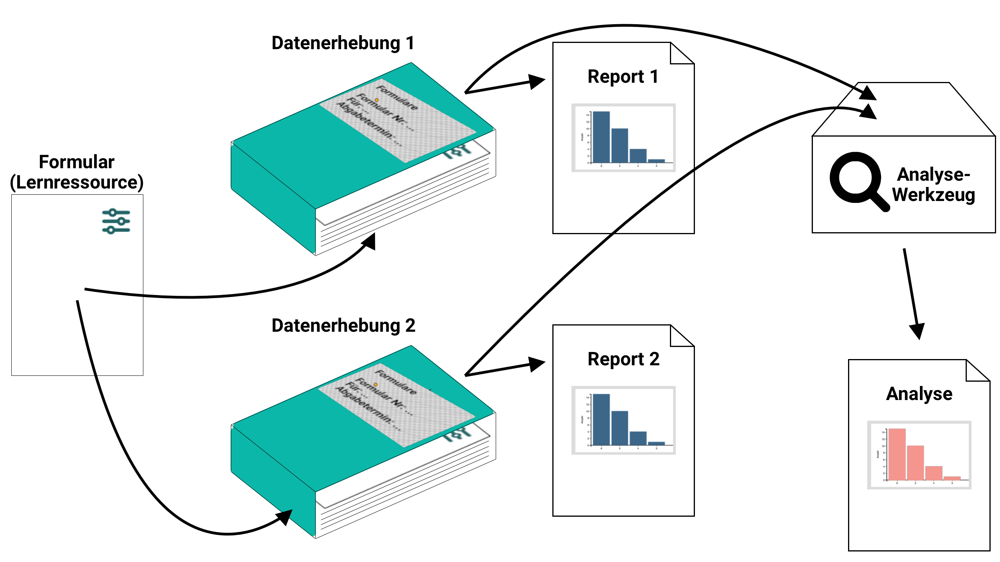{ class="lightbox" }

!!! info "Important"

    Reports are always compiled and displayed from the data currently available in the database when they are called up. This means that no document is created, but the current status is displayed. (If a document is required, it would have to be created via an export.)

    An analysis is, so to speak, a collective report that is created by combining several report queries.

[To the top of the page ^](#Quality_Management_Analysis)

---

## Open analysis {: #open_analysis}

To view analyses of the quality management, click on the link **"Go to analysis tool"** in the section Analysis.

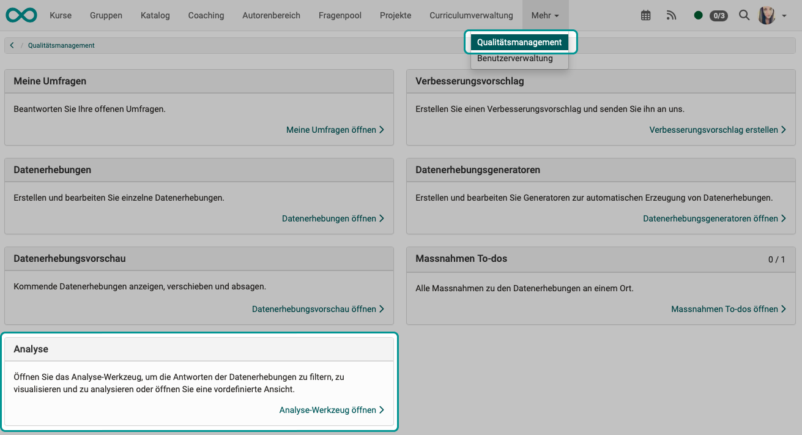{ class="shadow lightbox" }

Then select your analysis and click on **"Open"** there.

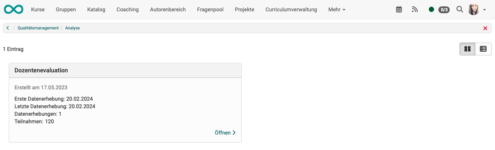{ class="shadow lightbox" }

An analysis can only be created from data collections/reports that are based on the same form (to ensure comparability). If different forms are used, a separate analysis is required for each form.

[To the top of the page ^](#Quality_Management_Analysis)

---

## Analyzing data collections {: #analyzing_data_collections}

As soon as the analysis tool is called up, an analysis is created "on the fly".

The analysis tool evaluates the data from various [data collections](Quality_Management_Data_Collections.md). It is the same data that is used for the individual reports.

Quality managers have access to the reports at all times, even while a data collection is still running and further survey results may be received.
In analyses, which correspond to a "collective report" from several data collections, on the other hand, only finished data collections are displayed.

[To the top of the page ^](#Quality_Management_Analysis)

---

## Data sources {: #data_source}

The following rules apply to the data basis of an analysis:

* For analyses, only data from already finished [data collections](Quality_Management_Data_Collections.md) is taken into account. (A data collection finishes itself at the end of the defined time window.)

* For both data collections and analyses, only data originating from the organizational unit of the quality manager is taken into account.

* Filters can be used to make a selection. The data collections defined in the filter are then taken into account as the data source for analyses. If there is no restriction by a filter, all data collections made with this form are taken into account.

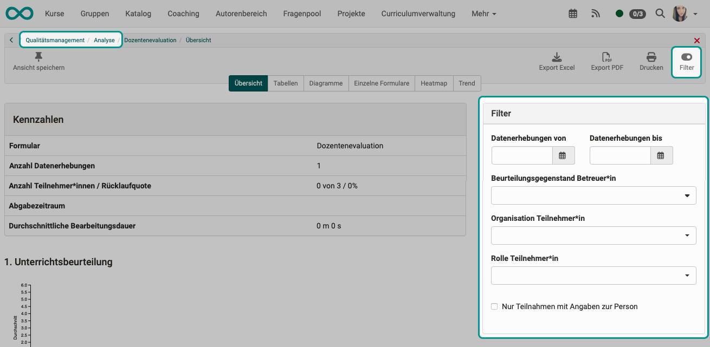{ class="shadow lightbox" }

[To the top of the page ^](#Quality_Management_Analysis)

---

## Who has access to analyses? {: #access}

Only quality managers and principals have access to analyses.

You can access the analyses via the main navigation in the header under: 
`Quality management > Analysis`

If organizational units are used, the following applies:  
For both data collections and analyses, quality managers can only analyze their own organizational unit.

[To the top of the page ^](#Quality_Management_Analysis)

---

## The color code in analyses {: #color_code}

**Which color codes are there?** 
Within the quality management, 3 colors are used for 3 categories:

* green = Good
* yellow = Neutral
* red = Insufficient

**Where can these color codes be found?** 
The rating is used in the individual reports and in the analysis, e.g. in the heat map.
In addition, the criteria of some data collection generators are based on these range divisions.

**Setting: When does which color code appear?** 
The 3 categories "Good", "Neutral" and "Insufficient" are defined and delimited from each other in the rubric element:

Proceed as follows:

- Select and open the form in the authoring area
- Edit the form: `Form > Administration > Edit content`
- Select the rubric element
- Open the inspector pop-up (click on the gear icon at the top left of the selection frame)
- Select the tab "Advanced" in the inspector
- Enter the values for "Insufficient", "Neutral" and "Good" there.

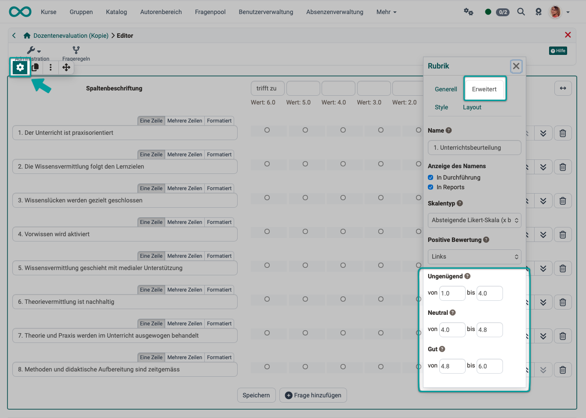{ class="lightbox" }

[To the top of the page ^](#Quality_Management_Analysis)

---

## Analysis: Tab Overview {: #tab_overview}

The first 4 tabs (Overview, Tables, Diagrams, Single forms) correspond to those of the [data collection](Quality_Management_Data_Collections.md), but have a different data basis here: in the analysis there are several data collections.

The tab Overview displays the key figures and 1 diagram per rubric.

In each diagram, one bar per question shows the average value (across all data collections).

In addition, the bar T shows an overall total (average of all questions).

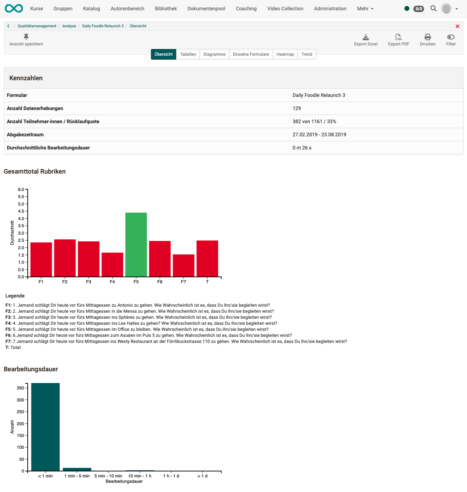{ class="shadow lightbox" }

[To the top of the page ^](#Quality_Management_Analysis)

---

## Analysis: Tab Tables {: #tab_table}

In the tabular display, all answers of all elements of the form are listed in detail.

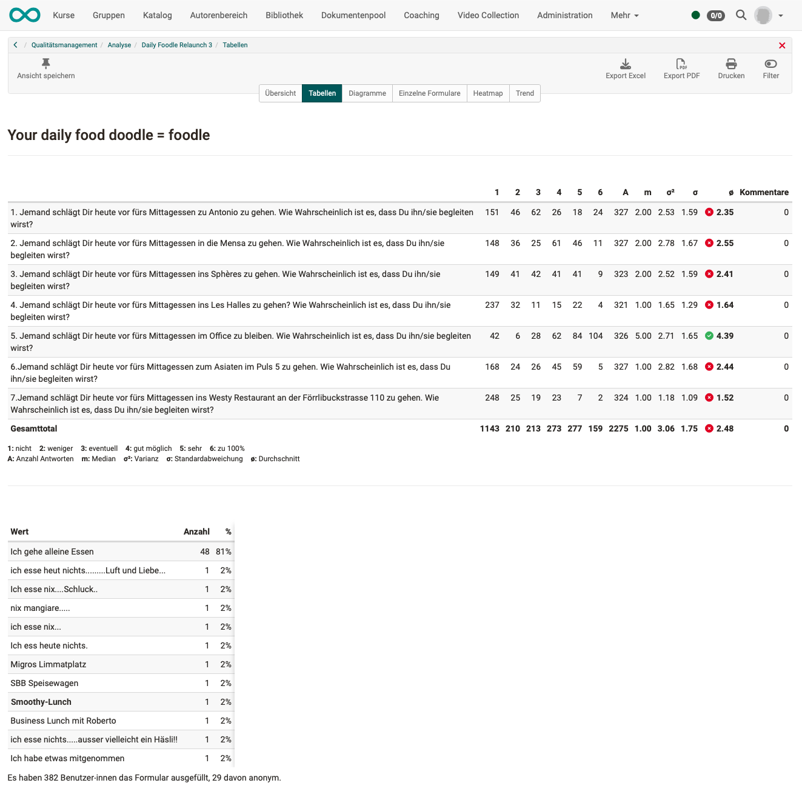{ class="shadow lightbox" }

[To the top of the page ^](#Quality_Management_Analysis)

---

## Analysis: Tab Diagrams {: #tab_diagram}

The diagrams are based on the same data as the tabular display.

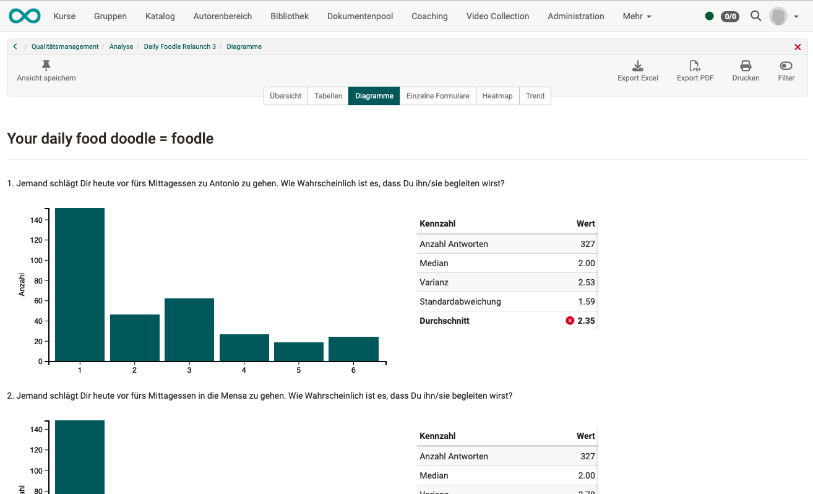{ class="shadow lightbox" }

[To the top of the page ^](#Quality_Management_Analysis)

---

## Analysis: Tab Single forms {: #tab_forms}

For insight into the data basis, the forms of the individual participants can also be viewed.

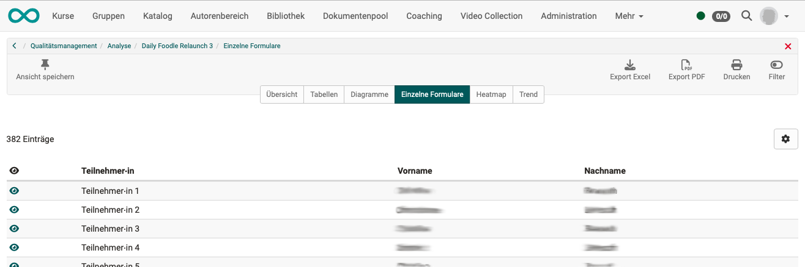{ class="shadow lightbox" }

[To the top of the page ^](#Quality_Management_Analysis)

---

## Analysis: Tab Heat map {: #tab_heatmap}

In the heat map, the problematic areas are visualized and become apparent more quickly.
The data can be grouped and filtered there according to various criteria.

The use of the colors and their assignment to a certain quality range (good, neutral, insufficient) is defined in the rubric element of the form.

The size of the dots symbolizes the number of answers.

These tools enable comparisons.

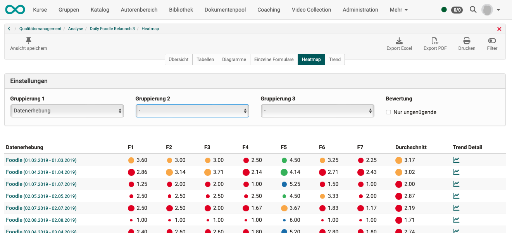{ class="shadow lightbox" }

[To the top of the page ^](#Quality_Management_Analysis)

---

## Analysis: Tab Trend {: #tab_trend}

In the **heat map** you can see whether an **overall rating** is good or bad over the entire period.

In the **trend**, on the other hand, you can see whether a topic has been rated differently **over time**.

If actions have been taken, the trend shows whether and from when the actions have had an effect.

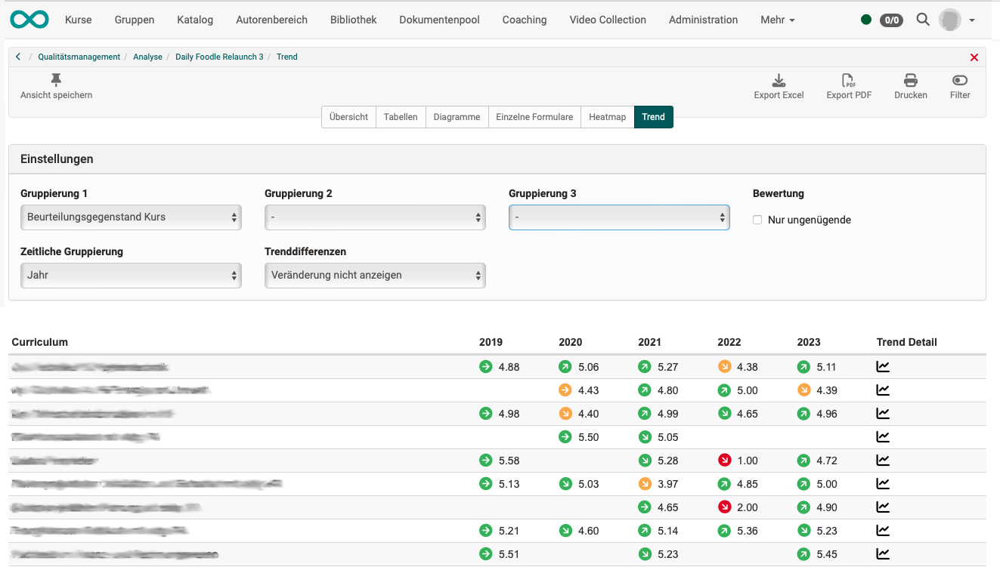{ class="shadow lightbox" }

[To the top of the page ^](#Quality_Management_Analysis)

---

## Print and export analyses {: #print_export}

Several buttons are available at the top right for exporting (pdf, Excel) and printing the created analyses.

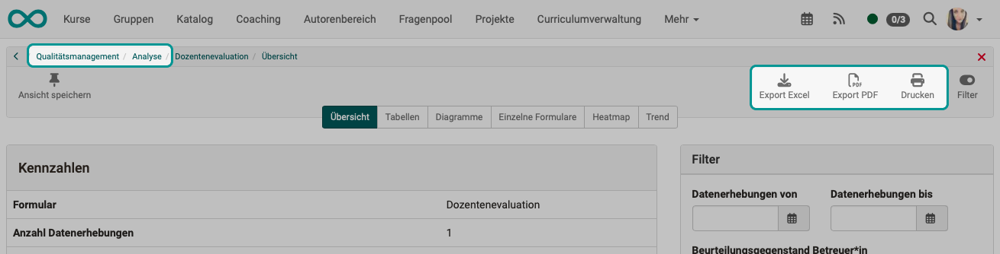{ class="shadow lightbox" }

[To the top of the page ^](#Quality_Management_Analysis)

---

## Analysis for organizational units {: #analysis_for_org_units}

In order for an analysis to be made for a specific organizational unit, an already **activated module "Organizational units"** is required.

The role Quality manager can then be assigned for individual organizational units. This means that the access options of the quality managers can also be restricted to their respective organizational unit.

If quality managers have permissions and access to several or all organizational units, they can restrict the survey to the desired organizational units when creating data collections. To do this, they make a corresponding entry in the tab "Configuration" of the data collection.

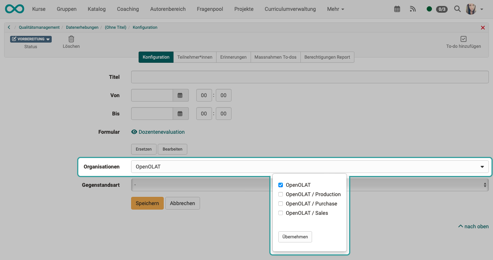{ class="shadow lightbox" }

[To the top of the page ^](#Quality_Management_Analysis)

---

## Further information {: #further_information}

[Quality Management: Data collections >](Quality_Management_Data_Collections.md)

[To the top of the page ^](#Quality_Management_Analysis)
