# Qualitätsmanagement: Datenerhebungsgeneratoren {: #Quality_Management_Data_Collection_Generators}

!!! info "Empfehlung"

    Für das Verständnis des Datenerhebungsgenerators werden Kenntnisse über Datenerhebungen vorausgesetzt.

## Was macht ein Datenerhebungsgenerator?

**Datenerhebungen** können im Modul Qualitätsmanagement auch **automatisiert nach bestimmten Regeln** erstellt werden. 

Die Beschreibung und Einrichtung der Regeln geschieht in sogenannten **Datenerhebungsgeneratoren**. 

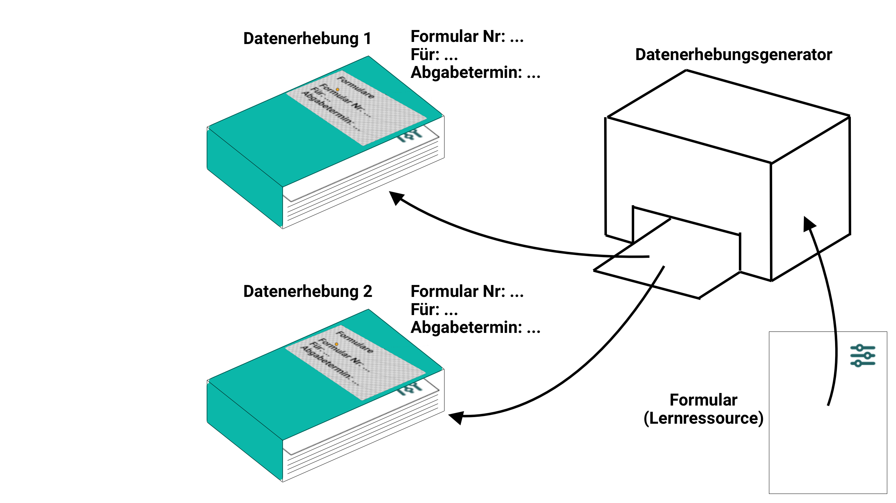{ class="lightbox" }

## Wie wird ein Datenerhebungsgenerator erstellt?

Bei entsprechender Berechtigung (Rolle) erscheint in Ihrer Hauptnavigation das **Qualitätsmanagement**. Klicken Sie auf den Link im Abschnitt **"Datenerhebungsgeneratoren"**.

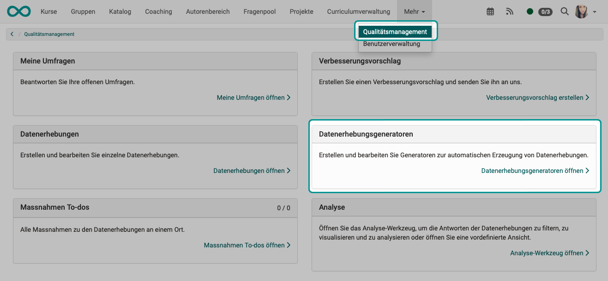{ class="shadow lightbox" }

Erstellen Sie dort einen neuen Datenerhebungsgenerator.

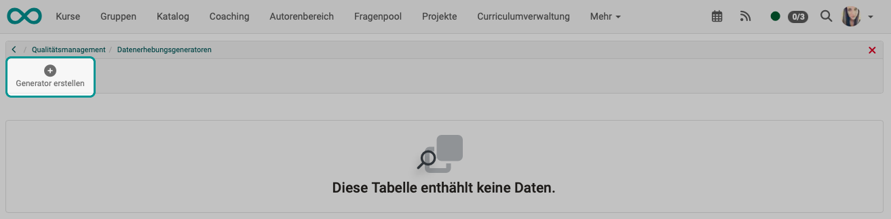{ class="shadow lightbox" }

Mit der Wahl eines Typs bestimmen Sie das Regel-Set, nach dem Datenerhebungen erstellt werden.

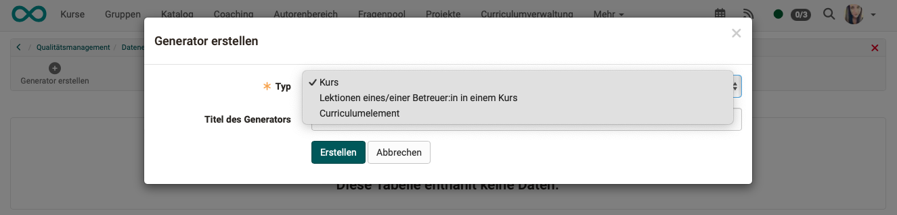{ class="shadow lightbox" }

## Generator Typ "Kurs"

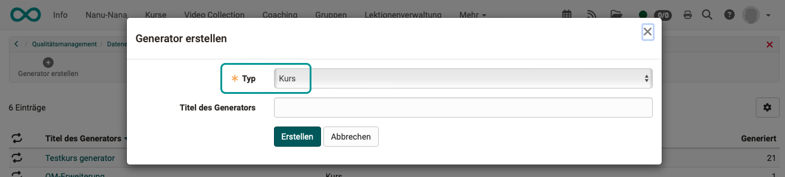{ class="shadow lightbox" }

### Tab "Konfiguration" {: #Quality_Management_Data_Collection_Generators_Type_Course_Config}

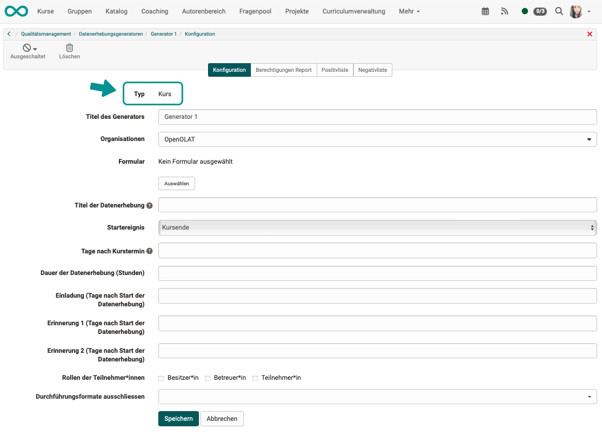{ class="shadow lightbox" }

**Titel** 
Verwenden Sie möglichst einen Titel, der eine Aussage zu Inhalt und Verwendung macht, um eine klare Zuordnung und Abgrenzung zu anderen Generatoren zu ermöglichen.

**Organisationen** 
Wurde das Modul "Organisationseinheiten" aktiviert und eingerichtet, können Datenerhebungen auch auf ausgewählte Organisationseinheiten bezogen werden.

**Formular** 
Auch bei Datengeneratoren kommt jeweils nur ein Formular zum Einsatz um Vergleichbarkeit und Auswertung zu ermöglichen. Soll ein weiteres Formular verwendet werden, müssten Sie einen weiteren Generator erstellen. 

**Titel der Datenerhebung** 
Geben Sie hier den Titel der vom Datengenerator erzeugten Datenerhebungen an. 
Im Titel können auch Variablen verwendet werden. 

**Startereignis** 
Auslösende Startereignisse können beim Generator vom Typ "Kurs" sein:

* Kursbeginn
* Kursende
* täglich

**Tage nach Kurstermin (Startereignis)**  
(Diese Option wird nur angezeigt, wenn "Kursbeginn" oder "Kursende" als Startereignis gewählt wurde.) 
Der Start der Datenerhebung wird aus dem Startereignis und der hier eingetragenen Anzahl Tage berechnet.
Die Anzahl Tage kann auch negativ sein. 

**Wochentag** 
(Diese Option wird nur angezeigt, wenn "täglich" als Startereignis gewählt wurde.) 
Es wird periodisch immer an den angegebenen Wochentagen eine Datenerhebung generiert.

!!! note "Hinweis"

    Hat ein Kurs ein Beginn- oder Enddatum, wird er vor und nach diesen Daten nicht in den Datenerhebungen berücksichtigt.

**Dauer der Datenerhebung (Stunden)** 
Nach Start der Datenerhebung können alle Teilnehmenden im angegebenen Zeitraum das Formular ausfüllen und abgeben. Nach Ablauf dieser Frist ist eine Abgabe nicht mehr möglich. 

**Einladung** 
Die Einladung ist eine Funktion der Datenerhebung. Werden nun vom Datengenerator mehrere Datenerhebungen automatisch generiert, werden in den Datenerhebungen das Versanddatum der Einladung in Abhängigkeit des jeweiligen Startdatums und des hier eingetragenen Wertes berechnet.

**Erinnerungen** 
Auch die Erinnerungen sind eine Funktion der Datenerhebung. Werden vom Datengenerator mehrere Datenerhebungen automatisch generiert, werden in den Datenerhebungen das Versanddatum der Erinnerung in Abhängigkeit des jeweiligen Startdatums und des hier eingetragenen Wertes berechnet.

**Teilnehmer** 
Die Kursmitglieder mit den hier ausgewählten Rollen können an der Datenerhebung teilnehmen.

**Durchführungsformate ausschliessen** 
Zu Kursen kann in den Metadaten ein Durchführungsformat angegeben werden. Es besteht die Möglichkeit, bei erzeugten Datenerhebungen bestimmte [Durchführungsformate](../../manual_admin/administration/Modules.de.md#kurs) auszuschliessen, z.B. wenn Prüfungskurse nicht berücksichtigt werden sollen.

### Tab "Berechtigungen Report"

Die hier eingegebene Konfiguration wird 1:1 in die erstellten Datenerhebungen übertragen.
Siehe [Datenerhebung](Quality_Management_Data_Collections.de.md).

### Tab "Positivliste" {: #Quality_Management_Data_Collection_Generators_Type_Course_PositivList}

Wurde ein Generator erstellt, ergibt sich daraus eine Liste von Kursen, zu welchen Datenerhebungen generiert werden.

Wird zudem noch eine Positivliste definiert, werden nur noch Kurse für Datenerhebungen berücksichtigt, die sowohl in der ursprünglich vom Generator erzeugten Liste enthalten sind, als auch in dieser Positivliste.

### Tab "Negativliste" {: #Quality_Management_Data_Collection_Generators_Type_Course_NegativList}

Wurde ein Generator erstellt, ergibt sich daraus eine Liste von Kursen, zu welchen Datenerhebungen generiert werden. In der Negativliste können einzelne dieser Kurs ausgenommen werden.

!!! note "Hinweis"

    Es macht nur Sinn, entweder eine Positivliste oder eine Negativliste zu erstellen. 
    Sollen nur zu einem kleinen Teil der Kurse Datenerhebungen gemacht werden, empfiehlt sich eine Positivliste. Sollen zum überwiegenden Teil der Kurse Datenerhebungen gemacht werden, empfiehlt sich eine Negativliste.

## Generator Typ "Lektionen eines/einer Betreuer:in in einem Kurs"

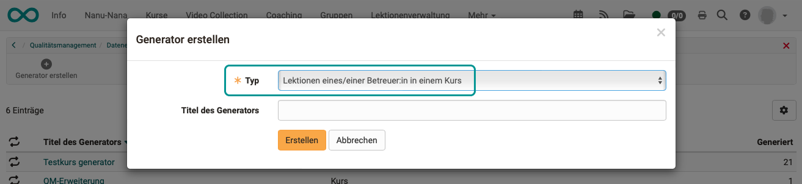{ class="shadow lightbox" }

### Tab "Konfiguration"

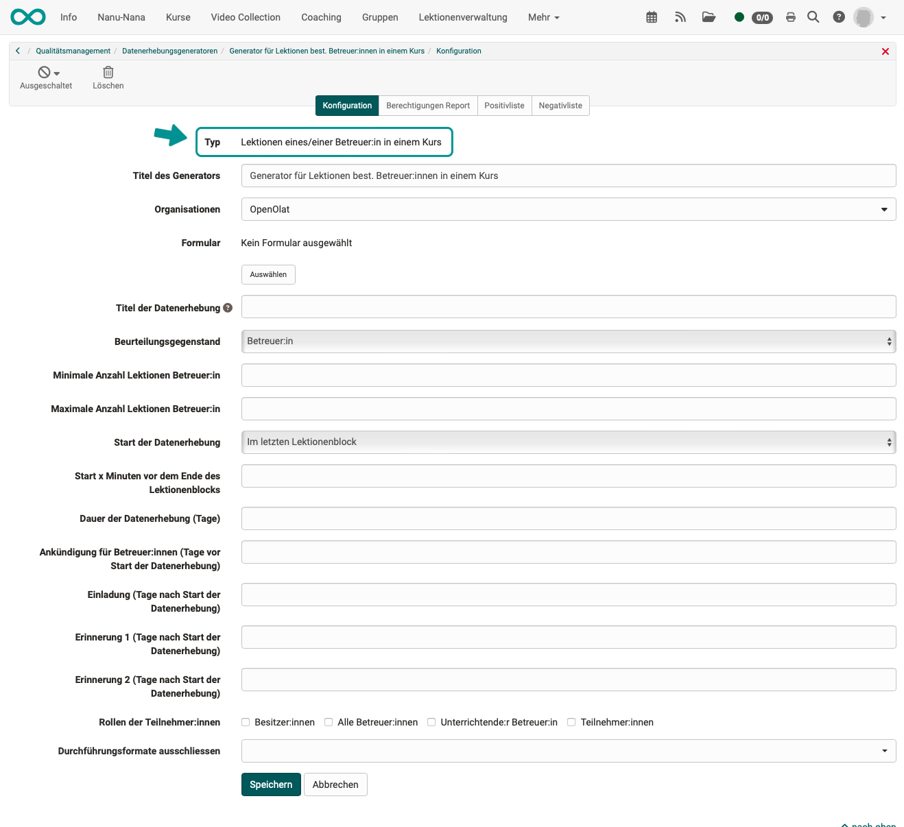{ class="shadow lightbox" }

Siehe auch [Konfiguration im Typ Kurs](#Quality_Management_Data_Collection_Generators_Type_Course_Config).

**Beurteilungsgegenstand** 
Der Generator trägt in der [Datenerhebung](Quality_Management_Data_Collections.de.md) den Beurteilungsgegenstand ein:

* Betreuer:in oder
* Kurs

!!! note "Hinweis"

    Gibt es in einem Kurs mehrere Betreuer:innen, welche die übrigen Kriterien erfüllen, wird pro Betreuer:in eine [Datenerhebung](Quality_Management_Data_Collections.de.md) initiiert.

**Minimale Anzahl Lektionen Betreuer:in** 
Die Datenerhebung findet nur statt, wenn der/die Betreuer:in die hier angegebene minmale Anzahl Lektionen in einem Kurs insgesamt hat. (Nicht nur die bereits durchgeführten Lektionen.)

**Maximale Anzahl Lektionen Betreuer:in** 
Die Datenerhebung findet nur statt, wenn der/die Betreuer:in die hier angegebene maximale Anzahl Lektionen in einem Kurs insgesamt nicht überschreitet.

!!! note "Beispiel"

    In der Datenerhebung für den Regelfall, sollen nur Betreuer:innen beurteilt werden, die mind. 10 Lektionen zu halten haben. Hierfür wird die minimale Anzahl Lektionen verwendet.
    
    Sollen nur selten unterrichtende Betreuer:innen beurteilt werden, kann in einem weiteren Generator eine Datenerhebung für Betreuer:innen mit einer maximalen Anzahl Lektionen erzeugt werden.

**Start der Datenerhebung** 

* Im letzten Lektionenblock (welchen der/die Betreuer:in in einem Kurs unterrichtet)
* Im Lektionenblock mit der Lektion x (Lektionenblöcke, die der/die Betreuer:in unterrichtet)

**Start x Minuten vor dem Ende des Lektionenblocks** 

Wird die Befragung kurz vor dem Ende durchgeführt, ist in der Regel mit einer höheren Beteiligung zu rechnen.

**Ankündigung für Betreuer:innen (Tage vor Start der Datenerhebung)** 

Wenn hier keine Angaben gemacht werden, wird keine Ankündigung verschickt.
In manchen Fällen ist es sinnvoll, dass z.B. Betreuer:innen vorab eine Ankündigung erhalten und ggf. intervienieren können.

**Einladung (Tage nach Start der Datenerhebung)** 

Die Einladung ist eine E-Mail an die Teilnehmer:innen mit dem Link zum Formular. Wird keine Angabe gemacht, wird keine E-Mail verschickt, die Teilnehmenden müssen anderweitig informiert werden. (Z.B. durch Dozierende im Unterricht.)

**Erinnerung (Tage nach Start der Datenerhebung)** 
Siehe auch [Konfiguration im Typ Kurs](#Quality_Management_Data_Collection_Generators_Type_Course_Config).

**Rollen der Teilnehmer:innen** 

Die Kursmitglieder mit den hier ausgewählten Rollen können an der Datenerhebung teilnehmen.

* Besitzer:innen
* Alle Betreuer:innen (= alle Betreuer:innen des Kurses)
* Unterrichtende:r Betreuer:in (= Unterrichtende(r) im Lektionenblock, der zur Datenerhebung führt)
* Teilnehmer:innen

### Tab "Berechtigungen Report"

Die hier eingegebene Konfiguration wird 1:1 in die erstellten Datenerhebungen übertragen.
Siehe [Datenerhebung](Quality_Management_Data_Collections.de.md).

### Tab "Positivliste"

Siehe [Typ Kurs Positivliste](#Quality_Management_Data_Collection_Generators_Type_Course_PositivList).

### Tab "Negativliste"

Siehe [Typ Kurs Negativliste](#Quality_Management_Data_Collection_Generators_Type_Course_NegativList).

## Generator Typ "Curriculumelement"

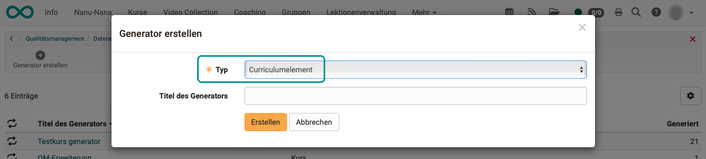{ class="shadow lightbox" }

### Tab "Konfiguration"

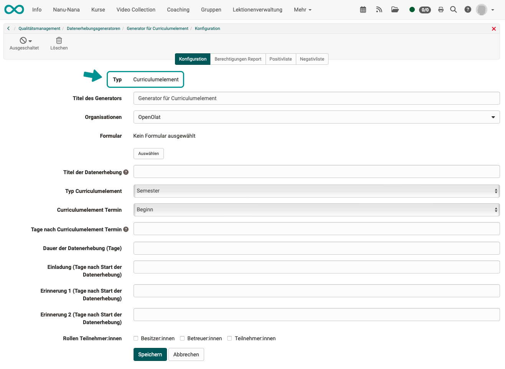{ class="shadow lightbox" }

Siehe auch [Konfiguration im Typ Kurs](#Quality_Management_Data_Collection_Generators_Type_Course_Config).

**Typ Curriculumelement** 

Zu jedem Curriculumelement gibt es eine Datenerhebung.

Abhänging davon, wie das Curriculum eingerichtet ist, können Curriculumelemente z.B. sein:

* Semester
* Lehrgang
* Modul

**Curriculumelement Termin** 
Auslösende Startereignisse können beim Generator vom Typ "Curriculumelement" sein:

* Beginn
* Ende

**Tage nach Curriculumelement Termin** 
Der Start der Datenerhebung wird aus dem Startereignis und der hier eingetragenen Anzahl Tage berechnet.
Die Anzahl Tage kann auch negativ sein. 

### Tab "Berechtigungen Report"

Die hier eingegebene Konfiguration wird 1:1 in die erstellten Datenerhebungen übertragen.
Siehe [Datenerhebung](Quality_Management_Data_Collections.de.md).

### Tab "Positivliste"

Wurde ein Generator erstellt, ergibt sich daraus eine Liste von Curriculumelementen, zu welchen Datenerhebungen generiert werden.

Wird zudem noch eine Positivliste definiert, werden nur noch Curriculumelemente für Datenerhebungen berücksichtigt, die sowohl in der ursprünglich vom Generator erzeugten Liste enthalten sind, als auch in dieser Positivliste.

### Tab "Negativliste"

Wurde ein Generator erstellt, ergibt sich daraus eine Liste von Curriculumelementen, zu welchen Datenerhebungen generiert werden. In der Negativliste können einzelne dieser Curriculumelemente ausgenommen werden.

!!! note "Hinweis"

    Es macht nur Sinn, entweder eine Positivliste oder eine Negativliste zu erstellen. Soll nur zu einem kleinen Teil der Curriculumelemente Datenerhebungen gemacht werden, empfiehlt sich eine Positivliste. Soll zum überwiegenden Teil der Curriculumelemente Datenerhebungen gemacht werden, empfiehlt sich eine Negativliste.

## Generator einschalten

Jeder neu erstellte Generator ist zunächst noch ausgeschaltet. So kann er in Ruhe konfiguriert werden. Das Einschalten und Aktivieren eines Generators erfolgt über den Button links oben.

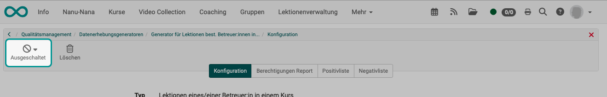{ class="shadow lightbox" }

!!! note "Hinweis"

    Ein Editieren eines Generators ist nur möglich, wenn der Generator ausgeschaltet ist.

