# Quality Management: Data Collection Generators {: #Quality_Management_Data_Collection_Generators}

!!! tip "Recommendation"

    Knowledge of data collections is a prerequisite for understanding the data collection generator.

## What does a data collection generator do? {: #QMgenerator_function}

**Data collections** can also be created **automatically according to certain rules** in the Quality management module.

The rules are described and set up in so-called **data collection generators**.

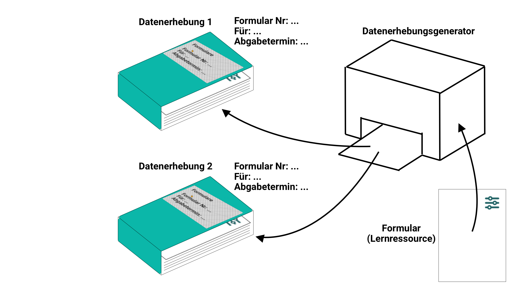{ class="lightbox" }

## How is a data collection generator created? {: #create_QMgenerator}

If you have the appropriate authorization (role), **Quality management** appears in your main navigation. Click on the link in the section **"Data collection generators"**.

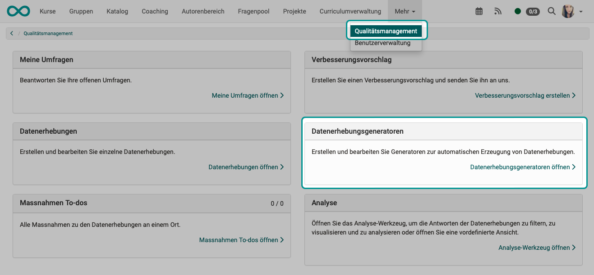{ class="shadow lightbox" }

Create a new data collection generator there.

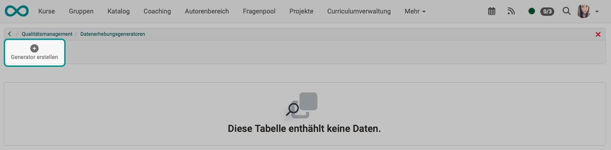{ class="shadow lightbox" }

By selecting a type, you determine the rule set according to which data collections are created.

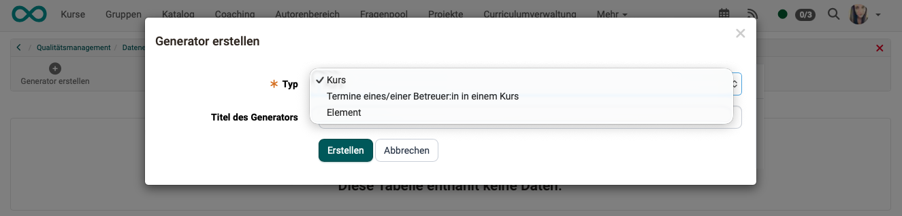{ class="shadow lightbox" }

[To the top of the page ^](#Quality_Management_Data_Collection_Generators)

---

## Generator type "Course" {: #QMgenerator_type_course}

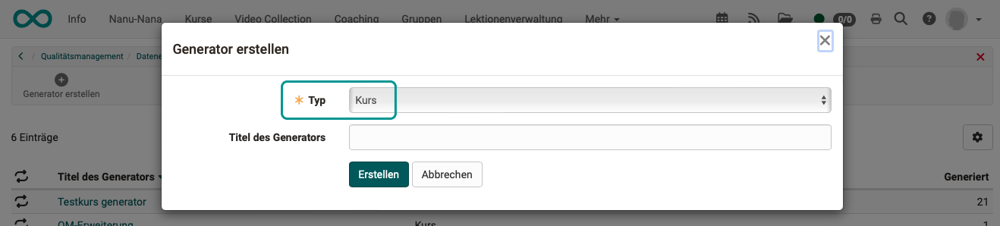{ class="shadow lightbox" }

### Tab "Configuration" {: #Quality_Management_Data_Collection_Generators_Type_Course_Config}

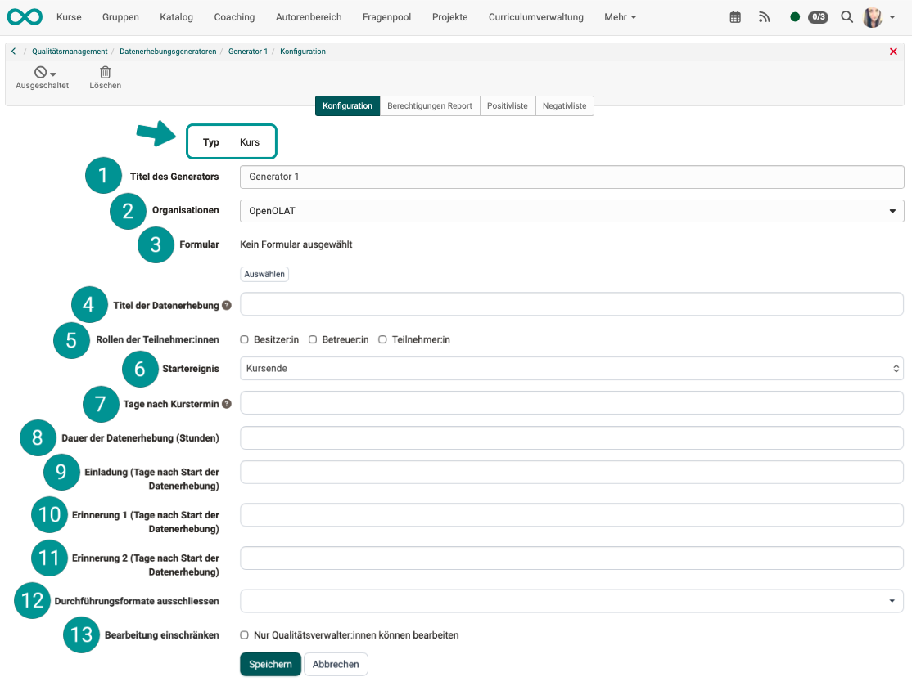{ class="shadow lightbox" }

 **Title of the generator** 
If possible, use a title that makes a statement about content and use, to enable a clear assignment and differentiation from other generators.

 **Organizations** 
If the module "Organizational units" has been activated and set up, data collections can also be related to selected organizational units.

 **Form** 
With data collection generators, too, only one form is used at a time to enable comparability and evaluation. If another form is to be used, you would have to create another generator.

 **Title of the data collection** 
Enter the title of the data collections generated by the data collection generator here.
Variables can also be used in the title.

 **Roles of participants** 
The course members with the roles selected here can participate in the data collection. It is possible, for example, to conduct this data collection exclusively among coaches.

 **Start trigger** 
Triggering start events for the generator of type "Course" can be:

* Start of course
* End of course
* daily

 **Days after course date** 
(This option is only displayed if "Start of course" or "End of course" has been selected as the start trigger.) 
The start of the data collection is calculated from the start trigger and the number of days entered here.
The number of days can also be negative.

**Days of week** 
(This option is only displayed if "Daily" has been selected as the start trigger.) 
A data collection is generated periodically on the specified days of the week.

!!! note "Note"

    If a course has a start or end date, it is not included in the data collections before and after these dates.

 **Duration of the data collection (hours)** 
After the start of the data collection, all participants can complete and submit the form within the specified period. After this deadline, it is no longer possible to submit the form.

 **Invitation** 
The invitation is a function of the data collection. If several data collections are generated automatically by the data collection generator, the dispatch date of the invitation is calculated in the data collections depending on the respective start date and the value entered here.

  **Reminders** 
The reminders are also a function of the data collection. If several data collections are generated automatically by the data collection generator, the dispatch date of the reminder is calculated in the data collections depending on the respective start date and the value entered here.

 **Exclude implementation formats** 
An implementation format can be specified for courses in the metadata. It is possible to exclude certain [implementation formats](../../manual_admin/administration/Modules.md#course) from generated data collections, e.g. if examination courses are not to be included.

 **Restrict editing** 
With the checkbox "Only quality managers can edit", the editing of the generator is restricted to quality managers.

### Tab "Report access"

The configuration entered here is transferred 1:1 to the created data collections.
See [Data collections](Quality_Management_Data_Collections.md).

### Tab "White list" {: #Quality_Management_Data_Collection_Generators_Type_Course_PositivList}

If a generator has been created, this results in a list of courses for which data collections are generated.

If a white list is also defined, only courses that are contained both in the list originally created by the generator and in this white list are taken into account for data collections.

### Tab "Black list" {: #Quality_Management_Data_Collection_Generators_Type_Course_NegativList}

If a generator has been created, this results in a list of courses for which data collections are generated. Individual courses can be excluded in the black list.

!!! note "Note"

    It only makes sense to create either a white list or a black list. 
    If data collections are to be carried out **only for a small part of the courses**, a **white list** is recommended.  If data collections are to be carried out **for the majority of the courses**, a **black list** is recommended.

[To the top of the page ^](#Quality_Management_Data_Collection_Generators)

---

## Generator type "Events of a coach in a course" {: #QMgenerator_type_events}

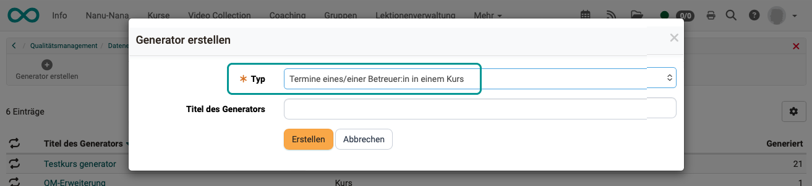{ class="shadow lightbox" }

### Tab "Configuration"

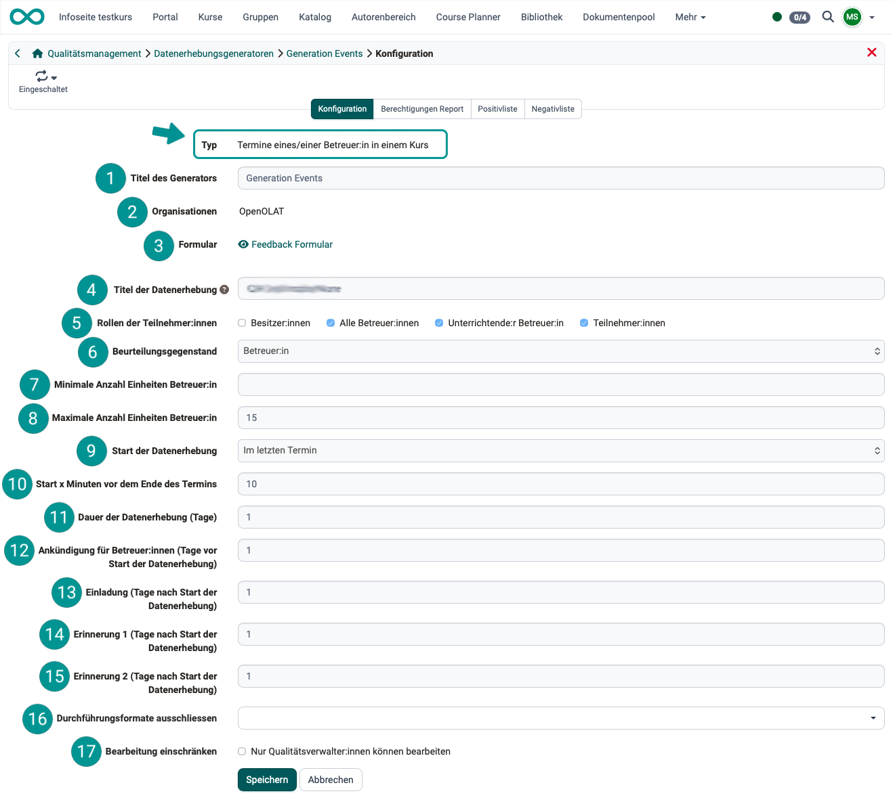{ class="shadow lightbox" }

See also [Configuration in the type Course](#Quality_Management_Data_Collection_Generators_Type_Course_Config).

 **Roles of participants** 

The course members with the roles selected here can participate in the data collection.

* Owners
* All coaches (= all coaches of the course)
* Teaching coach (= the person teaching at the event that leads to the data collection)
* Participants

 **Topic** 
The generator enters the topic in the [data collection](Quality_Management_Data_Collections.md):

* Coach or
* Course

!!! note "Note"

    If there are several coaches in a course who fulfill the other criteria, one [data collection](Quality_Management_Data_Collections.md) is initiated per coach.

 **Teacher minimum units** 
The data collection only takes place if the coach has the minimum number of units in a course in total specified here. (Not only the lessons already held.)

 **Teacher maximum units** 
The data collection only takes place if the coach does not exceed the maximum number of units in a course in total specified here.

!!! note "Example"

    In the data collection for the standard case, only coaches who have to hold at least 10 units should be assessed. The minimum number of units is used for this purpose.

    If only rarely teaching coaches are to be assessed, a data collection for coaches with a maximum number of units can be generated in another generator.

 **Start of data collection** 

* In the last event (which the coach teaches in a course)
* In the event with unit x (events taught by the coach)

 **Start x minutes before the end of the event** 

If the survey is conducted shortly before the end, a higher participation rate can generally be expected.

 **Duration of the data collection (days)** 

After the start of the data collection, all participants can complete and submit the form within the specified period. After this deadline, it is no longer possible to submit the form.

 **Announcement to coaches (days before data collection start)** 

If no information is provided here, no announcement is sent.
In some cases it makes sense that, for example, coaches receive an announcement in advance and can intervene if necessary.

 **Invitation (days after data collection start)** 

The invitation is an email to the participants with the link to the form. If no information is provided, no email is sent and the participants must be informed by other means. (E.g. by lecturers in class.)

  **Reminder (days after data collection start)** 
See also [Configuration in the type Course](#Quality_Management_Data_Collection_Generators_Type_Course_Config).

### Tab "Report access"

The configuration entered here is transferred 1:1 to the created data collections.
See [Data collections](Quality_Management_Data_Collections.md).

### Tab "White list"

See [Type Course White list](#Quality_Management_Data_Collection_Generators_Type_Course_PositivList).

### Tab "Black list"

See [Type Course Black list](#Quality_Management_Data_Collection_Generators_Type_Course_NegativList).

[To the top of the page ^](#Quality_Management_Data_Collection_Generators)

---

## Generator type "Element" {: #QMgenerator_type_element}

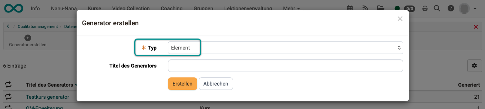{ class="shadow lightbox" }

### Tab "Configuration"

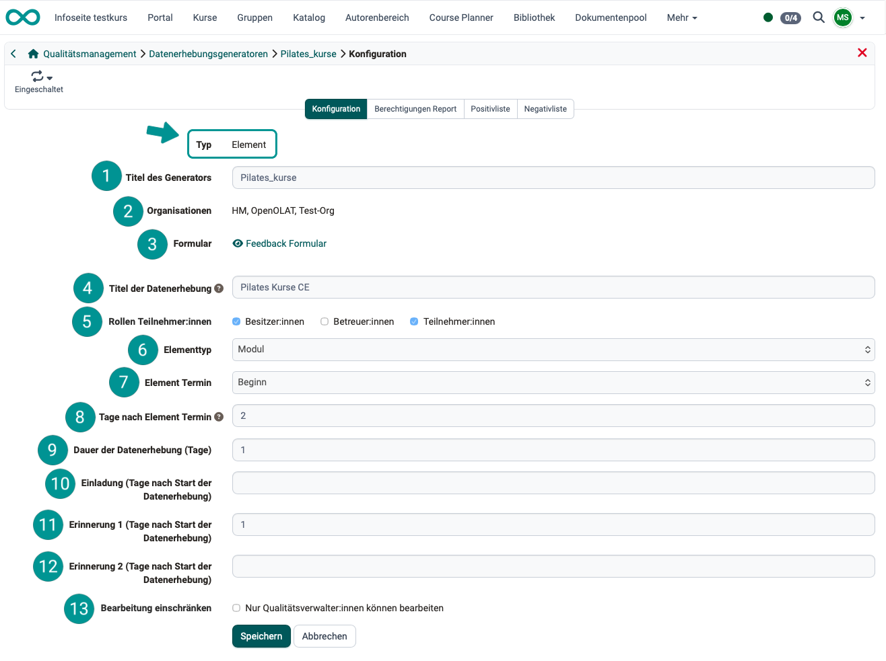{ class="shadow lightbox" }

See also [Configuration in the type Course](#Quality_Management_Data_Collection_Generators_Type_Course_Config).

 **Type element** 

There is one data collection for each element.

Depending on how the product is set up, elements can be, for example:

* Semester
* Program
* Module

 **Element date** 
Triggering start events for the generator of type "Element" can be:

* Begin
* End

 **Days after element date** 
The start of the data collection is calculated from the start trigger and the number of days entered here.
The number of days can also be negative.

### Tab "Report access"

The configuration entered here is transferred 1:1 to the created data collections.
See [Data collections](Quality_Management_Data_Collections.md).

### Tab "White list"

If a generator has been created, this results in a list of elements for which data collections are generated.

If a white list is also defined, only elements that are contained both in the list originally created by the generator and in this white list are taken into account for data collections.

### Tab "Black list"

If a generator has been created, this results in a list of elements for which data collections are generated. Individual elements can be excluded in the black list.

!!! note "Note"

    It only makes sense to create either a white list or a black list. If data collections are to be carried out **only for a small part of the elements**, a **white list** is recommended.  If data collections are to be carried out **for the majority of the elements**, a **black list** is recommended.

[To the top of the page ^](#Quality_Management_Data_Collection_Generators)

---

## Switch on generator {: #activate_QMgenerator}

Each newly created generator is initially switched off. This allows it to be configured at leisure. A generator is switched on and activated using the button at the top left.

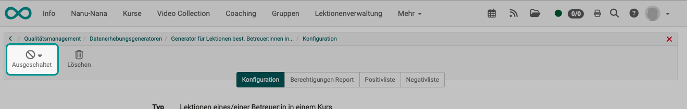{ class="shadow lightbox" }

!!! note "Note"

    Editing a generator is only possible if the generator is switched off.

[To the top of the page ^](#Quality_Management_Data_Collection_Generators)

---

## Further information {: #further_information}

[Modules: Overview >](../../manual_admin/administration/Modules.md) 
[Quality Management: Data collections >](Quality_Management_Data_Collections.md)

[To the top of the page ^](#Quality_Management_Data_Collection_Generators)
