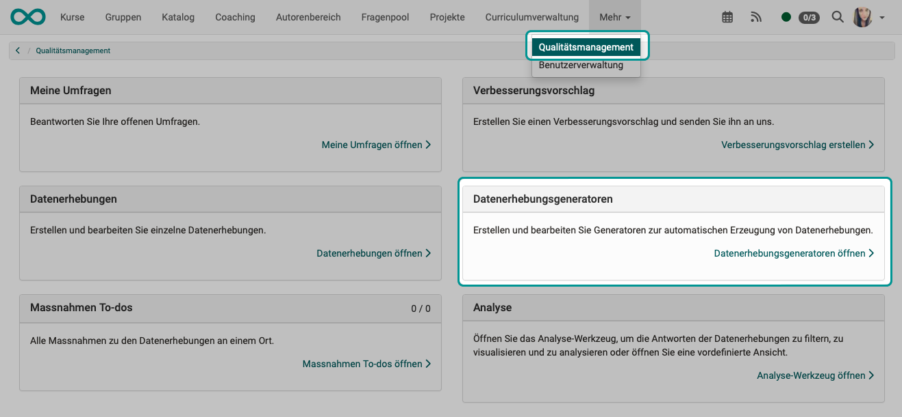
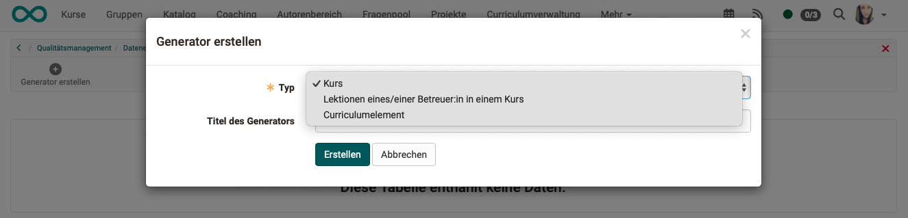
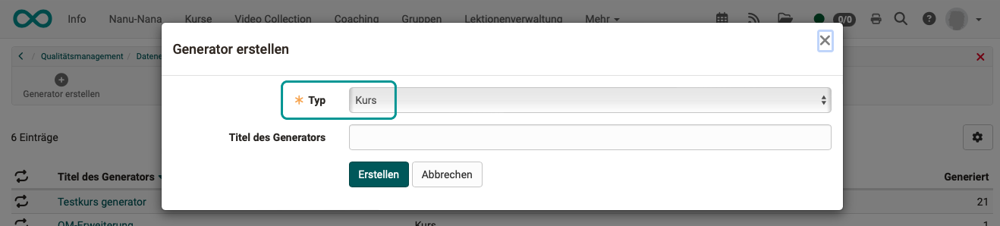
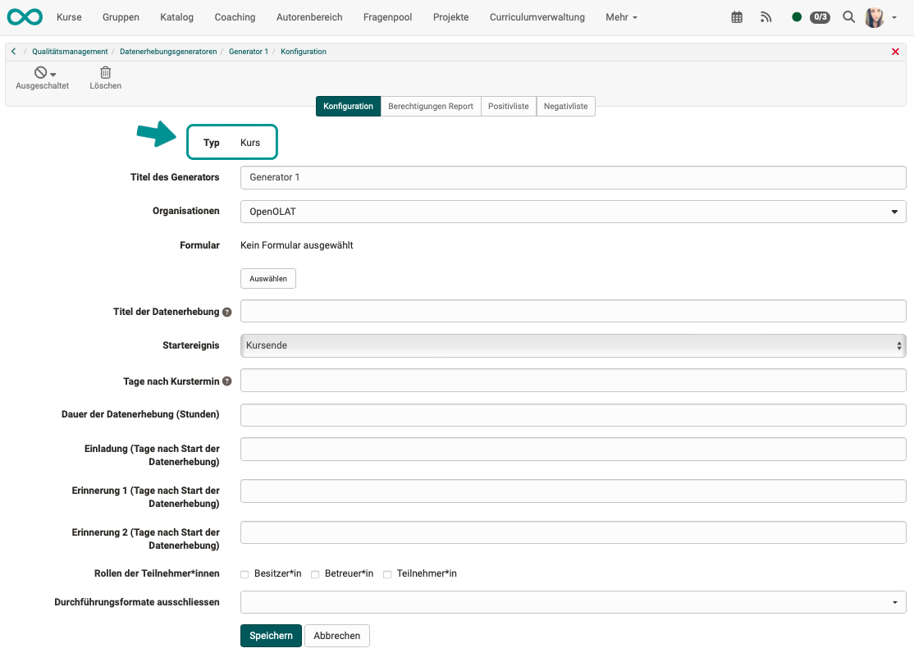
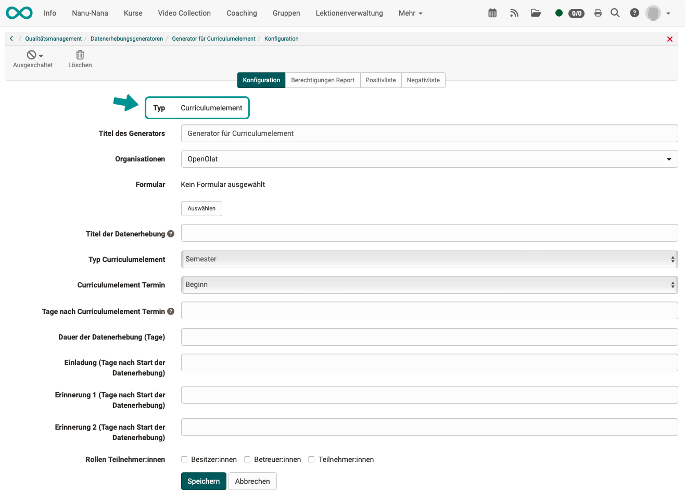
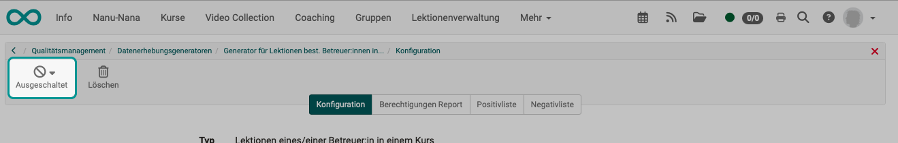

# Quality Management: Data Collection Generators {: #Quality_Management_Data_Collection_Generators}

!!! info "Recommendation"

    Knowledge of data collection is a prerequisite for understanding the data collection generator.

## What does a data collection generator do?

**Data surveys** can also be created **automatically according to certain rules** in the Quality Management module. 

The rules are described and set up in so-called **data collection generators**. 

{ class="lightbox" }

## How is a data collection generator created?

If you have the appropriate authorization (role), **Quality management** will appear in your main navigation. Click on the link in the section **"Data collection generators"**.

{ class="shadow lightbox" }

Create a new data collection generator there.

{ class="shadow lightbox" }

By selecting a type, you determine the rule set according to which data collections are created.

{ class="shadow lightbox" }

## Generator Type "Course"

{ class="shadow lightbox" }

### Tab "Configuration" {: #Quality_Management_Data_Collection_Generators_Type_Course_Config}

{ class="shadow lightbox" }

**Title** 
If possible, use a title that makes a statement about the content and use in order to enable clear assignment and differentiation from other generators.

**Organizations** 
If the "Organizational units" module has been activated and set up, data collection can also be related to selected organizational units.

**Form** 
Even with data generators, only one form is used at a time to enable comparability and evaluation. If another form is to be used, you would have to create another generator. 

**Title of data collection** 
Enter the title of the data collections generated by the data generator here. 
Variables can also be used in the title. 

**Start event** 
Triggering start events can be of the "Course" type for the generator:

* Course start
* Course end
* daily

**Days after the course date (start event)**  
(This option is only displayed if "Course start" or "Course end" has been selected as the start event). 
The start of the data collection is calculated from the start event and the number of days entered here.
The number of days can also be negative.

**Weekday** 
(This option is only displayed if "daily" has been selected as the start event). 
A data collection is always generated periodically on the specified days of the week.

!!! note "Note"

    If a course has a start or end date, it is not included in the data collection before and after these dates.

**Duration of data collection (hours)** 
Once the data collection has started, all participants can complete and submit the form within the specified period. After this deadline, it is no longer possible to submit the form.

**Invitation** 
The invitation is a function of data collection. If several data collections are now generated automatically by the data generator, the dispatch date of the invitation is calculated in the data collections depending on the respective start date and the value entered here.

**Reminders** 
Reminders are also a function of data collection. If several data collections are generated automatically by the data generator, the dispatch date of the reminder is calculated in the data collections depending on the respective start date and the value entered here.

**Participants** 
The course members with the roles selected here can participate in the data collection.

**Exclude implementation formats** 
An implementation format can be specified for courses in the metadata. It is possible to exclude certain [implementation formats](../../manual_admin/administration/Modules.md#kurs) from generated data collections, e.g. if examination courses are not to be included.

### "Authorizations report" tab

The configuration entered here is transferred 1:1 to the data surveys created.
See [Data collections](Quality_Management_Data_Collections.md).

### Tab "Positive list" {: #Quality_Management_Data_Collection_Generators_Type_Course_PositivList}

If a generator has been created, this results in a list of courses for which data surveys are generated.

If a positive list is also defined, only courses for data collection that are contained in both the list originally created by the generator and in this positive list are taken into account.

### Tab "Negative list" {: #Quality_Management_Data_Collection_Generators_Type_Course_NegativList}

If a generator has been created, this results in a list of courses for which data collections are generated. Some of these courses can be excluded from the negative list.

!!! note "Note"

    It only makes sense to create either a positive list or a negative list. 
    If data is only to be collected for a small proportion of the courses, a positive list is recommended. If data is to be collected for the majority of courses, a negative list is recommended.

## Generator type "Lessons of a coach in a course"

{ class="shadow lightbox" }

### Tab "Configuration"

{ class="shadow lightbox" }

See also [Course Configuration](#Quality_Management_Data_Collection_Generators_Type_Course_Config).

**Object of assessment** 
The generator enters the assessment object in the [Data Collection](Quality_Management_Data_Collections.md):

* Coaches or
* Course

!!! note "Note"

    If there are several coaches in a course who fulfill the other criteria, a [data collection](Quality_Management_Data_Collections.md) is initiated for each coach.

**Minimum number of lessons coaches** 
The data collection only takes place if the coach has the minimum number of lessons in a course specified here. (Not only the lessons already completed).

**Maximum number of lessons coaches** 
Data will only be collected if the coach does not exceed the maximum number of lessons in a course specified here.

!!! note "Example"

    In the data collection for the standard case, only coaches who have to give at least 10 lessons should be assessed. The minimum number of lessons is used for this purpose.
    
    If only infrequently teaching coaches are to be assessed, a data collection for coaches with a maximum number of lessons can be generated in another generator.

**Start of data collection** 

* In the last block of lessons (which the coach teaches in a course)
* In the lesson block with lesson x (lesson blocks taught by the coach)

**Start x minutes before the end of the lesson block** 

If the survey is conducted shortly before the end, a higher participation rate can generally be expected.

**Announcement for coaches (days before the start of data collection)** 

If no information is provided here, no announcement will be sent.
In some cases, it makes sense for coaches, for example, to receive an announcement in advance and to be able to intervene if necessary.

**Invitation (days after the start of data collection)** 

The invitation is an e-mail to the participants with a link to the form. If no information is provided, no e-mail will be sent and participants must be informed by other means. (E.g. by lecturers in class.)

**Reminder (days after the start of data collection)** 
See also [Course Config](#Quality_Management_Data_Collection_Generators_Type_Course_Config).

**Roles of the participants** 

The course members with the roles selected here can participate in the data collection.

* Owners
* All coaches (= all coaches of a course)
* Teaching coach (= Teacher(s) in the lesson block that leads to data collection)
* Participants

### Tab "Authorizations report"

The configuration entered here is transferred 1:1 to the data surveys created.
See [Data collections](Quality_Management_Data_Collections.md).

### Tab "Positive list"

See [Type Course Positive list](#Quality_Management_Data_Collection_Generators_Type_Course_PositivList).

### Tab "Negative list"

See [Type Course Negative list](#Quality_Management_Data_Collection_Generators_Type_Course_NegativList).

## Generator Type "Curriculum element"

{ class="shadow lightbox" }

### Tab "Configuration"

{ class="shadow lightbox" }

See also [Configuration in the type course](#Quality_Management_Data_Collection_Generators_Type_Course_Config).

**Type Curriculum element** 

There is one data collection for each curriculum element.

Depending on how the curriculum is set up, curriculum elements can be e.g:

* Semester
* Course
* Module

**Curriculum element Date** 
Triggering start events can be of the "Curriculum element" type for the generator:

* Beginning
* End

**Days after curriculum element Date** 
The start of the data collection is calculated from the start event and the number of days entered here.
The number of days can also be negative. 

### Tab "Authorizations report"

The configuration entered here is transferred 1:1 to the data surveys created.
See [Data collections](Quality_Management_Data_Collections.md).

### Tab "Positive list"

If a generator has been created, this results in a list of curriculum elements for which data collections are generated.

If a positive list is also defined, only curriculum elements for data collection that are contained both in the list originally created by the generator and in this positive list are taken into account.

### Tab "Negative list"

If a generator has been created, this results in a list of curriculum elements for which data collections are generated. Individual curriculum elements can be excluded from the negative list.

!!! note "Note"

    It only makes sense to create either a positive list or a negative list. If data is only to be collected on a small number of curriculum elements, a positive list is recommended. If data is to be collected for the majority of curriculum elements, a negative list is recommended.

## Switch on generator

Each newly created generator is initially switched off. This allows it to be configured at leisure. You can switch on and activate a generator using the button at the top left.

{ class="shadow lightbox" }

!!! note "Note"

    Editing a generator is only possible if the generator is switched off.

