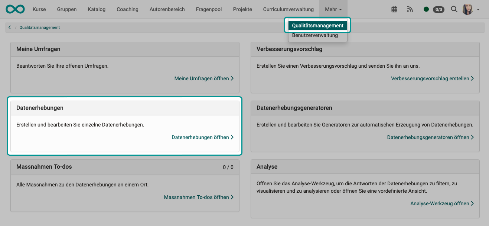
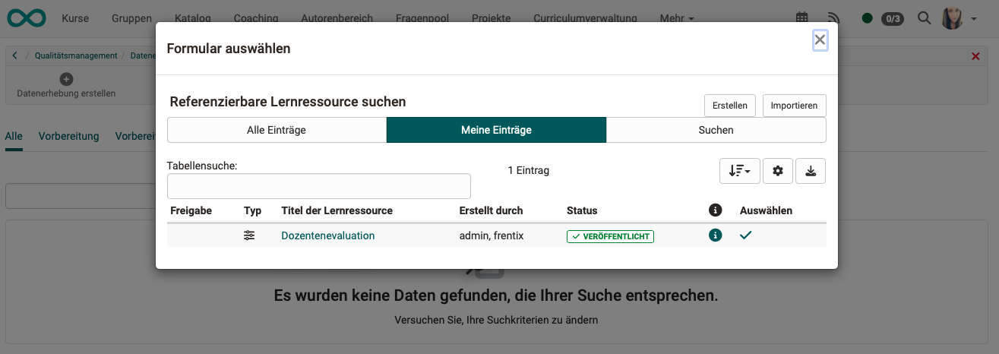

# Qualitätsmanagement: Datenerhebung {: #Quality_Management_Data_Collections}

## Was macht eine Datenerhebung? 

* Um Rückmeldung zur Qualität von Unterricht, Kursen, Dozierenden u.a. zu erhalten, wird ein Fragebogen (Formular-Lernressource) einem bestimmten Personenkreis zum Ausfüllen vorgelegt.  
* Zum festgelegten Zeitpunkt werden E-Mails mit einem Link auf die Formular-Lernressource verschickt.
* Die Eingaben der Teilnehmer:innen werden vom Modul "Qualitätsmanagement" ausgewertet, z.B. auch über verschiedene Kurse hinweg.
* Am Ende wird ein Report erzeugt, auf den ein bestimmbarer Personenkreis Zugriff erhält.
* Die Datenerhebungen werden im Modul "Qualitätsmanagement" erstellt.
* Es können Erinnerungen und To-dos (Massnahmen) zugeordnet werden.

## Neue Datenerhebung erstellen

Bei entsprechender Berechtigung (Rolle) erscheint in Ihrer Hauptnavigation das **Qualitätsmanagement**. Klicken Sie auf den Link im Abschnitt **"Datenerhebungen"**.

{ class="shadow lightbox" }

Erstellen Sie dort eine neue Datenerhebung.

{ class="shadow lightbox" }

Als Erstes werden Sie aufgefordert, eine Formular-Lernressource zu bestimmen.
Wählen Sie eine bereits vorhandene oder erstellen Sie eine neue.

{ class="shadow lightbox" }

Die Eigenschaften und Funktionsweise der Datenerhebung wird in 5 Tabs definiert. Zum festgelegten Zeitpunkt werden E-Mails mit einem Link zum Formular an die hier festgelegten Teilnehmer:innen geschickt. Am Ende wird ein Report erzeugt, auf den die im Tab "Berechtigungen Report" genannten Personen Zugriff bekommen.

{ class="shadow lightbox" }

