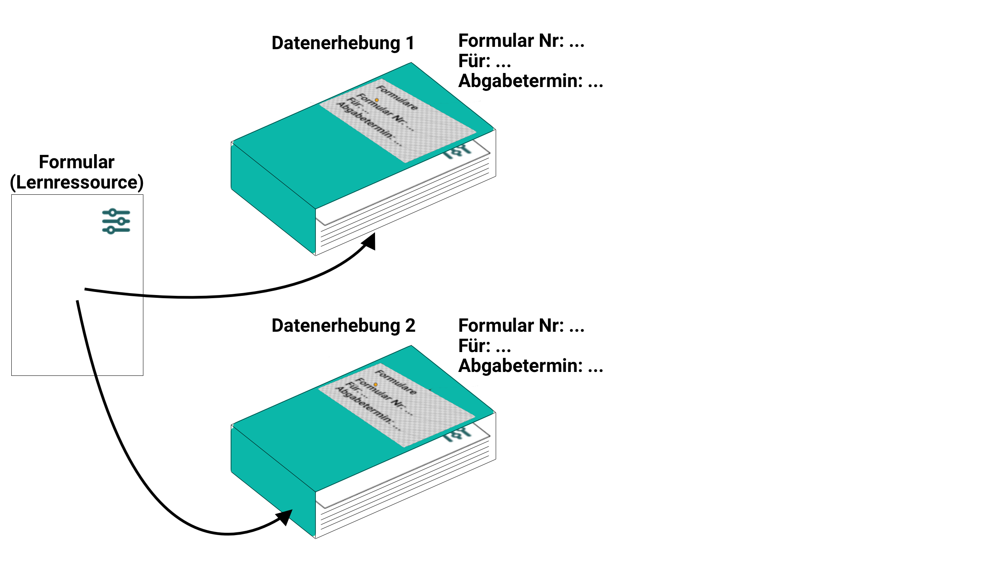
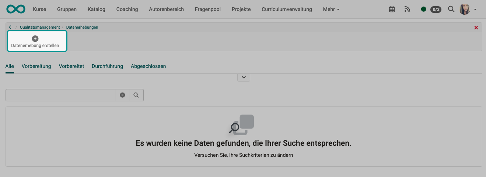
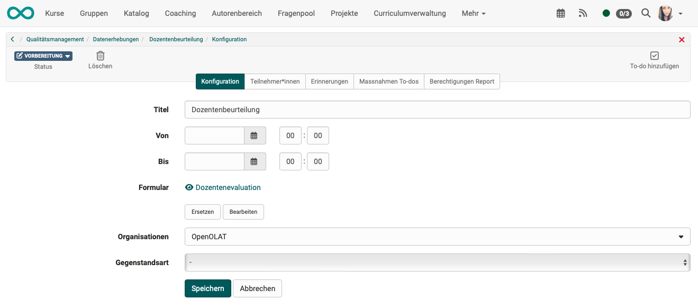
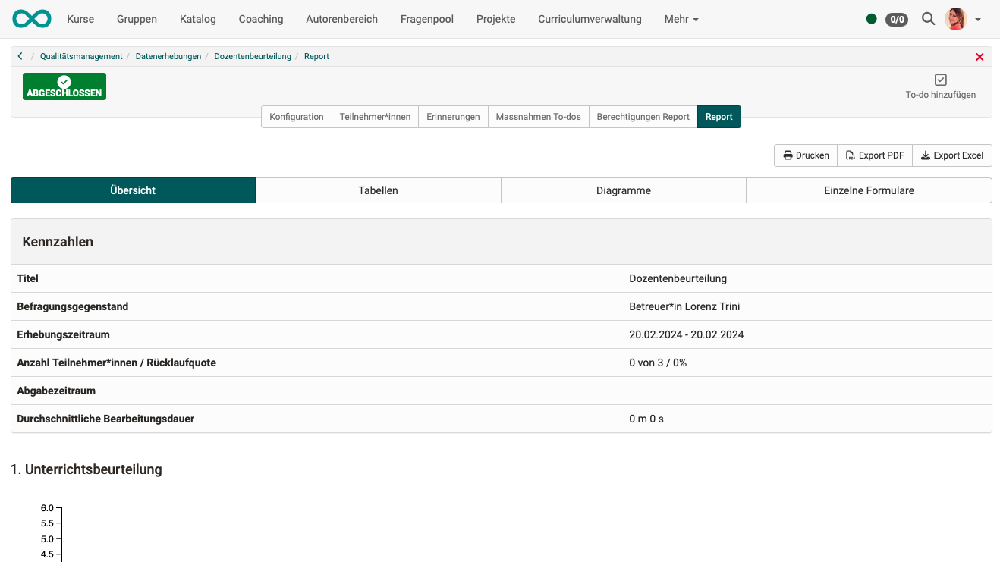
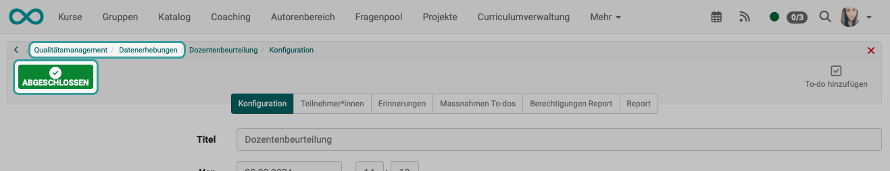

# Qualitätsmanagement: Datenerhebung {: #Quality_Management_Data_Collections}

## Was ist eine Datenerhebung? 

!!! info "Zusammenfassung"

    Bei einer Datenerhebung wird
    
    * ein bestimmter **Personenkreis**
    * in einem bestimmten **Zeitfenster**
    * zu einem bestimmten **Thema**
    * mit einem bestimmten **Formular** befragt.

* Um Rückmeldung zur Qualität von Unterricht, Kursen, Dozierenden u.a. zu erhalten, wird ein Fragebogen (Formular-Lernressource) einem bestimmten Personenkreis zum Ausfüllen vorgelegt.  
* Zum festgelegten Zeitpunkt werden dann E-Mails mit einem Link auf die Formular-Lernressource verschickt.
* Die Eingaben der Teilnehmer:innen werden vom Modul "Qualitätsmanagement" ausgewertet, z.B. auch über verschiedene Kurse hinweg.
* Am Ende wird ein Report erzeugt, auf den ein bestimmbarer Personenkreis Zugriff erhält.
* Die Datenerhebungen werden im Modul "Qualitätsmanagement" erstellt.

{ class="lightbox" }

## Neue Datenerhebung erstellen

Bei entsprechender Berechtigung (Rolle) erscheint in Ihrer Hauptnavigation das **Qualitätsmanagement**. Klicken Sie auf den Link im Abschnitt **"Datenerhebungen"**.

{ class="shadow lightbox" }

Erstellen Sie dort eine neue Datenerhebung.

{ class="shadow lightbox" }

Als Erstes werden Sie aufgefordert, eine Formular-Lernressource zu bestimmen.
Wählen Sie eine bereits vorhandene oder erstellen Sie eine neue.

{ class="shadow lightbox" }

Die Eigenschaften und Funktionsweise der Datenerhebung wird in 5 Tabs definiert. Zum festgelegten Zeitpunkt werden E-Mails mit einem Link zum Formular an die hier festgelegten Teilnehmer:innen geschickt. Am Ende wird ein Report erzeugt, auf den die im Tab "Berechtigungen Report" genannten Personen Zugriff bekommen.
(Sobald ein Report vorhanden ist, wird ein weiterer Tab "Report" angezeigt.)

{ class="shadow lightbox" }

**Tab "Konfiguration"** 
Nach Start der Datenerhebung können alle Teilnehmenden im angegebenen Zeitraum das hier ausgewählte Formular ausfüllen und abgeben. Nach Ablauf dieser Frist ist eine Abgabe nicht mehr möglich. 

Nach Ende der Abgabefrist steht der Report allen Personen zur Verfügung, die im Tab "Berechtigungen Report" aufgelistet sind.

**Tab "Teilnehmer:innen"** 
In diesem Tab wird die Gruppe der befragten Personen definiert, bzw. wer die Aufforderung zur Teilnahme mit dem Link zum Formular per Mail erhält.

**Tab "Erinnerungen"** 
Es können verschiedene Erinnerungsmails vorbereitet werden, die bei Eintritt der gewählten Versandbedingungen automatisch verschickt werden.

Die Einladung ist eine E-Mail an die Teilnehmer:innen mit dem Link zum Formular. Wird keine Angabe gemacht, wird keine E-Mail verschickt, die Teilnehmenden müssen anderweitig informiert werden. (Z.B. durch Dozierende im Unterricht.)

**Tab "Massnahmen To-dos"** 
Auf die Ergebnisse von Datenerhebungen oder einer bestimmten Teilnehmerbefragung kann direkt mit entsprechenden Massnahmen reagiert werden. Notwendige To-dos können kontextbezogen angelegt und direkt an die betreffenden Personen delegiert werden. Sie werden per E-Mail über ein neues To-do informiert. Alle To-dos stehen im neuen Bereich ["Massnahmen (To-dos")](Quality_Management_To-dos.de.md) zur Verfügung.

**Tab "Berechtigungen Report"** 
Ist eine Datenerhebung abgeschlossen, kann von den aufgelisteten Personen auf die Reports zugegriffen werden. 
Im Tab "Berechtigungen Report" kann bestimmt werden, 
a) wer welche Reports sehen darf 
b) und ob/wie darüber informiert wird.

* **Online-Zugriff** = Die in der 1. Spalte genannten Empfänger können online auf Reports zugreifen.
* **E-Mail bei Abschluss** = Die in der 1. Spalte genannten Empfänger erhalten eine E-Mail, sobald ein Report erzeugt wurde.
* **E-Mail bei qualitativem Feedback** = Die in der 1. Spalte genannten Empfänger erhalten eine E-Mail, sobald ein Report erzeugt wurde und im Formular **Textfelder** ausgefüllt wurden oder eine Datei von den Befragten hochgeladen wurde.

Qualitätsmanager:innen haben auch schon vor Abschluss Zugriff auf den aktuellen Status der Datenerhebung.

**Tab "Report"** 
Dieser Tab wird erst sichtbar, wenn ein Report vorhanden ist.

{ class="shadow lightbox" }

## Datenerhebung ausführen

Die Durchführung wird automatisch angestossen. Sobald das definierte Zeitfenster beginnt (Tab "Konfiguration"), können die befragten Personen das Formular ausfüllen und abgeben. Nach Ablauf dieser Frist ist eine Abgabe nicht mehr möglich. 

## Datenerhebung abschliessen

Eine Datenerhebung schliesst sich selbst ab, wenn das vorgegebene Zeitfenster abgelaufen ist. 

{ class="shadow lightbox" }

Wurde eine Datenerhebung beendet, kann sie nicht mehr in den Status "Durchführung" zurückversetzt werden.

Die Bearbeitung einer abgeschlossenen Datenerhebung ist nur noch möglich in den Tabs

* Massnahmen To-dos und
* Berechtigungen Report

Es besteht die Möglichkeit, den Abschluss einer laufenden Datenerhebung auch manuell zu erzwingen (ohne den Ablauf des vorgegebenen Zeitfensters abzuwarten). Klicken Sie dazu auf den Button zum Wechsel des Status.

{ class="shadow lightbox" }

