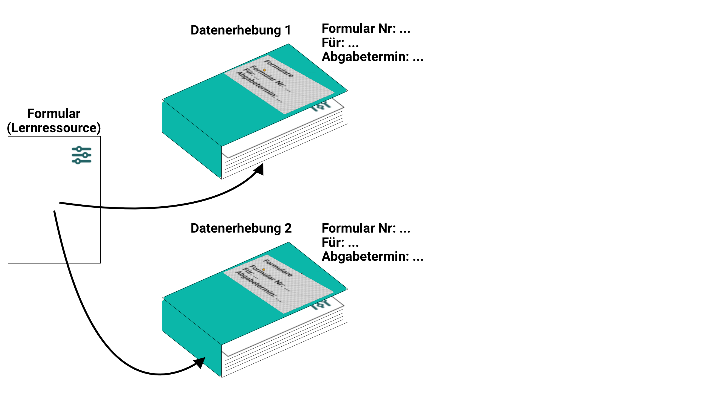
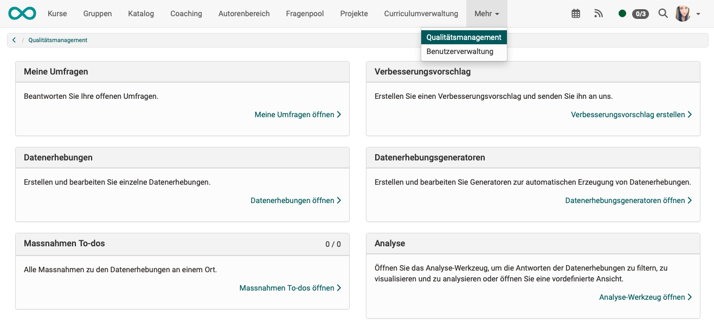
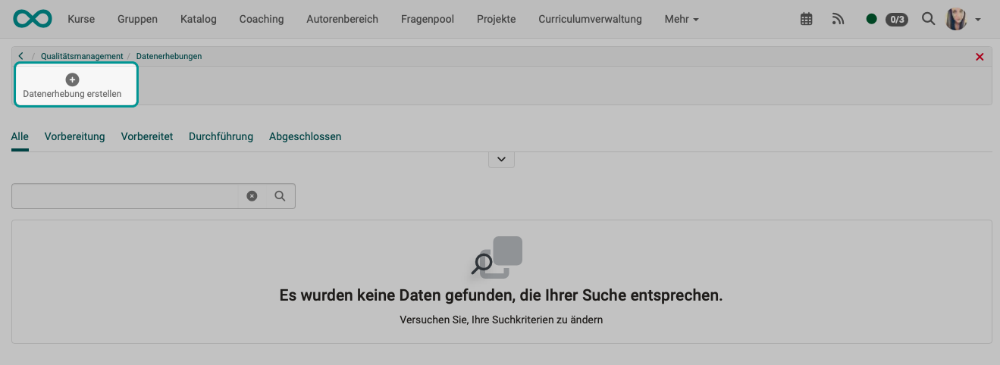
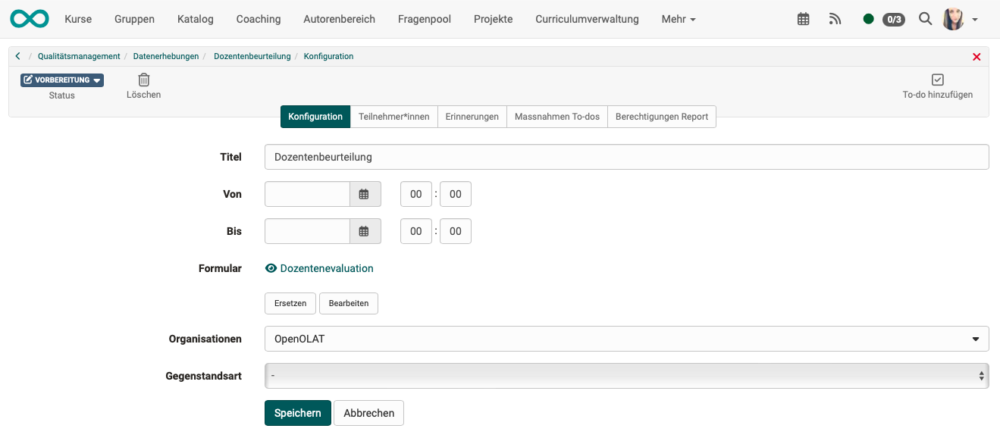
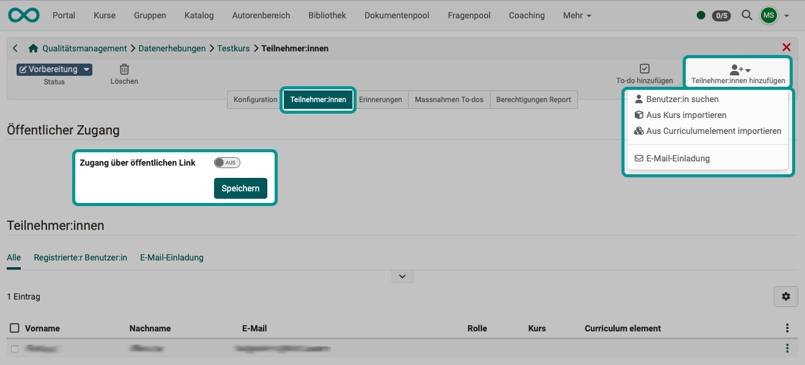
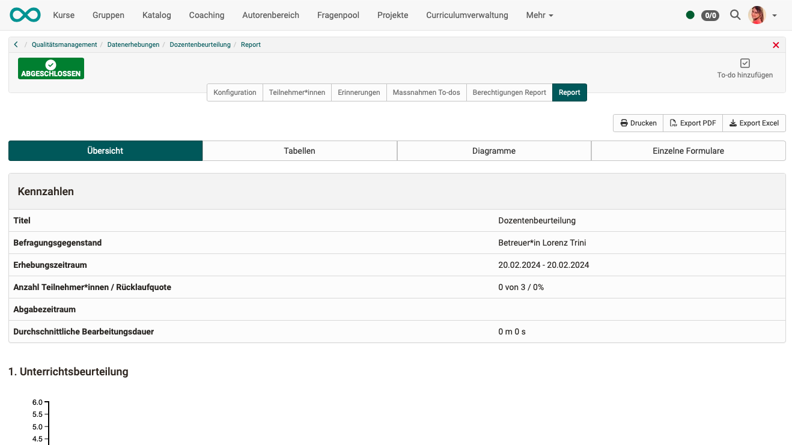
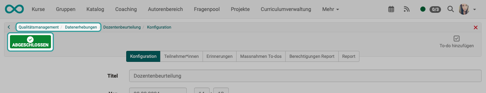
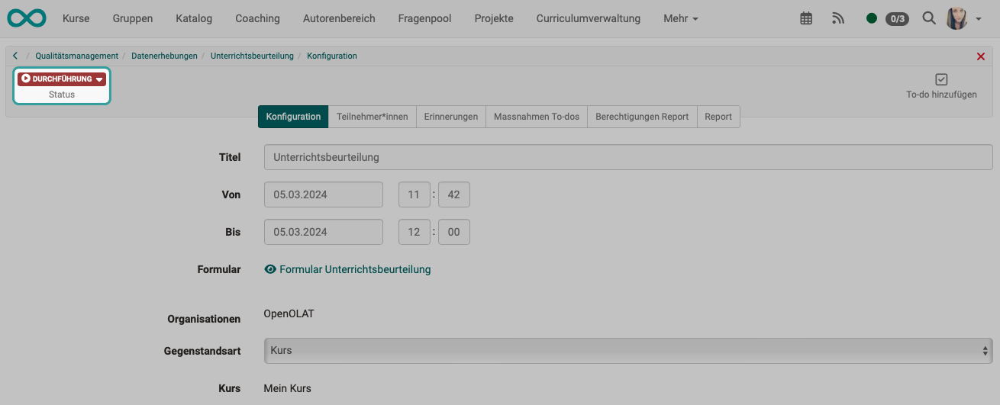

# Quality Management: Data collections {: #Quality_Management_Data_Collections}

## What's a data collection?

!!! info "Summary"

    Questioned are

    * a certain **group of people**
    * in a certain **time window**
    * about a certain **topic**
    * in a certain **form**
  
    in a Data collection.

* In order to obtain feedback on the quality of teaching, courses, lecturers, etc., a questionnaire (learning resource form) is submitted to a specific group of people for completion.
* E-mails with a link to the form learning resource are then sent at the specified time.
* Participant entries are evaluated by the "Quality Management" module, e.g. across different courses.
* At the end, a report is generated which can be accessed by a defined group of people.
* The data surveys are created in the "Quality Management" module.

{ class="lightbox" }

## Create new data collections

If you have the appropriate authorization (role), **Quality management** will appear in your main navigation. Click on the link in the **"Data collection"** section.

{ class="shadow lightbox" }

Create a new data collection there.

{ class="shadow lightbox" }

You will first be asked to specify a form learning resource.
Select an existing one or create a new one.

{ class="shadow lightbox" }

The properties and functionality of data collection are defined in 5 tabs. E-mails with a link to the form will be sent to the participants specified here at the specified time. At the end, a report is generated to which the persons named in the "Report authorizations" tab have access. (As soon as a report is available, another "Report" tab is displayed).

{ class="shadow lightbox" }

**Tab "Configuration"** 
After the start of data collection, all participants can complete and submit the form selected here during the specified period. After this deadline, it is no longer possible to submit the form. 

At the end of the submission period, the report is available to all persons listed in the "Report authorizations" tab.

**Tab "Participants"**
In this tab, the group of respondents is defined, i.e. who receives the invitation to participate with the link to the form by e-mail.

Groups of people can be searched for or added using the "Add participants" button. An invitation via email list is also possible.

A link can be generated by activating the toggle button “Access via public link”. Anyone who uses this link can then participate in the data collection without being registered as an OpenOlat user.

{ class="shadow lightbox" }

**Tab "Reminders"**
Various reminder e-mails can be prepared which are sent automatically when the selected shipping conditions are met.

The invitation is an e-mail to the participants with a link to the form. If no information is provided, no e-mail will be sent and participants must be informed by other means. (E.g. by lecturers in class.)

**Tab "Action to-dos"**
The results of data surveys or a specific participant survey can be responded to directly with appropriate measures. Necessary to-dos can be created contextually and delegated directly to the relevant persons. You will be informed of a new to-do by e-mail. All to-dos are available in the new section ["Action To-dos"](Quality_Management_To-dos.md).

**Tab "Permission report"** 
Once data collection has been completed, the reports can be accessed by the listed persons.
In the "Permissions report" tab, you can determine 
a) who is allowed to see which reports 
b) and whether/how information is provided.

* **Online access** = The recipients listed in the 1st column can access reports online.
* **E-mail on completion** = The recipients listed in the 1st column receive an e-mail as soon as a report has been generated.
* **E-mail for qualitative feedback** = The recipients listed in the 1st column will receive an e-mail as soon as a report has been generated and the **text fields** in the form have been filled in or a file has been uploaded by the respondents.

Quality managers have access to the current status of data collection even before completion.

**Tab "Report"** 
This tab is only visible if a report is available.

{ class="shadow lightbox" }

## Execute data collection

The process is triggered automatically. As soon as the defined time window begins ("Configuration" tab), the respondents can complete and submit the form. Once this period has expired, it is no longer possible to submit the form. 

## Complete data collection

Data collection closes automatically when the specified time window has expired. 

{ class="shadow lightbox" }

Once a data collection has been completed, it can no longer be reset to the "Execution" status.

It is only possible to edit a completed data collection in the tabs

* To-dos and
* Permissions report

It is also possible to force the completion of an ongoing data collection manually (without waiting for the specified time window to expire). To do this, click on the button to change the status.

{ class="shadow lightbox" }

