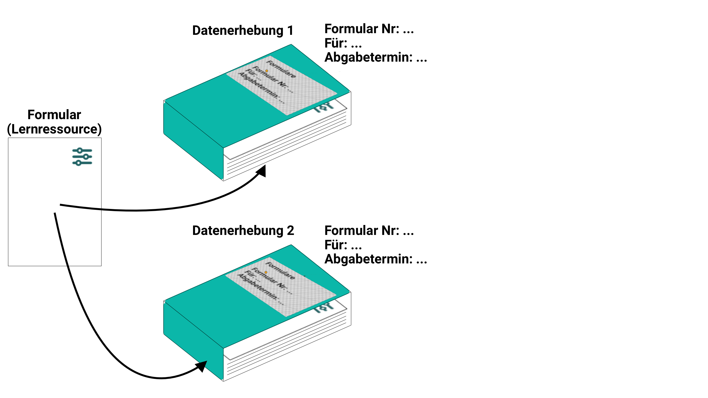
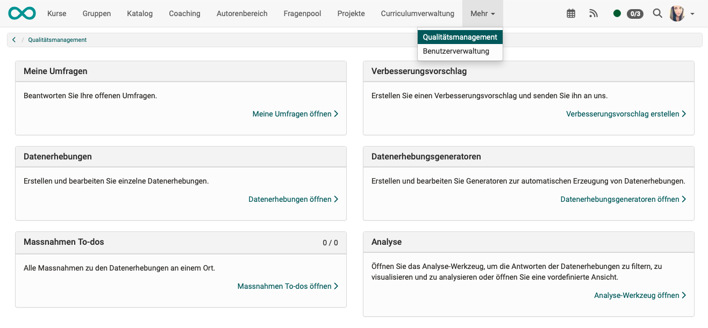
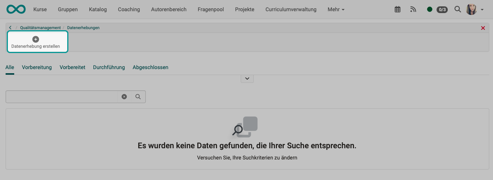
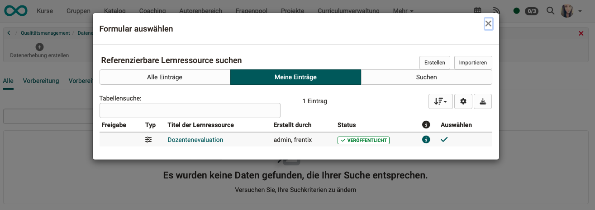
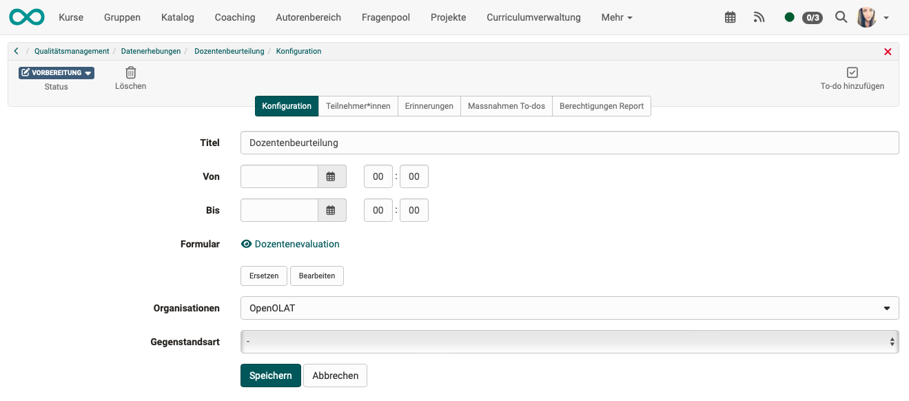
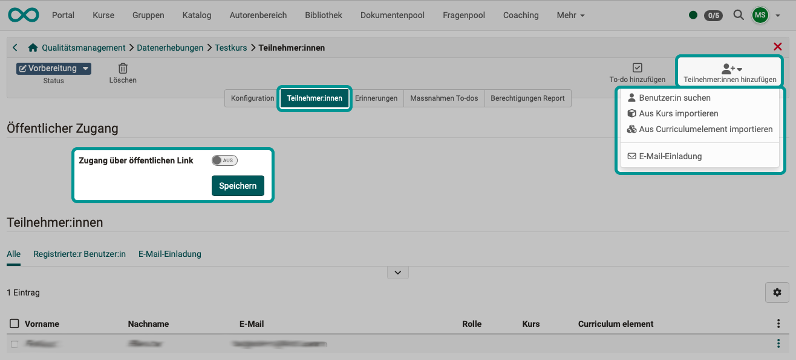
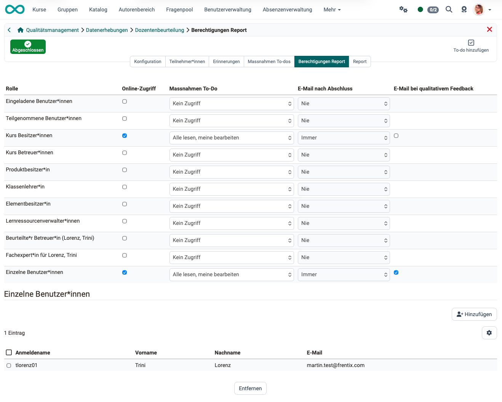
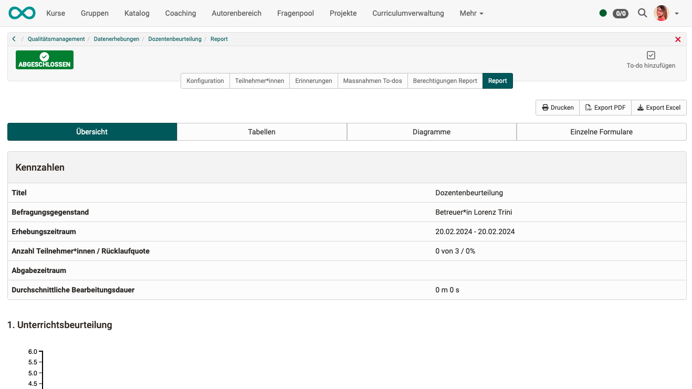
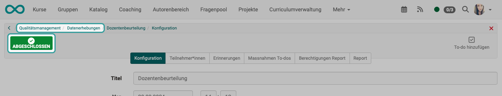
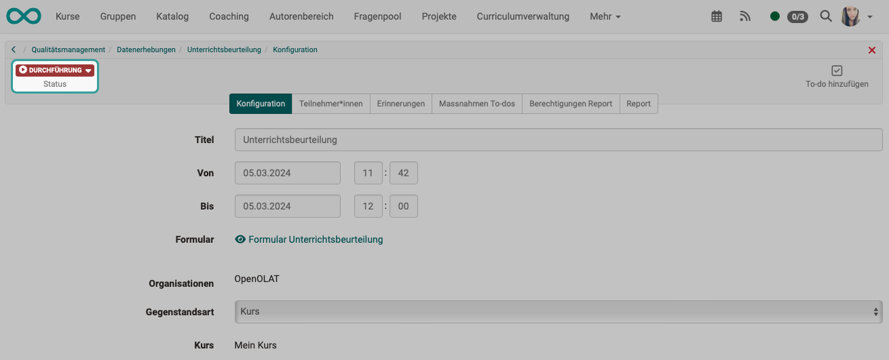

# Quality Management: Data collections {: #Quality_Management_Data_Collections}

## What is a data collection? {: #definition}

!!! info "Summary"

    In a data collection

    * a certain **group of people**
    * in a certain **time window**
    * on a certain **topic**
    * is surveyed with a certain **form**.

* In order to obtain feedback on the quality of teaching, courses, lecturers, etc., a questionnaire (form learning resource) is submitted to a specific group of people for completion.
* Emails with a link to the form learning resource are then sent at the specified time.
* The participants' entries are evaluated by the "Quality management" module, e.g. also across different courses.
* At the end, a report is generated which a definable group of people can access.
* The data collections are created in the "Quality management" module.

{ class="lightbox" }

[To the top of the page ^](#Quality_Management_Data_Collections)

---

## Create new data collection {: #create_data_collections}

If you have the appropriate authorization (role), **Quality management** appears in your main navigation. Click on the link in the section **"Data collections"**.

{ class="shadow lightbox" }

Create a new data collection there.

{ class="shadow lightbox" }

You are first asked to specify a form learning resource.
Select an existing one or create a new one.

{ class="shadow lightbox" }

The properties and functionality of the data collection are defined in 5 tabs. At the specified time, emails with a link to the form are sent to the participants specified here. At the end, a report is generated to which the persons named in the tab "Report access" have access.
(As soon as a report is available, a further tab "Report" is displayed.)

{ class="shadow lightbox" }

### Tab "Configuration" {: #tab_config}

After the start of the data collection, all participants can complete and submit the form selected here during the specified period. After this deadline, it is no longer possible to submit the form.

At the end of the submission period, the report is available to all persons listed in the tab "Report access".

### Tab "Participants" {: #tab_participants}

In this tab, the group of surveyed persons is defined, i.e. who receives the invitation to participate with the link to the form by email.

Groups of people can be searched for or taken over using the button "Add participants". An invitation via mail list is also possible.

A link can be generated by activating the toggle button "Access via public link". Any person who uses this link can then participate in the data collection without being registered as an OpenOlat user.

{ class="shadow lightbox" }

### Tab "Reminders" {: #tab_reminders}

Various reminder emails can be prepared, which are sent automatically when the selected dispatch conditions are met.

The invitation is an email to the participants with the link to the form. If no information is provided, no email is sent and the participants must be informed by other means. (E.g. by lecturers in class.)

### Tab "Action to-dos" {: #tab_action_to_dos}

The results of data collections or a specific participant survey can be responded to directly with appropriate actions. Necessary to-dos can be created in context and delegated directly to the persons concerned. They are informed of a new to-do by email. All to-dos are available in the section ["Actions (To-dos)"](Quality_Management_To-dos.md).

### Tab "Report access" {: #tab_permission_report}

Once a data collection has been finished, the listed persons can access the reports.
In the tab "Report access" you can determine 
a) who is allowed to see which reports 
b) and whether/how they are informed about it.

{ class="shadow lightbox" }

* Column **Online access:** The recipients named in the 1st column can access reports online.
* Column **Email when done:**  The recipients named in the 1st column receive an email as soon as a report has been generated.
* Column **Email in case of qualitative feedback:**  The recipients named in the 1st column receive an email as soon as a report has been generated and **text fields** in the form have been filled in or a file has been uploaded by the respondents.
* Section **Single users:** Access can also be granted to freely definable users who do not have access based on a role.

Quality managers have access to the current status of the data collection even before it is finished.

**Conditions for an email notification** 
The calculation of the cases in which an email is triggered is based on the rubric elements used in the form. 
For each rubric, the average is calculated across all questions based on the answers. This average is then converted into a rating (insufficient, neutral, good) using the value ranges (scale) in the configuration of the rubric. If the average does not fall within a value range (e.g. because none are defined), the rating "none" is returned.

**Example:**

- The form contains 6 rubrics. 
- No value ranges are defined for the first two rubrics, so the rating "none" is always returned. 
- Averages and ratings are calculated for the other 4.
- With the setting "insufficient", the email is sent if the rating "insufficient" was calculated for at least one of the rubrics.
- With the setting "insufficient or neutral", the email is sent if the rating "insufficient" or "neutral" was calculated for at least one of the rubrics.
- In this case, if the email "insufficient" is configured, it is sufficient for one of the questions 3-6 to be rated as insufficient on average to trigger the email.

### Tab "Report" {: #tab_report}

This tab is only visible once a report is available.

{ class="shadow lightbox" }

[To the top of the page ^](#Quality_Management_Data_Collections)

---

### Recommended forms {: #recommended_forms}

For surveys as part of quality management, **form learning resources** created in OpenOlat are used. They can be created in the Content Editor and ideally contain **rubric questions**. These can be evaluated best after a data collection. Free text fields are also possible, for example, but this question type cannot be evaluated automatically. It is therefore generally recommended to use a form with several rubric elements, supplemented by one or two free text fields in which the respondents can formulate additional comments themselves.

For more information on creating suitable forms for quality management, see:

[Quality Management: Surveys >](Quality_Management_Surveys.md) 
[What should a quality management form incorporate? >](Quality_Management_Surveys.md#what-should-a-quality-management-form-incorporate) 
[Forms in Rubric Scoring in a course >](../learningresources/Forms_in_Rubric_Scoring.md)

[To the top of the page ^](#Quality_Management_Data_Collections)

---

## Execute data collection {: #execute_data_collection}

The execution is triggered automatically. As soon as the defined time window begins (tab "Configuration"), the surveyed persons can complete and submit the form. After this deadline, it is no longer possible to submit the form.

[To the top of the page ^](#Quality_Management_Data_Collections)

---

## Finish data collection {: #complete_data_collection}

A data collection finishes itself when the specified time window has expired.

{ class="shadow lightbox" }

Once a data collection has been finished, it can no longer be reset to the status "Running".

A finished data collection can only be edited in the tabs

* Action to-dos and
* Report access

It is also possible to force the finishing of a running data collection manually (without waiting for the specified time window to expire). To do this, click on the button to change the status.

{ class="shadow lightbox" }

[To the top of the page ^](#Quality_Management_Data_Collections)

---

## Further information {: #further_information}

[Quality Management: Actions (To-dos) >](Quality_Management_To-dos.md) 
[Quality Management: Surveys >](Quality_Management_Surveys.md) 
[Forms in Rubric Scoring >](../learningresources/Forms_in_Rubric_Scoring.md)

[To the top of the page ^](#Quality_Management_Data_Collections)
