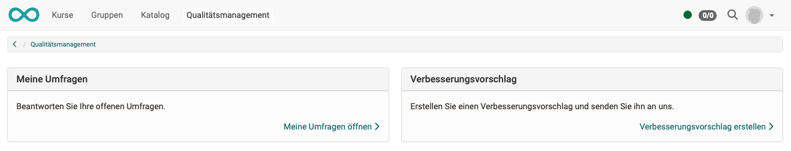
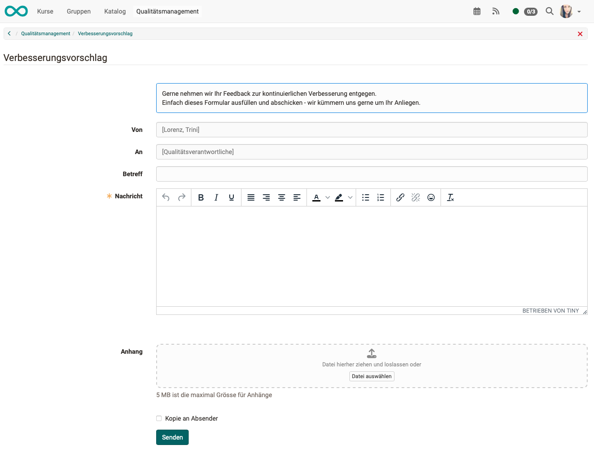

# Qualitätsmanagement: Verbesserungsvorschlag {: #Quality_Management_Improvement}

Ist das Qualitätsmanagement eingeschaltet, sehen OpenOlat-Benutzer:innen im Normalfall oben in der Hauptnavigation den Eintrag "Qualitätsmanagement". Teilnehmer:innen finden dort **"Meine Umfragen"** und **"Verbesserungsvorschläge"**, die Qualitätsmanager:innen finden weitere Optionen.

{ class="lightbox" }

!!! note "Hinweis"

    Die Option für Verbesserungsvorschläge kann von Administrator:innen auch deaktiviert werden. Dann rufen die Teilnehmer:innen bei Klick auf "Qualitätsmanagement" in der Hauptnavigation direkt "Meine Umfragen" auf (ohne Zwischenschritt).

Der Aufruf von "Verbesserungsvorschlag" öffnet ein Mail-Fenster, in dem Text frei eingegeben werden kann. Die Empfängeradresse (Qualitätsverantwortliche) konfigurieren Administrator:innen in der System-Administration vor: 
`Administration > Module > Qualitätsmanagement`

{ class="lightbox" }
