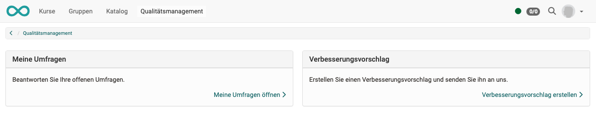
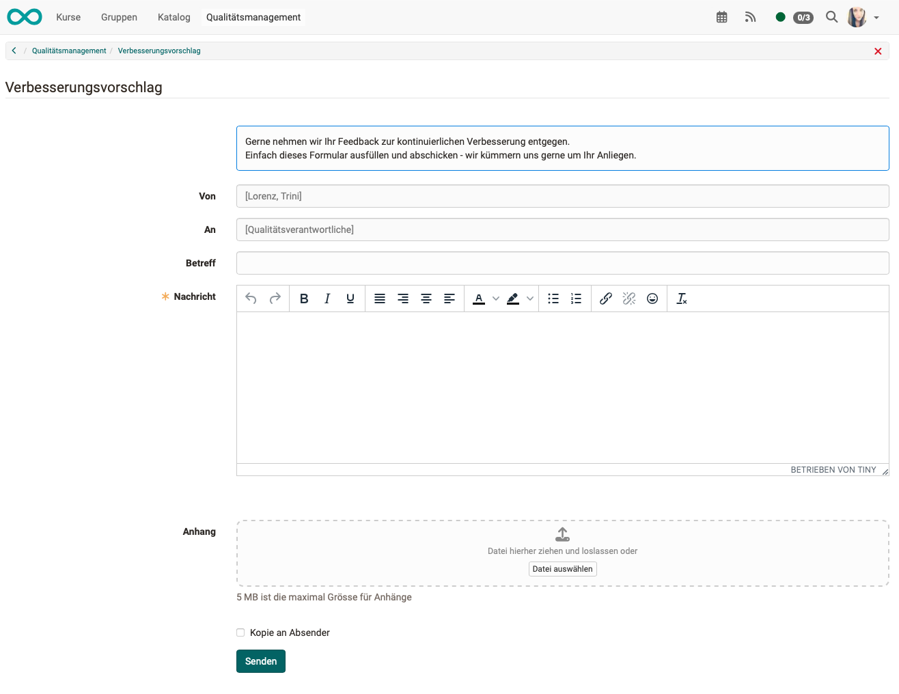

# Quality Management: Suggestion for improvement {: #Quality_Management_Improvement}

If quality management is activated, OpenOlat users will normally see the "Quality management" entry at the top of the main navigation bar. Participants will find **"My surveys"** and **"Suggestions for improvement"** there, while quality managers will find further options.

{ class="lightbox" }

!!! note "Hint"

    The option for "suggestions for improvement" can also be deactivated by an administrator. Participants can then click on "Quality management" in the main navigation to go directly to "My surveys" (without an intermediate step).

Clicking on "suggestion for improvement" opens a mail window in which text can be entered freely. The recipient address (quality manager) is preconfigured in the administration.

{ class="lightbox" }

