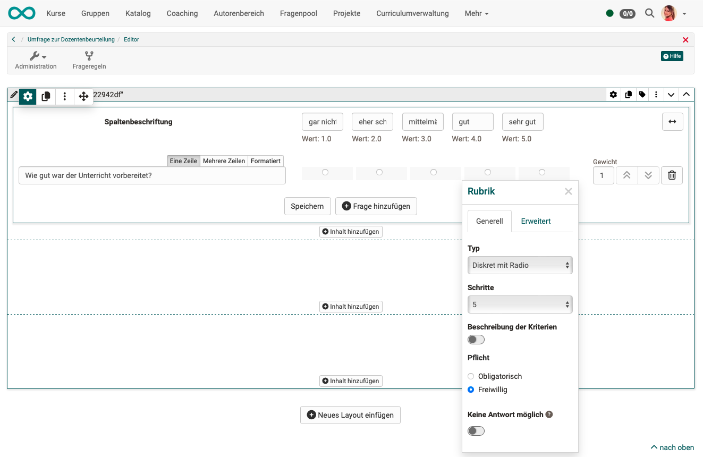

# Quality Management: Surveys {: #Quality_Management_Surveys}

## How are surveys created? 

For quality management, a **form learning resource** is used as standard, which is **directly integrated in the quality management** module instead of in a course element (Course element "form", course element "survey", course element "assessment"). From there, a **link** is sent to the target group also defined in the module at the configured time, under which the recipients can find the questions.

!!! note "Note"

        Please differentiate:

        * **learning resource "form"** (corresponds to a sheet of paper with questions)
        * **[course element "form"](../learningresources/Course_Element_Form.md)** 
        A form learning resource is integrated into this course element.
        * **[course element "survey"](../learningresources/Course_Element_Survey.md)** 
        A form learning resource is also integrated into this course element. In contrast to the "form" course element, however, participants' entries in the "form" learning resource can be made anonymously. A report with statistics is also generated.

## Where are the forms created?

The form learning resources for quality management are created **[in the authoring area](../area_modules/Authoring.md)**, just like all other learning resources.

When creating a data collection or a data collection generator, it is also possible to switch to the author area and create a form learning resource there. 

## Who creates the forms for quality management?

The creation of form learning resources for quality management is **not restricted to persons with the role of quality manager**.

All authors can create form learning resources that can then be used for quality management.

While quality managers will often formulate their own quality control questions (i.e. create the learning resource themselves), they can also incorporate existing form learning resources from other authors into their data collections. 
Conversely, the learning resources you create yourself for quality control purposes are visible to all other authors. However, editing rights must be explicitly granted by the owner of a learning resource. 
(Select learning resource in the authoring area > Administration > Settings > Tab Share > Options under "Authors can ...")

## What should a quality management form incorporate?

Learning resources of the "Form" type are created in the authoring area with the [Content Editor](../learningresources/Form_Editor.md). This means that all elements offered there can be inserted into a form learning resource.

A category element with a Likert scale is often used. Fields for free text entries can be used to enable personal comments. If no name fields are created, the survey remains anonymous.

{ class="shadow lightbox" }

If a form is used for surveys as part of quality management, a standardized form is required for all participants and courses. The questions included should be formulated in general terms and adapted to the respective purpose, e.g.

* Start survey
* Lecturer evaluation
* Interim survey
* Final survey
* Ad hoc surveys

This means that relatively few standard questionnaires are used, and one questionnaire corresponds to one analysis.

## Modification of forms for quality management

Once form learning resources have been used, they can only be edited minimally. Changes would distort the result because the new respondents would answer different questions than those asked before the change. 

If you want to work with new form learning resources, you can copy the previous learning resource in the authoring area and modify the copy. The form learning resource should then be replaced for further data collection at a convenient time.

