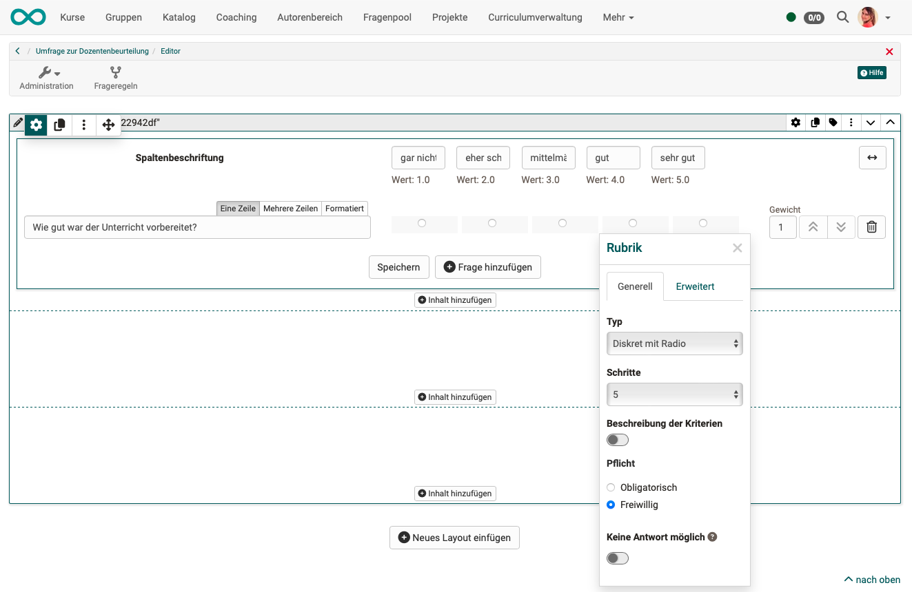

# Quality Management: Surveys {: #Quality_Management_Surveys}

## How are surveys created?

For quality management, a **form learning resource** is used as standard, which is **integrated directly in the Quality management module** instead of in a course element (course element Form, course element Survey, course element Assessment). From there, a **link** is sent at the configured time to the target group that is also defined in the module, under which the recipients find the questions.

!!! note "Note"

    Please differentiate:

    * **Learning resource "Form"** (corresponds to a sheet of paper with questions)
    * **[Course element "Form"](../learningresources/Course_Element_Form.md)** 
    A form learning resource is integrated into this course element.
    * **[Course element "Survey"](../learningresources/Course_Element_Survey.md)** 
    A form learning resource is also integrated into this course element. In contrast to the course element "Form", however, the participants' entries in the form learning resource can be made anonymously. A report with statistics is also generated.

## Where are the forms created?

The form learning resources for quality management are created **[in the authoring area](../area_modules/Authoring.md)**, just like all other learning resources.

When creating a data collection or a data collection generator, it is also possible to switch to the authoring area and create a form learning resource there.

## Who creates the forms for quality management?

The creation of form learning resources for quality management is **not restricted to persons with the role Quality manager**.

All authors can create form learning resources that can then be used for quality management.

Quality managers will often formulate their quality control questions themselves (i.e. create the learning resource themselves), but they can also integrate existing form learning resources of other authors into their data collections. 
Conversely, the learning resources created for quality control are visible to all other authors. Editing rights, however, must be granted explicitly by the owners of a learning resource: 
`Learning resource > Administration > Settings > Tab "Share" > Options under "Authors can ..."`

## What should a quality management form incorporate?

Learning resources of the type "Form" are created in the authoring area with the [Content Editor](../learningresources/Form_Editor.md). This means that all elements offered there can be inserted into a form learning resource.

A rubric element with a Likert scale is often used. Fields for free text entries can be used to enable personal comments. If no fields for entering the name are created, the survey remains anonymous.

{ class="shadow lightbox" }

If a form is used for surveys as part of quality management, a uniform form is required for all participants and courses. The questions included should be formulated in general terms accordingly and adapted to the respective purpose, e.g.

* Start survey
* Lecturer evaluation
* Interim survey
* Final survey
* Ad hoc surveys

This means that relatively few standard questionnaires are used, and one questionnaire corresponds to one analysis.

## Modification of forms for quality management

Once form learning resources have been used, they can only be edited minimally. Changes would distort the result because the newly surveyed persons would answer different questions than those surveyed before the change.

If you want to work with new form learning resources, you can copy the previous learning resource in the authoring area and modify the copy. The form learning resource should then be replaced for the further data collections at a convenient date.

## Further information {: #further_information}

[Course Element "Form" >](../learningresources/Course_Element_Form.md) 
[Course Element "Survey" >](../learningresources/Course_Element_Survey.md) 
[Authoring - Overview >](../area_modules/Authoring.md) 
[The Form Editor >](../learningresources/Form_Editor.md)

[To the top of the page ^](#Quality_Management_Surveys)
