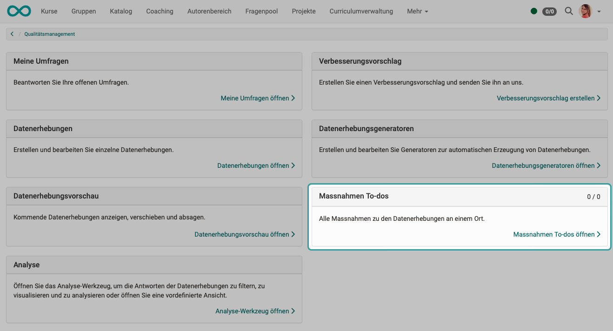
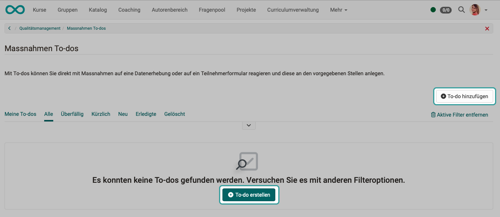
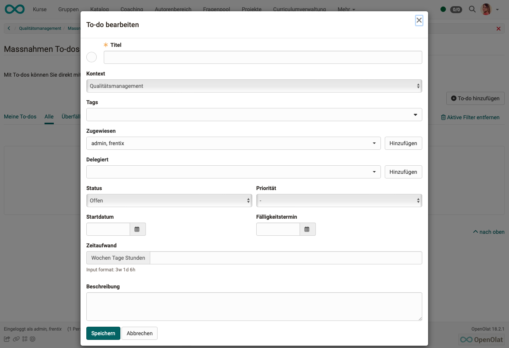
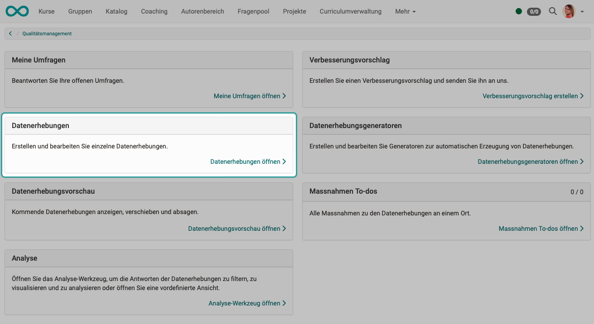
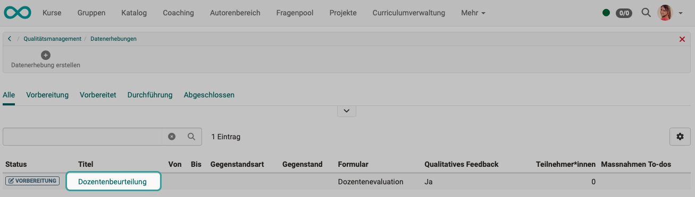
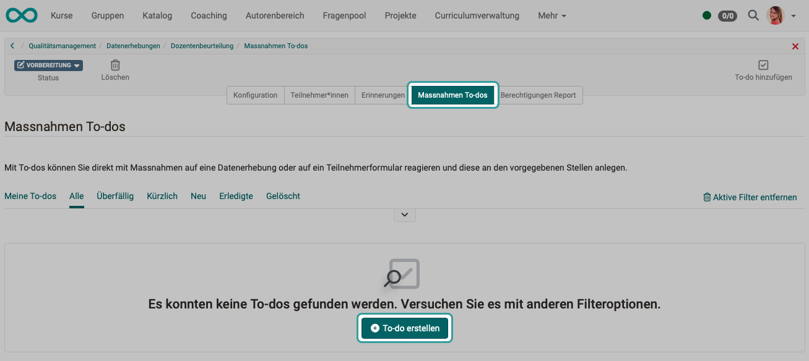
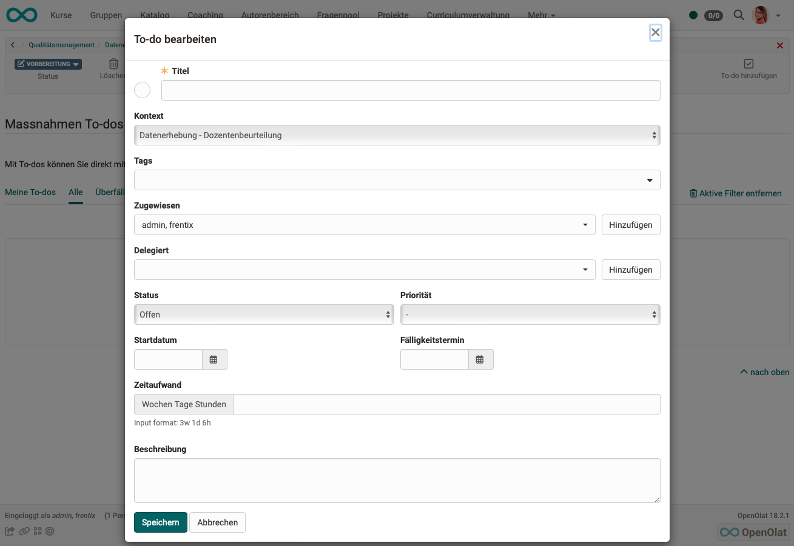
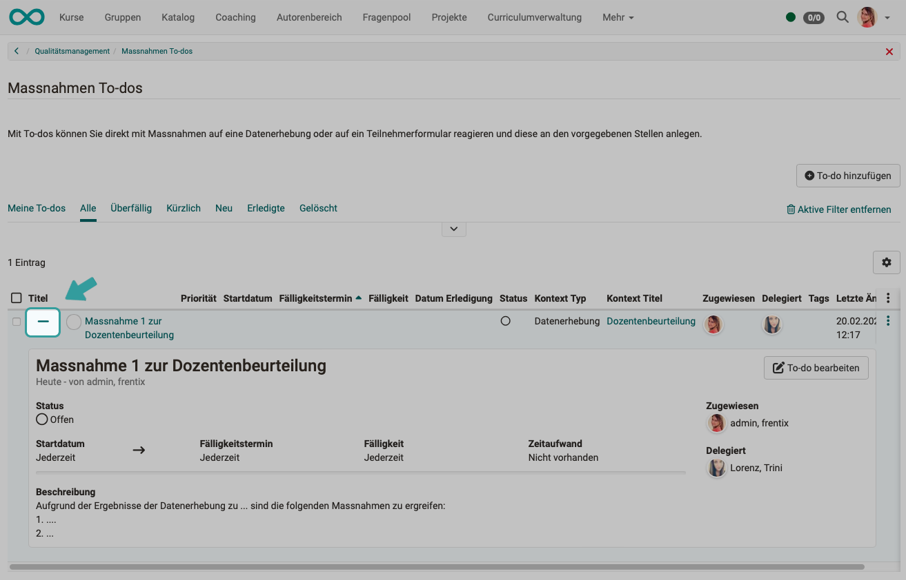

# Qualitätsmanagement: Massnahmen (To-dos) {: #Quality_Management_To-dos}

:octicons-tag-24: Release 18.0

## Aus Fehlern lernen

Wurden die Erkenntnisse aus den Reports gewonnen, dann ist bei einem schlechtem Befragungsresultat in aller Regel eine Massnahme zu ergreifen. In OpenOlat sind Massnahmen technisch gesehen eine Art der To-dos. 

## Massnahmen (To-dos)

In OpenOlat existieren bereits an anderen Stellen To-dos, z.B. in Projekten oder als persönliche To-dos.

Mit Hilfe der To-do Infrastruktur kann direkt mit entsprechenden Massnahmen auf die Ergebnisse von Datenerhebungen oder einer bestimmten Teilnehmerbefragung reagiert werden. Notwendige To-dos können kontextbezogen angelegt und direkt an die betreffenden Personen delegiert werden. Diese werden per E-Mail über ein neues To-do informiert. 

Alle To-dos zum Qualitätsmanagement sind unter "Massnahmen To-dos" aufgelistet.

{ class="shadow lightbox" }

## Massnahmen (To-dos) zum Qualitätsmanagement in der Übersicht

Werden die Massnahmen (To-dos) in der Übersicht des Qualitätsmanagements aufgerufen, wird beim Erstellen einer neuen Massnahme als Kontext des To-dos das Qualitätsmanagement generell eingetragen.

{ class="shadow lightbox" }

{ class="shadow lightbox" }

## Massnahmen (To-dos) zu bestimmten Datenerhebungen
Massnahmen (To-dos) können auch direkt an der Datenerhebung erfasst werden. Sie sind dann bereits diesem Kontext (dieser Datenerhebung) zugeordnet.

{ class="shadow lightbox" }

Klicken Sie auf den Namen einer vorhandenen Datenerhebung.

{ class="shadow lightbox" }

{ class="shadow lightbox" }

{ class="shadow lightbox" }

Die Massnahmen (To-dos), die zu bestimmten Datenerhebungen erstellt wurden, erscheinen ebenfalls in der Übersichts-Liste, die auf der oberen Ebene des Qualitätsmanagements aufgerufen werden kann. Der spezifische Kontext (Zuordnung zu einer bestimmten Datenerhebung) ist ersichtlich. 

Durch Klick auf das + bzw - Symbol zu Beginn einer Zeile kann die Detailansicht aus- und eingeklappt werden.

{ class="shadow lightbox" }
