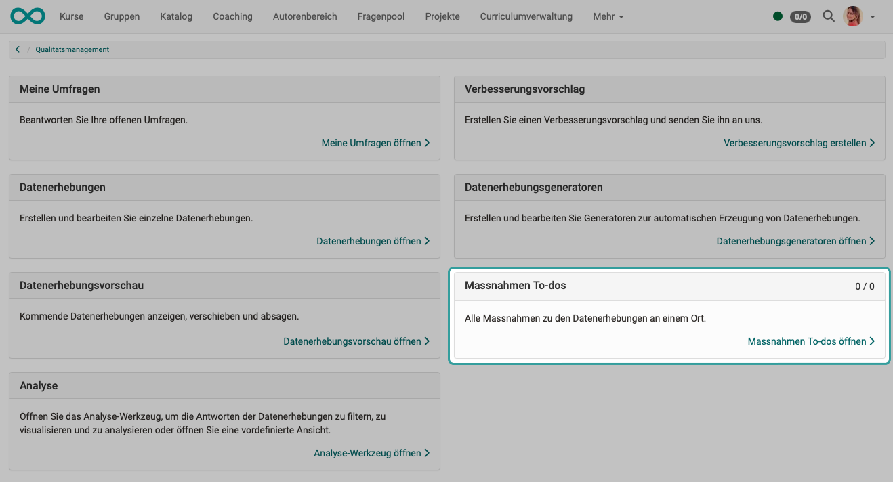
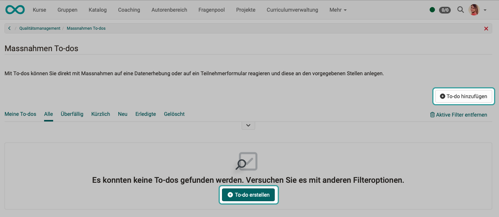
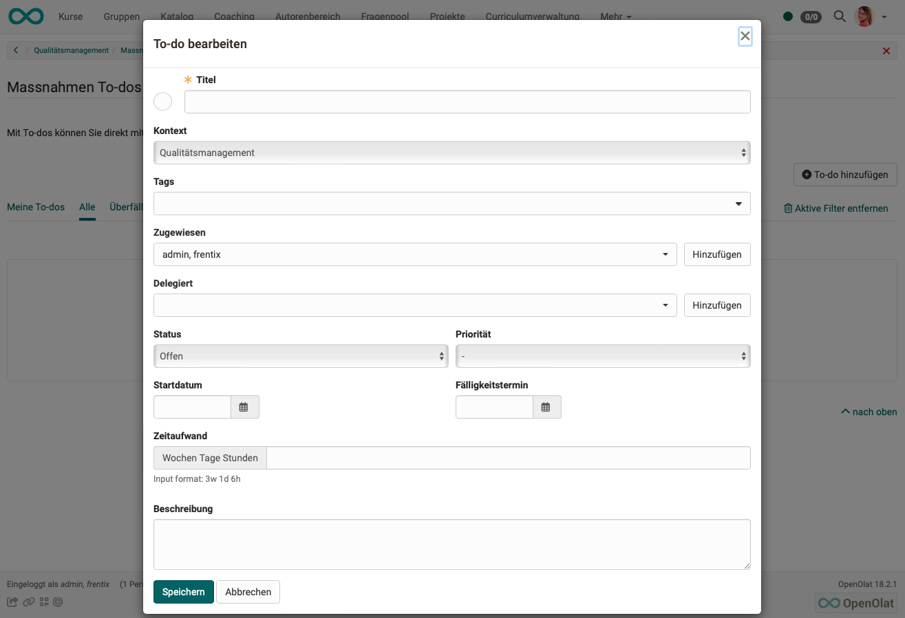
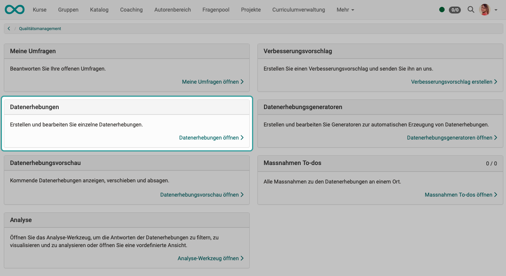
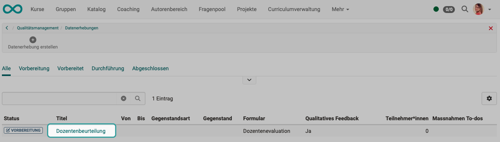
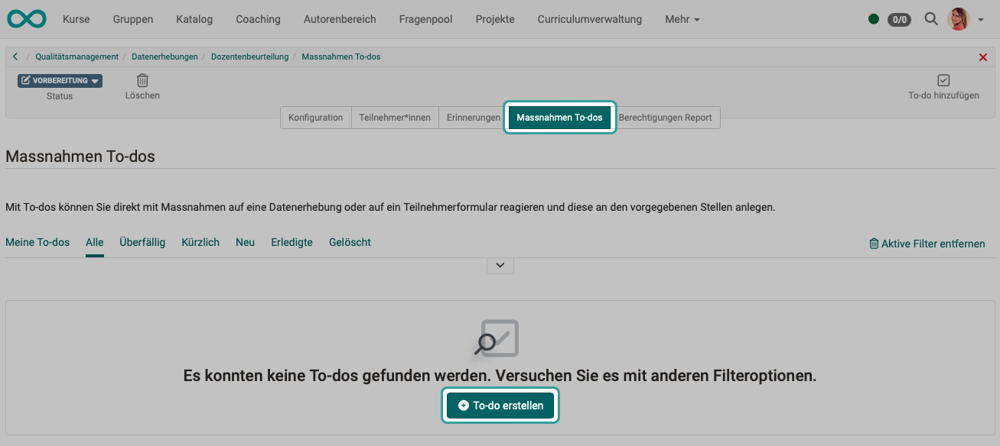
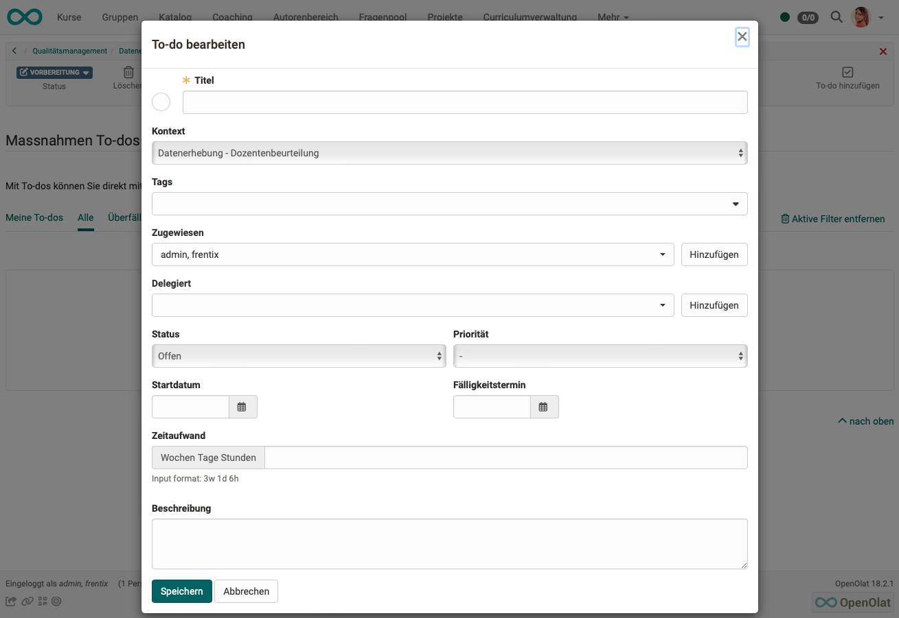
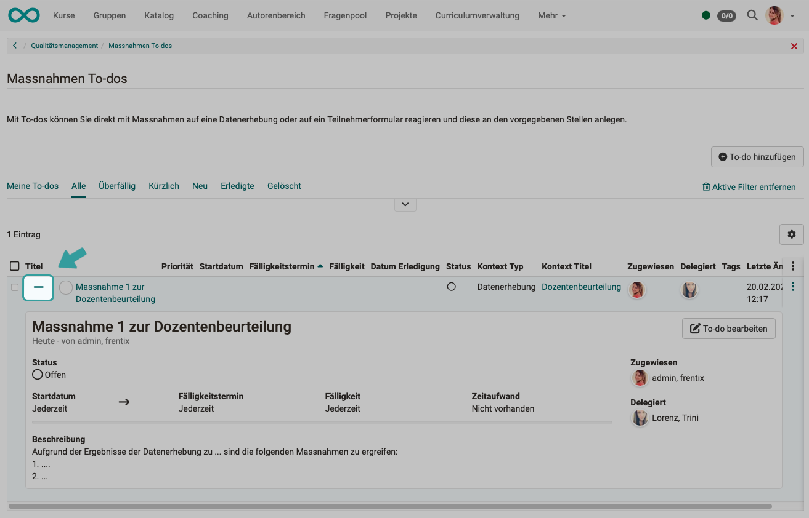

# Quality Management: Actions (To-dos) {: #Quality_Management_To-dos}

## Learn from mistakes

Once the findings have been obtained from the reports, an action must generally be taken if the survey result is poor. In OpenOlat, actions are technically a type of to-do.

## Actions (to-dos) [:octicons-tag-16:{ title="from Release 18.0 (OO-6781)" }](https://track.frentix.com/issue/OO-6781)

To-dos already exist in other places in OpenOlat, e.g. in projects or as personal to-dos.

With the help of the to-do infrastructure, the results of data collections or a specific participant survey can be responded to directly with appropriate actions. Necessary to-dos can be created in context and delegated directly to the persons concerned. They are informed of a new to-do by email.

All to-dos for quality management are listed under "Action to-dos".

{ class="shadow lightbox" }

## Actions (to-dos) for quality management in the overview

If the actions (to-dos) are called up in the overview of the quality management, quality management in general is entered as the context of the to-do when a new action is created.

{ class="shadow lightbox" }

{ class="shadow lightbox" }

## Actions (to-dos) for specific data collections
Actions (to-dos) can also be recorded directly at the data collection. They are then already assigned to this context (this data collection).

{ class="shadow lightbox" }

Click on the name of an existing data collection.

{ class="shadow lightbox" }

{ class="shadow lightbox" }

{ class="shadow lightbox" }

The actions (to-dos) that were created for specific data collections also appear in the overview list, which can be called up at the top level of the quality management. The specific context (assignment to a specific data collection) is visible.

Click on the plus or minus symbol at the beginning of a row to expand or collapse the detailed view.

{ class="shadow lightbox" }
