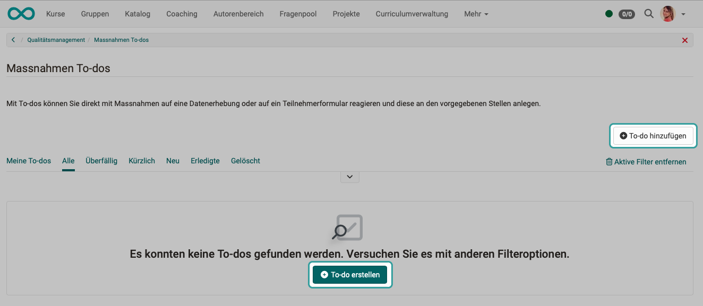
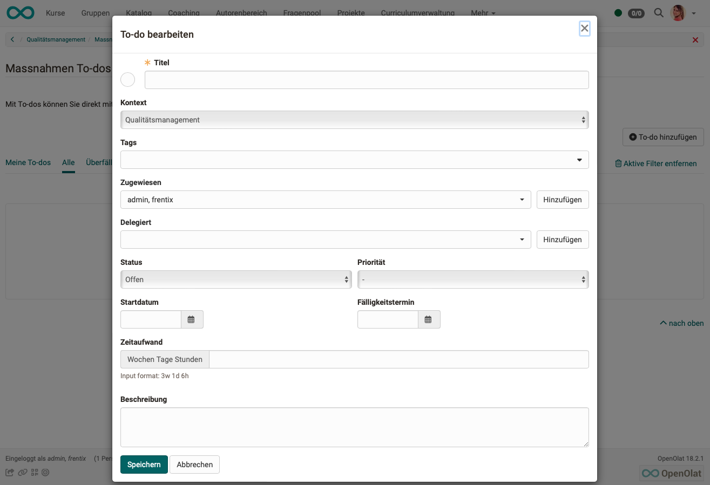
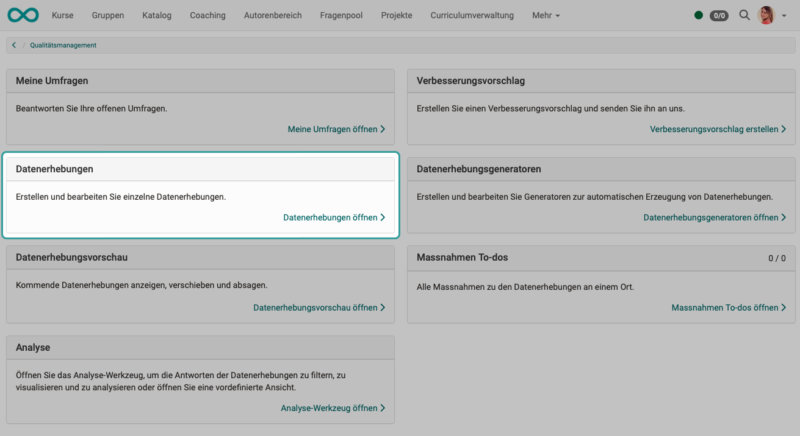
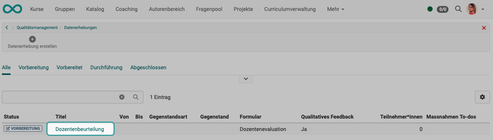
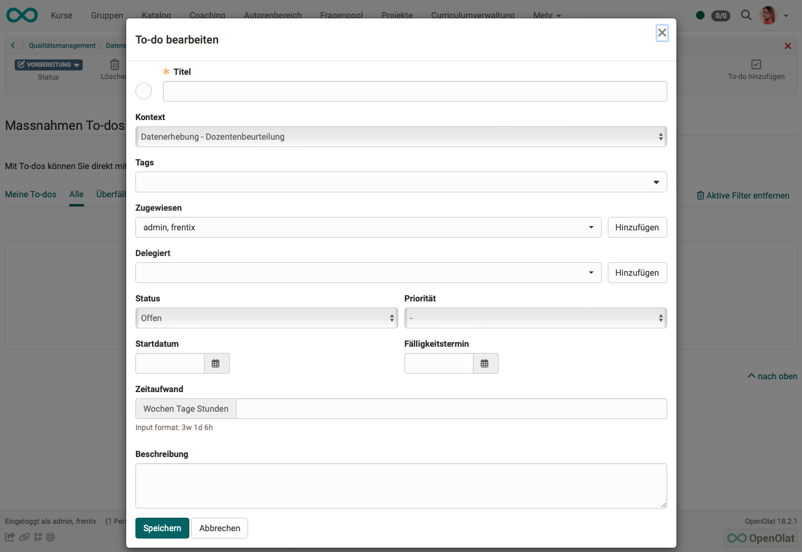

# Quality Management: Actions (To-dos) {: #Quality_Management_To-dos}

:octicons-tag-24: Release 18.0

## Learn from mistakes

If the findings have been obtained from the reports, a measure must generally be taken if the survey results are poor. In OpenOlat, measures are technically a type of to-do. 

## Measures (to-dos)

To-dos already exist in other places in OpenOlat, e.g. in projects or as personal to-dos.

The to-do infrastructure can be used to respond directly to the results of data surveys or a specific participant survey with appropriate measures. Necessary to-dos can be created contextually and delegated directly to the relevant persons. They are informed of a new to-do by e-mail.

All quality management to-dos are listed under "Measures to-dos".

{ class="shadow lightbox" }

## Overview of quality management measures (to-dos) 

If the measures (to-dos) are called up in the quality management overview, quality management is generally entered as the context of the to-do when a new measure is created.

{ class="shadow lightbox" }

{ class="shadow lightbox" }

## Measures (to-dos) for specific data collections
Measures (to-dos) can also be recorded directly at the data collection point. They are then already assigned to this context (this data collection).

{ class="shadow lightbox" }

Click on the name of an existing data collection.

{ class="shadow lightbox" }

{ class="shadow lightbox" }

{ class="shadow lightbox" }

The measures (to-dos) that have been created for specific data collections also appear in the overview list, which can be accessed at the top level of quality management. The specific context (assignment to a specific data collection) is evident. 

Click on the + or - symbol at the beginning of a line to expand or collapse the detailed view.

{ class="shadow lightbox" }

