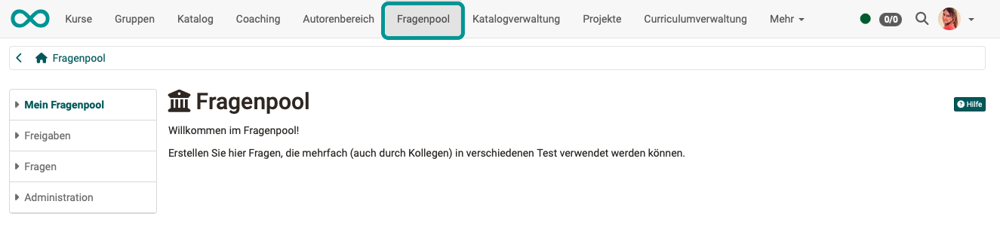
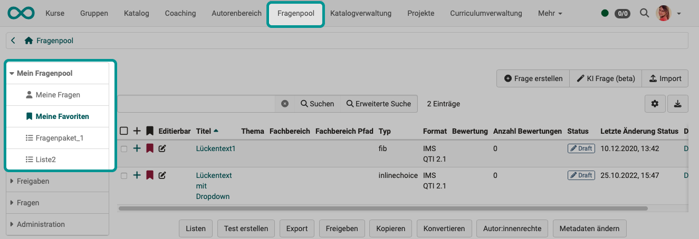
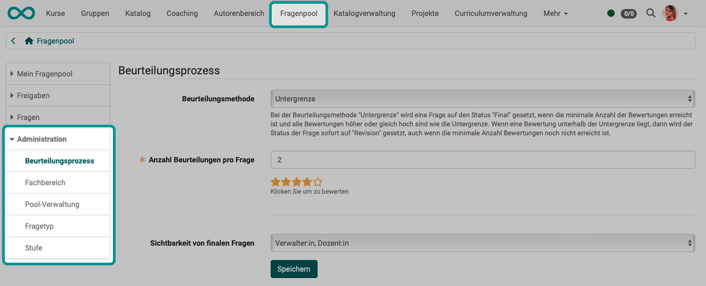

# Fragenpool: Übersicht {: #question_bank}

Der kollaborative Fragenpool in OpenOlat erlaubt Autor:innen, Testfragen als eigenständige Items in einer katalogähnlichen Struktur zu erstellen, zu speichern, zu bearbeiten und weiter zu verwenden. 

Es ist eine **Sammlung (Datenbank)** vieler einzelner Testfragen, in der Regel im QTI-Format, inklusive aller zugehörigen Informationen und Metadaten.

Die Fragen können mit anderen Personen, die auch Zugriff auf den Pool haben, geteilt werden.

**Ziel** ist die **Wiederverwendung** einmal erstellter Fragen. Sei es in Tests, als Quizfrage in einem interaktiven Video oder in einem Kursbaustein vom Typ "Seite". Durch Sie selbst oder (bei Freigabe) durch andere Autor:innen.

**Zugriff** auf einen Fragenpool haben Benutzer:innen mit **Autorenrecht**, sowie administrative Rollen. Diesem Benutzerkreis wird der Fragenpool in der Hauptnavigation in der Kopfzeile angezeigt.

{ class="shadow lightbox" }

!!! note "Quick Links"

    * [Handhabung der Daten](Data_Management.de.md)
    * [Fragen importieren](Question_Pool_Import_Questions.de.md)
    * [Detailansicht einer Frage](Item_Detailed_View.de.md)
    * [Mögliche Aktionen im Fragenpool](Question_bank_possible_operations.de.md)
    * [Suche im Fragenpool](Question_Pool_Search.de.md)
    * [Freigabemöglichkeiten im Fragenpool](Question_Pool_Sharing_Options.de.md)
    * [Beurteilungsprozess für Fragen im Pool](Question_Bank_Review_Process.de.md)
    * [Fragenpool-Administration](Question_Bank_Administration.de.md)

Das Menü des Fragenpools ist in folgende Bereiche gegliedert:

### Mein Fragenpool {: #my_question_bank}

Unter "**Meine Fragen**"  finden Sie Ihre eigenen Fragen. Sie können die Fragen als **Favoriten** markieren und sie in **Listen** zusammenfassen. Favoriten und Listen sind zwei Möglichkeiten um Items zu sortieren und zu organisieren. 

Items, die unter "**Meine Fragen**" als Favorit gekennzeichnet wurden, erscheinen unter dem Menüpunkt "**Meine Favoriten**" erneut. Es handelt sich dabei um ein und dasselbe Item. Änderungen in den "Favoriten" werden somit auch unter "Meine Fragen" gespeichert.

Ist der [Beurteilungsprozess](Question_Bank_Review_Process.de.md) aktiviert (Autor:innen beurteilen die erstellten Fragen gegenseitig), dann sind unter "Mein Fragenpool" zusätzlich die eigenen Fächer sichtbar und je nach Berechtigung die **Abschnitte "Beurteilung"** und **"Final"**.

{ class="shadow lightbox" }

[Zum Seitenanfang ^](#question_bank)

## Freigaben {: #sharing_options}

Im Bereich "**Freigaben**" werden Pools und Gruppen zum Austausch von Fragen zur Verfügung gestellt. Während Favoriten und Listen der persönlichen Ordnung und Sortierung dienen, sind die Pools die Sammelstelle für alle freigegebenen Items. Bevor ein Item in einem Pool gelistet wird, muss dieses entweder zuerst vom Besitzer freigegeben, oder direkt in den entsprechenden Pool importiert werden. 

Listen, Pools und Gruppen können durch die Administration deaktiviert werden und sind deshalb eventuell nicht sichtbar. 

[Zum Seitenanfang ^](#question_bank)

## Fragen {: #questions}

Im Unterschied zum Abschnitt "**Meine Fragen**" werden hier **alle** Fragen des Pools aufgelistet, auf die Sie Zugriffsberechtigung haben. Also auch Fragen, die von anderen Autor:innen erstellt und freigegeben wurden.

Einzelne Fragen, ganze Sektionen oder Tests können auch direkt aus dem [Testeditor](../learningresources/Test_editor_QTI_2.1.de.md) in den Pool exportiert werden. Wählen Sie dazu im Testeditor in der Toolbar den Link "Export" → "Zum Pool exportieren". Abhängig davon auf welcher Stufe Sie sich im Menübaum links befinden, werden entweder einzelne Fragen, einzelne Sektionen oder der ganze Test in den Fragenpool exportiert.

Der kollaborative Fragenpool in OpenOlat erlaubt Autoren, Testfragen als eigenständige Items in einer katalogähnlichen Struktur zu speichern, zu erstellen, zu bearbeiten und weiter zu verwenden. Die Fragen können mit anderen Personen, die entsprechend der Konfiguration in der OpenOlat [System Administration](../../manual_admin/administration/Customizing.de.md) Zugriff auf den Pool haben, geteilt werden.

Dieses Kapitel erklärt wie einzelne Testfragen, sogenannte Items, mit dem Fragenpool erstellt, bearbeitet und verwaltet werden können. Jedes Item enthält nicht nur die Frage samt den dazugehörigen Antworten, sondern auch Informationen zu z.B. Autor, Erstelldatum, Schlagworte, aber auch Kennwerte zur Itemanalyse können hinzugefügt werden.

[Zum Seitenanfang ^](#question_bank)

## Administration {: #administration}

[Poolverwalter:innen](Question_Bank_Administration.de.md#pool_manager) bekommen zusätzlich den Bereich Administration des Fragepools angezeigt und haben dort Zugriff auf weitere spezifische Konfigurationen.

{ class="shadow lightbox" }

[Zu den Details >](Question_Bank_Administration.de.md) 
[Zum Seitenanfang ^](#question_bank)

## Weitere Informationen {: #further_info}

[Mehr über das Erstellen von Fragen >](Data_Management.de.md) 
[Detailansicht einer Frage >](Item_Detailed_View.de.md) 
[Mehr über den Beurteilungsprozess >](Question_Bank_Review_Process.de.md) 

[Zum Seitenanfang ^](#question_bank)