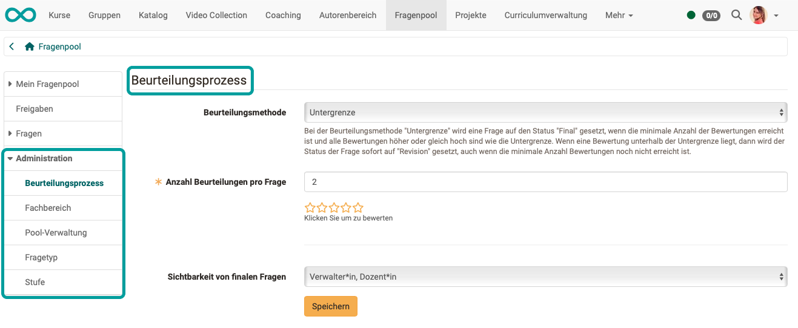
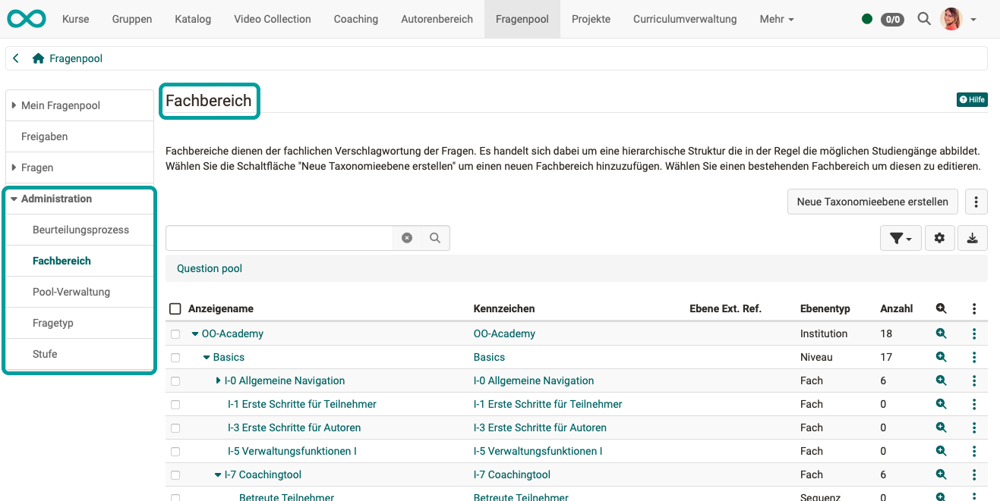
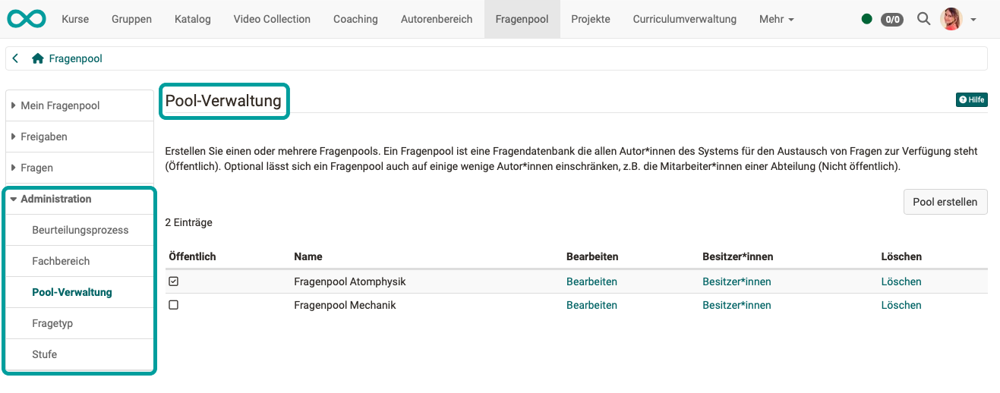

# Fragenpool: Administration {: #question_bank_administration}

## Konfiguration durch Poolverwalter:innen {: #pool_manager}

**Poolverwalter:in** ist eine [Rolle](../basic_concepts/Roles_Rights.de.md), die  OpenOlat-Benutzer:innen von Administrator:innen oder Benutzerverwalter:innen zugewiesen bekommen. 

Poolverwalter:innen haben das Recht, organisatorische Aspekte der Fragenbank zu ändern. Sie haben jedoch keinen Einfluss auf den Inhalt der Fragenbank, sowie einzelner Pools.

Im Administrationsbereich des Fragenpools verwalten Poolverwalter:innen fünf Bereiche zur Organisation des Fragenpool-Moduls.

  * Beurteilungsprozess
  * Fachbereich
  * Pool-Verwaltung
  * Fragetyp
  * Stufe

---

###  Beurteilungsprozess {: #assessment_process}

{ class="shadow lightbox" }

Hier kann definiert werden, wann eine Frage den Status "Final" erhält, falls für sie ein Beurteilungsprozess gestartet wurde. Liegt ein Item unterhalb der hier angegebenen Grenze, wird das Item auf "Revision" gesetzt.

[Zum Seitenanfang ^](#question_bank_administration)

---

###  Fachbereich {: #subject}

{ class="shadow lightbox" }

Fachbereiche dienen der fachlichen Verschlagwortung der Fragen (Items) und werden in einer hierarchischen Struktur dargestellt. Diese bildet z.B. in Ausbildungsorganisationen mögliche Studiengänge ab, in der Privatwirtschaft eventuell Organisationseinheiten. 

Hinter den Fachbereichen steht eine [Taxonomie](../../manual_admin/administration/Modules_Taxonomy.de.md). Neue Fachbereiche werden über die Schaltfläche "Neue Taxonomieebene erstellen" oder über "Taxonomieebenen importieren" hinzugefügt. Bereits bestehende Fachbereiche können auch bearbeitet werden.

Damit eine Frage in den Beurteilungsprozess gegeben werden kann, muss ein Fachbereich angegeben werden. Die Beurteilung soll durch Fachexperten erfolgen, die in diesem Bereich Kompetenz besitzen. Weil auch die Expert:innen einem Fachbereich zugeordnet sind, kann so eine Zuordnung von Frage und Expert:in erfolgen. 

[Zum Seitenanfang ^](#question_bank_administration)

---

###  Pool-Verwaltung {: #pool}

{ class="shadow lightbox" }

Ein Pool (engl. Sammelbecken, Reservoir etc.) ist eine Fragendatenbank, die Autor:innen für den Austausch von Testfragen zur Verfügung steht. 

Neue Pools werden über die Schaltfläche "Pool erstellen" hinzugefügt. Bereits bestehende Pools können bearbeitet, oder gelöscht werden.

Fragenpools können entweder **öffentlich** sein (und stehen damit automatisch allen Autor:innen zur Verfügung) oder **nicht öffentlich**, wodurch sich der Zugriff auf ausgesuchte Personen einschränken lässt. Z.B. die Mitarbeiter:innen einer Abteilung.

{ class="aside-right lightbox" }

Diese Personen können über den Link "Besitzer:in" dem Pool hinzugefügt werden. So erstellte Pools erscheinen mit dem nebenstehenden Icon.

{ class="aside-right lightbox" }

Benutzer:innen **ohne Poolverwalterrechte** können ebenfalls eigene Pools erstellen. Die Freigabe für diese Pools erfolgt allerdings über OpenOlat-Gruppen. Solche Gruppenfreigaben erscheinen mit dem nebenstehenden Icon.

{ class="shadow lightbox" }

[Zum Seitenanfang ^](#question_bank_administration)

**Pool erstellen**

{ class="shadow lightbox" }

  1. Schaltfläche "Pool erstellen": Damit wird ein neuer Pool erstellt. Es öffnet sich ein Formular "Pool erstellen"
  2. Geben Sie den Namen des neuen Pools ein.
  3. Legen Sie fest, ob der Pool öffentlich (für alle Autoren sichtbar) oder privat sein soll. Ist der Pool privat, können Sie unter Besitzer (5) festlegen, welche Benutzer:innen Zugriff auf den Pool erhalten.
  4. Für bereits bestehende Pools können Sie den Namen und die Sichtbarkeit ändern.
  5. Fügen Sie Besitzer:innen hinzu oder entfernen Sie diese.

[Zum Seitenanfang ^](#question_bank_administration)

---

###  Fragetyp {: #type}

{ class="shadow lightbox" }

OpenOlat verfügt über diverse Test [Fragetypen](../learningresources/Test_question_types.de.md), die entweder im Testeditor der Lernressource Test oder im Itemeditor der Fragenbank erstellt werden können. Erstellen Sie zusätzliche Fragetypen, wenn die Standard-Fragetypen von OpenOlat nicht genügen. Die Standard-Fragetypen können nicht gelöscht werden.

Ein vom Standard abweichender Fragetyp kann nicht über den Editor erstellt werden, sondern muss einer bestehenden Frage eines Standard-Typs in der Detailansicht mit Hilfe des Metadatums "Typ" in der Kategorie "Itemanalyse" zugewiesen werden. Eine in diesem Stil geänderte Frage wird nach wie vor dem ursprünglichen Fragetyp entsprechen, allerdings wird nun im Fragepool in der Spalte "Typ" der neue Typ angezeigt.

Neu erstellte Fragen müssen pro verfügbarer Sprache übersetzt werden, damit sowohl z.B. deutsch- als auch englischsprachige Benutzer:innen die korrekten Begriffe angezeigt bekommen (und nicht den hier sichtbaren Übersetzungsschlüssel).

**Fragetyp erstellen**

Nachdem Sie mit Hilfe der Schaltfläche "Fragetyp erstellen" einen neuen Fragetyp erstellt haben, erscheint dieser zuunterst in der Tabelle der Typen, in der Spalte "Übersetzung". Dazu wird stets folgende Namenskonvention angewandt:

    
    
    item.type.[Typenname]

Dies ist der sogenannte Übersetzungsschlüssel, mit dem der Typenname in die
verschiedenen, auf ihrer OpenOlat-Instanz verfügbaren, Sprachen übersetzt
wird.

Klicken Sie in der Tabellenspalte "Übersetzung" auf die entsprechende Zeile. Es öffnet sich das folgende Formular:

  1. Im Dropdown-Menü "Übersetzungsschlüssel" sehen Sie den Typennamen wie er noch in der Tabelle aufgelistet erscheint. Hier und im darüber liegenden Menü "Paket" können Sie keine Änderungen vornehmen.
  2. Tragen Sie im Feld "Anpassungen: Deutsch" den gewünschten Typennamen ein. Dieser wird ab nun in der Tabellenübersicht hier, in der Typenauswahl in der Detailansicht sowie bei eventuell bereits bestehenden Fragen unter "Typ" angezeigt.
  3. Aktivieren Sie die Vergleichssprache und wählen Sie die entsprechende Sprache im Dropdown-Menü dazu aus, um die Begriffe zu vergleichen und zu überprüfen.

Wiederholen Sie diese Schritte für jede in ihrer Instanz verfügbaren Sprache.

[Zum Seitenanfang ^](#question_bank_administration)

---

###  Stufe {: #level}

{ class="shadow lightbox" }

Stufen stellen eine weitere Kategorisierungsmöglichkeit dar und können z.B. mit einer Schwierigkeitsstufe verglichen werden. Hier erstellen Sie Stufen, die in ihrem Kontext ihren verfügbaren Ausbildungsleveln entsprechen. 

Die Stufe eines Frageitems kann in der [Detailansicht](Item_Detailed_View/#metadata_general) als Metadatum "Stufe" unter "Allgemein" zugewiesen werden. So kann z.B. die Schwierigkeit einer Frage einer Stufe zugeordnet werden.

Beispiele für Stufen im schulischen Kontext sind:

* Unterstufe
* Oberstufe
* Gymnasium
* Bachelor
* Master 

In einem Unternehmenskontext könnten Stufen so aussehen:

* ohne Berufsausbildung
* mit Berufsausbildung
* Führungsfunktion
* Administration
* Kader
* Management
 

**Neue Stufen** erstellen Sie mit dem Button rechts oben.

Wie Fragetypen, müssen auch Stufen pro verfügbarer Sprache übersetzt werden, damit sowohl z.B. deutsch- als auch englischsprachige Benutzer:innen die korrekten Begriffe angezeigt bekommen. Gehen Sie dazu vor, wie unter "Fragetypen erstellen" beschrieben.

[Zum Seitenanfang ^](#question_bank_administration)

