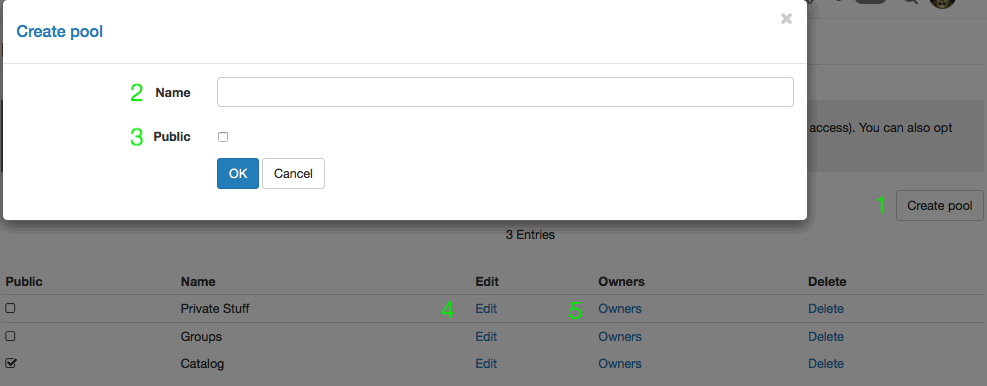
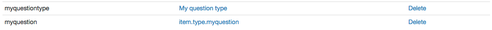
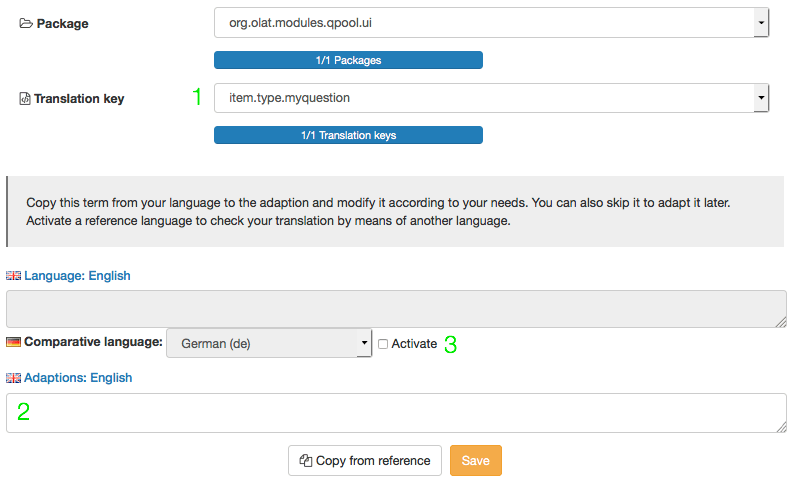

# Question Bank: Administration {: #question_bank_administration}

## Configuration by question bank managers {: #pool_manager}

**Question bank manager** is a [role](../basic_concepts/Roles_Rights.md) that OpenOlat users are assigned by administrators or user managers. 

Question bank managers have the right to change organizational aspects of the question bank. However, they have no influence on the content of the question bank or of individual pools.

In the administration area of the question bank, question bank managers manage five areas for organizing the question bank module.

  * Review Process
  * Subject
  * Pool administration
  * Type
  * Level

---

### Review Process {: #assessment_process}

{ class="shadow lightbox" }

Here you can define when a question receives the status "Final" if a review process has been started for it. If an item is below the limit specified here, the item is set to "Revision".

[To the top of the page ^](#question_bank_administration)

---

### Subject {: #subject}

{ class="shadow lightbox" }

Subjects are used for the subject-related tagging of the questions (items) and are presented in a hierarchical structure. In educational organizations, for example, this represents possible courses of study, in the private sector possibly organizational units. 

A [taxonomy](../../manual_admin/administration/Modules_Taxonomy.md) is behind the subjects. New subjects are added via the button "Create new taxonomy level" or via "Import taxonomy levels". Existing subjects can also be edited.

In order for a question to be submitted to the review process, a subject must be specified. The review should be carried out by subject experts who have expertise in this area. Because the experts are also assigned to a subject, the question and expert can be matched in this way. 

[To the top of the page ^](#question_bank_administration)

---

### Pool administration {: #pool}

{ class="shadow lightbox" }

A pool is a question database that is available to authors for the exchange of test questions. 

New pools are added via the button "Create pool". Existing pools can be edited or deleted.

Question pools can either be **public** (and are therefore automatically available to all authors) or **non-public**, which means that access can be restricted to selected persons. For example, the employees of a department.

{ class="aside-right lightbox" }

These persons can be added to the pool via the "Owners" link. Pools created in this way appear with the adjacent icon.

{ class="aside-right lightbox" }

Users **without question bank manager rights** can also create their own pools. However, these pools are shared via OpenOlat groups. Such group shares appear with the adjacent icon.

{ class="shadow lightbox" }

[To the top of the page ^](#question_bank_administration)

**Create pool**

{ class="shadow lightbox" }

  1. Button "Create pool": This creates a new pool. A form "Create pool" opens.
  2. Enter the name of the new pool.
  3. Define whether the pool should be public (visible to all authors) or private. If the pool is private, you can define under Owners (5) which users get access to the pool.
  4. For existing pools you can change the name and the visibility.
  5. Add or remove owners.

[To the top of the page ^](#question_bank_administration)

---

### Type {: #type}

{ class="shadow lightbox" }

OpenOlat has various test [question types](../learningresources/Test_question_types.md) that can be created either in the test editor of the learning resource Test or in the item editor of the question bank. Create additional question types if the default question types of OpenOlat are not sufficient. The default question types cannot be deleted.

A question type deviating from the default cannot be created via the editor, but must be assigned to an existing question of a default type in the detailed view using the metadata "Type" in the category "Item analysis". A question changed in this way will still correspond to the original question type, but the new type will now be displayed in the "Type" column in the question bank.

Newly created types must be translated per available language so that, for example, both German- and English-speaking users see the correct terms (and not the translation key visible here).

**Create question type**

After you have created a new question type using the button "Create question type", it appears at the bottom of the table of types, in the column "Translation". The following naming convention is always applied:

    item.type.[type name]

This is the so-called translation key with which the type name is translated into the various languages available on your OpenOlat instance.

{ class="shadow lightbox" }

Click on the corresponding row in the table column "Translation". The following form opens:

{ class="shadow lightbox" }

  1. In the dropdown menu "Translation key" you see the type name as it still appears in the table. You cannot make any changes here or in the "Package" menu above.
  2. Enter the desired type name in the field "Adaptions: English". From now on, it is displayed in the table overview here, in the type selection in the detailed view and for any existing questions under "Type".
  3. Activate the comparison language and select the corresponding language in the dropdown menu to compare and check the terms.

Repeat these steps for each language available in your instance.

[To the top of the page ^](#question_bank_administration)

---

### Level {: #level}

{ class="shadow lightbox" }

Levels are a further categorization option and can be compared, for example, with a difficulty level. Here you create levels that correspond to the training levels available in your context. 

The level of a question item can be assigned in the [detailed view](Item_Detailed_View.md#metadata_general) as the metadata "Level" under "General". For example, the difficulty of a question can be assigned to a level.

Examples of levels in a school context are:

* Lower secondary school
* Upper secondary school
* Grammar school
* Bachelor
* Master 

In a corporate context, levels could look like this:

* without vocational training
* with vocational training
* leadership function
* administration
* executive staff
* management

You create **new levels** with the button "Create level" at the top right.

Like question types, levels must also be translated per available language so that, for example, both German- and English-speaking users see the correct terms. To do this, proceed as described under "Create question type".

[To the top of the page ^](#question_bank_administration)

## Further information {: #further_information}

**Mentioned on this page** 
[Roles and rights: Overview >](../basic_concepts/Roles_Rights.md) 
[Module Taxonomy >](../../manual_admin/administration/Modules_Taxonomy.md) 
[Test question types >](../learningresources/Test_question_types.md) 
[Item Detailed View >](Item_Detailed_View.md)

[To the top of the page ^](#question_bank_administration)
