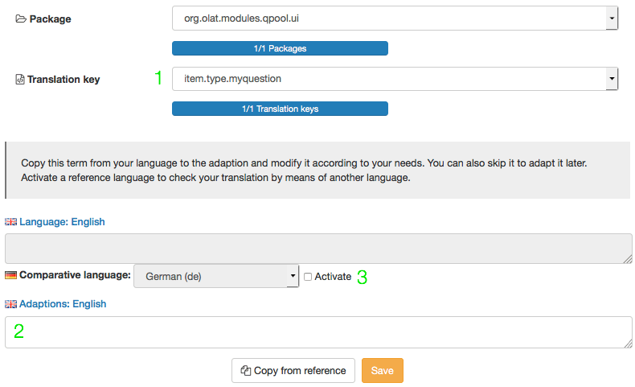

# Question Bank: Administration {: #question_bank_administration}

## Configuration by pool administrator {: #pool_manager}

**Pool administrator** is a [role](../basic_concepts/Roles_Rights.md) that OpenOlat users are assigned by administrators or user administrators.

Pool administrators have the right to change organizational aspects of the question bank. However, they have no influence on the content of the question bank or individual pools.

In the administration area of the question pool, pool administrators manage five areas for organizing the question pool module.

  * Assessment process
  * Subject
  * Pool administration
  * Question type
  * Level

---

###  Assessment process {: #assessment_process}

{ class="shadow lightbox" }

Here you can define when a question, for which an assessment process has been started, receives the status "final". If an item is below this limit, the item is set to "revision".

[To the top the page ^](#question_bank_administration)

---

###  Subject {: #subject}

{ class="shadow lightbox" }

Subject areas are used to categorize the questions (items) and are presented in a hierarchical structure. In educational organizations, for example, this represents possible courses of study, in the private sector possibly organizational units.

A [Taxonomy](../../manual_admin/administration/Modules_Taxonomy.md) is located behind the departments. New departments are added via the "Create new taxonomy level" button or via "Import taxonomy levels". Existing departments can also be edited.

In order for a question to be included in the assessment process, a specialist area must be specified. The assessment should be carried out by experts who have expertise in this area. Because the experts are also assigned to a specialist area, the question and expert can be assigned in this way.

[To the top the page ^](#question_bank_administration)

---

###  Pool administration {: #pool}

{ class="shadow lightbox" }

A pool is a question database that is available to authors for the exchange of test questions.

New pools are added using the "Create pool" button. Existing pools can be edited or deleted.

Question pools can either be **public** (and are therefore automatically available to all authors) or **non-public**, which means that access can be restricted to selected people. For example, the employees of a department.

{ class="aside-right lightbox" }

These people can be added to the pool via the "Owner" link. Pools created in this way appear with the adjacent icon.

{ class="aside-right lightbox" }

Users **without pool administrator rights** can also create their own pools. However, these pools are shared via OpenOlat groups. Such group releases appear with the adjacent icon.

{ class="shadow lightbox" }

[To the top the page ^](#question_bank_administration)

 **Create Pool**

  1. "Create pool" button: Creates a new pool. The "Create pool" form opens.
  2. Enter the name of the new pool.
  3. Define whether the pool should be public (visible to all authors) or private. If you are creating a private pool, add owners (5) to determine who should have access to the pool.
  4. Edit name or visibility for already existing pools.
  5. Add or remove owners - only relevant for private pools.

[To the top the page ^](#question_bank_administration)

###  Question Type {: #type}

{ class="shadow lightbox" }

OpenOlat has several standardized [question types](../learningresources/Test_question_types.md) that can be created either in the test editor of the learning resource Test or in the item editor of the question bank. Create additional question types if the default question types of OpenOlat are not sufficient. The default question types cannot be deleted.

A question type different from the default cannot be created using the editor, but must be assigned to an existing question of a default type in the detail view using the "Type" metadata in the "Item Analysis" category. A question modified in this style will still correspond to the original question type, but the new type will now be displayed in the "Type" column in the question pool.

Newly created questions must be translated per available language so that both German and English speaking users, for example, will see the correct terms and not the translation key visible here.

**Create Type**

After successfully creating a new question type, the new type will appear in the type table at the very bottom. The Translation - or the missing translation - is shown in the translation column. The following name convention will always apply:

    
    
    item.type.[Type name]

This is the so-called translation key, which allows the new type to be translated into the various languages available on your OpenOlat system.

Click in the corresponding line in the translation column. The following form opens:

  1. You can see the type name listed in the drop down menu "Translation key" as it is momentarily displayed in the table. No changes can be made to this menu or the "Package" menu above.
  2. Enter the designated type name in the field "Adaptions: English". From now on, this name will be displayed in the table here, in the type selection in the detailed view as well as in the question bank table under "Type" for already existing questions of this type.
  3. Activate the comparative language and select the relevant language in order to compare and verify the terms.

Repeat these steps for all languages available in your OpenOlat system.

[To the top the page ^](#question_bank_administration)

---

###  Level {: #level}

{ class="shadow lightbox" }

Levels add another categorization option to the question bank, and can be compared to difficulty levels. Create those levels that apply to your organizations' educational level.

The level of a question item can be assigned in the [Detailed view](Item_Detailed_View/#metadata_general) as the metadata "Level" under "General". For example, the difficulty of a question can be assigned to a level.

Examples of levels in a school context are:

* Middle school
* High school
* Secondary school
* Bachelor
* Master

In a corporate context, stages could look like this:

* Without job training
* With job training
* Leader position
* Administration
* Management

You can create **new levels** using the button at the top right.

Like question types, levels must also be translated for each available language so that both German and English-speaking users, for example, are shown the correct terms. To do this, proceed as described under "Create question types".

[To the top of the page ^](#question_bank_administration)

